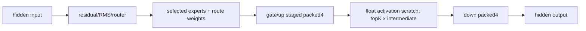
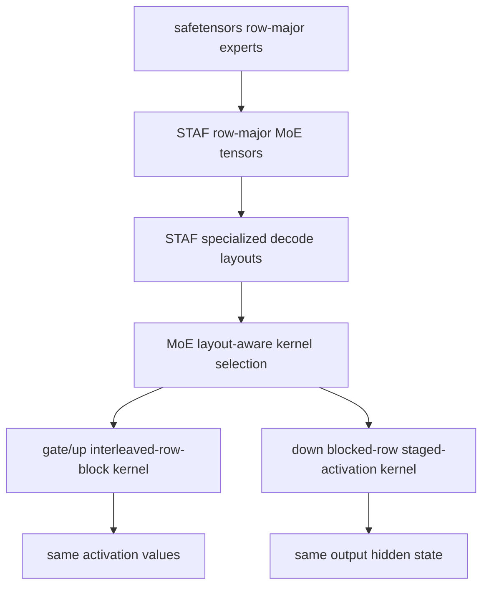
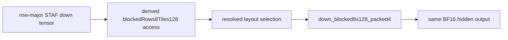
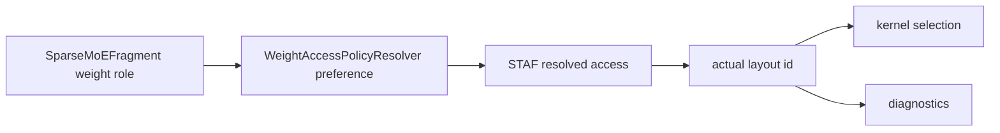
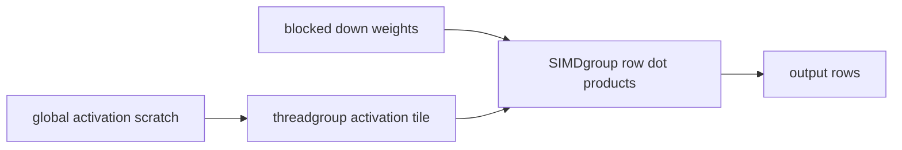
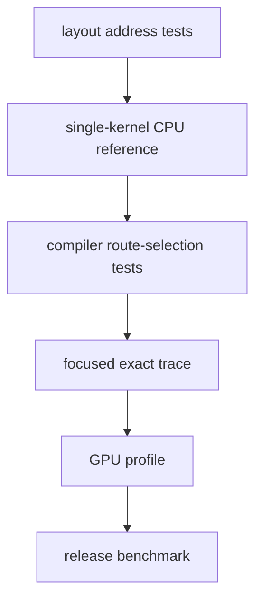
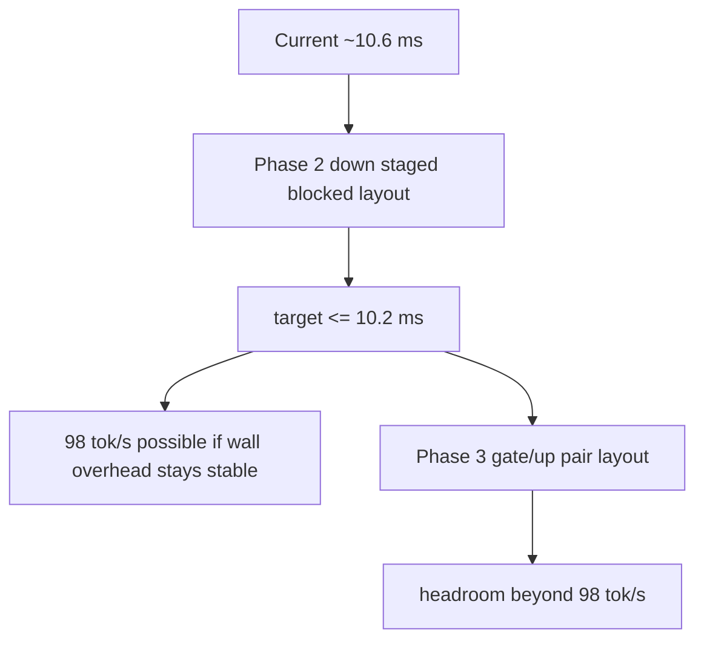

# LFM2.5 A1B MoE Layout and Scratch-Traffic Design

This document designs the next non-quantized BF16 decode optimization track for
`LiquidAI/LFM2.5-8B-A1B`.

The target is the remaining gap from the current `~10.6 ms/token` profiled
decode path toward `98 tok/s` (`<= 10.2 ms/token`). The design focuses on two
cost centers:

1. expert weight layout for MoE gate/up and down projections
2. activation scratch traffic between gate/up and down

The source of truth remains the HuggingFace safetensors bundle. STAF remains a
regenerable executable cache.

## Scope

| Field | Value |
|---|---|
| Model | `LiquidAI/LFM2.5-8B-A1B` |
| Precision | BF16 weights, BF16 decode buffers |
| Quantization | Out of scope |
| First target shape | hidden `2048`, intermediate `1792`, experts `32`, top-k `4` |
| Correctness gate | exact 64-token trace before any throughput claim |
| Promotion gate | repeated wall benchmark improvement plus focused GPU profile improvement |

## Current MoE Decode Shape

The current accepted route is:



The hot-path profile is dominated by MoE projection:

| Family | Approx. share | Notes |
|---|---:|---|
| `sparse_moe_bf16_gate_up_staged_packed4` | `~34%` | reads gate and up rows for active experts |
| `sparse_moe_bf16_down_packed4` | `~17%` | rereads activation scratch for every output row |
| MoE total | `~51%` | primary structural frontier |

The current STAF MoE payload layout is row-major:

```text
gate_up: [expert][gate rows][input] then [expert][up rows][input]
down:    [expert][output row][intermediate]
scratch: [selected expert ids][route weights][router scratch][activation k][m]
```

This is correct and simple, but it does not match the reuse pattern of the
decode kernels.

## Design Principles

| Principle | Consequence |
|---|---|
| STAF is a cache, not canonical storage | Add optimized buffers as derived layouts; never require source safetensors to change |
| Keep model declarations semantic | Layout selection stays in `MetalCompiler`, not in `ModelDeclarations` |
| Exact trace first | A faster kernel that changes the token trace is rejected |
| Avoid broad API changes | Public `SwiftLM` APIs and sampling semantics remain unchanged |
| Promote narrow defaults only after evidence | New routes start behind diagnostics or explicit layout admission |

## Proposed Architecture



## Implementation Status

This track has an initial implementation for the down projection only.

| Area | Status | Result |
|---|---|---|
| `expert_down_proj` specialized layout | implemented | uses derived `blockedRows8Tiles128` decode access |
| resolved-layout-aware MoE routing | implemented | split MoE and fused residual/router paths use the same resolved layout |
| down blocked packed4 kernel | implemented and default | `sparse_moe_bf16_down_blocked8x128_packed4` |
| down staged-activation kernel | implemented but opt-in | `SWIFTLM_SPARSE_MOE_ENABLE_DOWN_STAGED_ACTIVATION=1` |
| gate/up pair-interleaved layout | not implemented | remains Phase 3 |

Default route after this implementation:



The staged-activation kernel was kept as an opt-in experiment because focused
profile showed that the additional per-tile threadgroup barriers outweighed the
global scratch-read reduction on the tested route. The default route therefore
uses the blocked down expert weight layout without staging activation scratch.

Validation snapshot:

| Check | Result |
|---|---|
| `SparseMoEDecodeRoutingTests` | pass |
| `SparseMoEPrefillRoutingTests` | pass |
| `productionSparseMoERouteUsesA1BOptimizedKernels` | pass; default histogram uses `sparse_moe_bf16_down_blocked8x128_packed4` |
| `defaultSparseMoERouteMatchesHFTracesAcrossMultiplePrompts` | pass |
| `localLFM25A1BMatchesHFShortTraceForStrictCapitalChat` | pass with `SWIFTLM_OUTPUT_HEAD_PARTIAL_ARGMAX=0`; default partial-argmax mode still exposes a pre-existing debug-logits materialization issue |
| decode profile, default blocked-packed | `~10.33 ms/token`, down `~1.77 ms/token` in the focused profile run |
| decode profile, row-major fallback | down `~2.36 ms/token` in the focused comparison run |
| decode profile, staged activation | down `~2.37 ms/token` in the focused comparison run; rejected as default |

Wall benchmark runs during this pass were not used as a promotion signal because
concurrent `xctest`, code-signing, and Spotlight processes made wall time
unstable. The focused GPU profile is the current evidence source for this
implementation step.

### Contract Boundary

The route must be selected from the resolved STAF access, not from the requested
preference alone.



This matters because prior blocked-layout work showed that a request can be
accepted by the planner while the kernel still assumes a different physical
layout. The implementation should therefore add a small explicit MoE layout
selection value at the decode-plan boundary.

Recommended internal shape:

```text
SparseMoEWeightLayoutSelection
  gateUp: STAFWeightLayout
  down: STAFWeightLayout
```

Both split MoE entry points must use the same resolved layout selection:

- the normal `SparseMoEFragment.splitDecodeSteps` path
- the fused residual/router path that delegates into `splitDecodeSteps`

Prefill remains row-major unless a separate sequence-kernel design proves a
benefit. This document is only for the decode hot path.

### Traffic Model

The main opportunity is not fewer arithmetic operations. It is reducing repeated
global-memory traffic for data that already has token-local reuse.

Approximate per-token traffic for the A1B shape:

| Stream | Current rough read volume | Proposed first-order change |
|---|---:|---|
| gate/up expert weights | `~56 MiB` | same bytes, better adjacent gate/up access |
| gate/up staged hidden input | `~7 MiB` | same in Phase 3 |
| down expert weights | `~28 MiB` | same bytes, blocked-row access |
| down activation scratch | `~56 MiB` | `~7 MiB` with 8-row staging |

The down scratch estimate is the core Phase 2 target:

```text
current: 2048 output rows * 4 topK * 1792 intermediate * 4 bytes
staged:  256 row blocks * 4 topK * 1792 intermediate * 4 bytes
```

That is an approximate `8x` reduction for the activation-scratch global-read
component inside the down projection. Weight reads remain the same order of
magnitude, so the expected total down-family speedup is bounded and must be
confirmed by profile.

### New Layout Concepts

Add layout support at the STAF access layer. The exact naming can be adjusted
during implementation, but the behavior should stay explicit.

| Layout | Tensor role | Physical order | Purpose |
|---|---|---|---|
| `moeGateUpPairRows8Tiles128` | `expert_gate_up_proj` | `[expert][mBlock][inputTile][mInBlock][gate/up][tileLane]` | Keep gate and up rows adjacent and align row-block reads with one threadgroup |
| `blockedRows8Tiles128` or `moeDownRows8Tiles128` | `expert_down_proj` | `[expert][rowBlock][mTile][rowInBlock][tileLane]` | Make a block of output rows consume one staged activation tile coherently |

The down layout can initially reuse the existing `blockedRows8Tiles128`
mechanism if diagnostics stay clear. A dedicated `moeDownRows8Tiles128` enum
case is preferable if it makes route reporting and admission less ambiguous.

Address contracts:

```text
moeGateUpPairRows8Tiles128:
  mBlock = m / 8
  mLane = m % 8
  hTile = h / 128
  hLane = h % 128
  pair = 0 for gate, 1 for up

  offset =
    (((expert * mBlockCount + mBlock) * hTileCount + hTile) * 8 + mLane)
      * 2 * 128
    + pair * 128
    + hLane

moeDownRows8Tiles128:
  rowBlock = outputRow / 8
  rowLane = outputRow % 8
  mTile = m / 128
  mLane = m % 128

  offset =
    (((expert * rowBlockCount + rowBlock) * mTileCount + mTile) * 8 + rowLane)
      * 128
    + mLane
```

These contracts are element offsets in BF16 scalar units. Buffer byte offsets
remain the STAF entry offset plus `offset * 2`.

### Gate/Up Layout

Current gate/up reads two far-apart streams for the same `(expert, m)` row:

```text
gate row: expertGateUpWeight + expert * (2I * H) + m * H
up row:   gateBase + I * H + m * H
```

The proposed layout packs gate and up tile data together:

```text
for expert in experts
  for mBlock in 0..<intermediate step 8
    for inputTile in 0..<hidden step 128
      for mInBlock in 0..<8
        append gate[mBlock + mInBlock][inputTile ..< inputTile + 128]
        append up[mBlock + mInBlock][inputTile ..< inputTile + 128]
```

The corresponding kernel should map one threadgroup to one `(topK slot,
mBlock)` pair. Each SIMDgroup owns one `m` row and reads adjacent gate/up tiles.

Expected benefits:

- better locality between gate and up for the same row
- lower pointer arithmetic in the inner loop
- no change to activation math or scratch format in the first phase

### Down Layout and Activation Staging

The current down kernel computes one output row per SIMDgroup. Every output row
reloads the same activation vector from global scratch:

```text
for output row
  for topK expert
    read activation[k][0..<1792]
    read downWeight[expert][row][0..<1792]
```

For one threadgroup with 32 output rows, this repeats the same activation loads
32 times. The first scratch-traffic reduction should stage activation tiles once
per row block:



A conservative first kernel:

| Parameter | Initial value | Reason |
|---|---:|---|
| rows per threadgroup | `8` | Lower occupancy risk than `16` or `32` |
| activation tile | `128` floats | Matches existing blocked-row tile size |
| topK loop | `4` fixed for A1B route | Keeps the first route narrow and auditable |
| output rows | one SIMDgroup per row | Preserves the current reduction contract |

Pseudo-structure:

```text
for k in 0..<4
  for mTile in 0..<1792 step 128
    cooperative load activation[k][mTile ..< mTile + 128] into threadgroup memory
    barrier
    each SIMDgroup computes one output row using blocked down weights
accumulate row total
write BF16 output
```

This differs from the previously rejected generic down-staging experiment in two
ways:

1. it pairs activation staging with a matching down weight layout
2. it starts with a smaller row block and A1B-only admission instead of a broad
   default route

## Implementation Plan

### Phase 1: Layout Infrastructure

| File area | Change |
|---|---|
| `STAFWeightAccessRequest.swift` | Add the MoE layout enum cases or reuse `blockedRows8Tiles128` for down with explicit diagnostics |
| `STAFSpecializedWeightStoreBuilder.swift` | Include `SparseMoEFragment` weight roles in `specializedRequests` |
| `STAFSpecializedWeightStoreBuilder.swift` | Add `makeMoEGateUpPairRows8Tiles128Access` |
| `ProjectionWeightAccessPolicyResolver.swift` | Return optimized decode layout preferences for `expert_gate_up_proj` and `expert_down_proj` only when the A1B shape matches |
| diagnostics | Report preferred and resolved MoE layouts in the decode plan |

Acceptance for Phase 1:

- row-major route remains unchanged when optimized layouts are disabled
- specialized buffers are generated once per tensor and kept resident
- synthetic layout tests prove source-to-packed address mapping

Layout generation should be implemented as derived STAF access variants:

```text
canonical safetensors payload
  -> canonical STAF row-major entry
  -> specialized decode-only access variant
```

Do not replace the canonical STAF payload and do not require the source bundle
to carry an optimized MoE layout.

### Phase 2: Down Blocked Layout + Optional Staged Activation

| File area | Change |
|---|---|
| `SparseMoEFragment.swift` | Pass resolved MoE weight layout into projection kernel selection |
| `MetalSourceGenerator+MoE.swift` | Add `sparse_moe_bf16_down_blocked8x128_packed4` and `sparse_moe_bf16_down_blocked8x128_staged_act` |
| `MetalKernelSourceCatalog.swift` | Generate the new down kernel only when the layout is requested |
| `MetalDispatchStepBuilder.swift` | Preserve explicit read/write access patterns for the staged route |

Initial admission:

```text
weightFormat == BF16
inputDimension == 2048
outputDimension == 2048
intermediateDimension == 1792
expertsPerToken == 4
expertCount == 32
down layout == blockedRows8Tiles128 or moeDownRows8Tiles128
```

Promotion target:

| Metric | Current rough value | Promotion target |
|---|---:|---:|
| down family GPU time | `~1.8 ms/token` | `<= 1.35 ms/token` |
| total decode profile | `~10.6 ms/token` best-profile range | `<= 10.2 ms/token` |
| exact trace | pass | pass |

The kernel must keep the current output accumulation contract:

```text
output[row] = sum(topK routeWeight[k] * downWeight[selectedExpert[k], row, m] * activation[k, m])
```

The only intended changes are:

- down weights use the resolved blocked-row physical layout
- `down_blocked8x128_packed4` remains the default because it adds no internal barriers
- `down_blocked8x128_staged_act` is available only as an explicit experiment
- row-major down remains available and selected when the optimized layout is not resolved

### Phase 3: Gate/Up Interleaved Layout

| File area | Change |
|---|---|
| `STAFSpecializedWeightStoreBuilder.swift` | Generate `moeGateUpPairRows8Tiles128` buffers |
| `MetalSourceGenerator+MoE.swift` | Add `sparse_moe_bf16_gate_up_pair8x128` |
| `SparseMoEFragment.swift` | Select the kernel only when the layout is resolved |

Promotion target:

| Metric | Current rough value | Promotion target |
|---|---:|---:|
| gate/up family GPU time | `~3.6 ms/token` | `<= 3.35 ms/token` |
| total decode profile | after Phase 2 | additional `>= 0.2 ms/token` reduction |

The kernel should keep the current activation scratch format at first:

```text
activationScratch[k][m] = silu(gate[k][m]) * up[k][m] * routeWeight[k]
```

Changing the activation layout at the same time would make Phase 3 harder to
attribute. The first gate/up route should prove only the expert-weight layout
change.

### Phase 4: Optional Packed Activation Scratch

This is intentionally not the first implementation step.

Possible format:

```text
activationByM[m] = float4(topK0, topK1, topK2, topK3)
```

Expected benefit:

- fewer scalar activation streams in down
- easier vectorized top-k accumulation

Primary risk:

- gate/up must coordinate all top-k activations for one `m`, which changes the
  current independent `(k, m)` execution shape and raises correctness risk.

Only start this phase after Phase 2 and Phase 3 have reference tests.

## Required Tests

| Layer | Test |
|---|---|
| STAF layout | synthetic address-mapping tests for gate/up interleaving and down blocked layout |
| Kernel | single-layer real A1B CPU reference comparison for down staged route |
| Kernel | single-layer real A1B CPU reference comparison for gate/up interleaved route |
| Compiler | route-selection tests proving row-major fallback and optimized-layout admission |
| Runtime | `productionSparseMoERouteUsesA1BOptimizedKernels()` updated only after promotion |
| Correctness | exact 64-token LFM2.5 A1B trace |
| Profile | `LFM25A1BDecodeProfileTests/a1bDecodeStepProfileIdentifiesHotKernelFamilies()` |
| Benchmark | `lfm25-a1b-benchmark --tokens 64 --warmup 1 --iterations 10` |

Suggested test order:



The focused exact trace must run before throughput claims. Benchmark results
from a build that changes the trace are not useful.

## Rejection Rules

Reject a candidate immediately if any of these occur:

- exact trace changes
- the intended kernel family does not improve in the focused GPU profile
- wall throughput improves only in a single noisy run
- optimized layout silently falls back to row-major
- route requires quantization or a GGUF/GGML loader
- host sampling semantics require a greedy-only shortcut

## Expected Outcome



The most likely path to `98 tok/s` is Phase 2. The down projection is smaller
than gate/up, but it rereads activation scratch aggressively. A layout-matched
staged down kernel can reduce that repeated global scratch traffic without
changing routing, gate/up activation math, or sampling behavior.
