# Hybrid Prefill Fast Path Progress

Last updated: 2026-05-14

This file is the single progress ledger for the hybrid prefill fast-path work.
It tracks the current milestone, implementation status, validation evidence,
failed experiments, and next decisions.

## Goal

Move hybrid Qwen/LFM prefill from the current decode-equivalent sequence GEMV
path toward the final fastest design without losing production correctness.

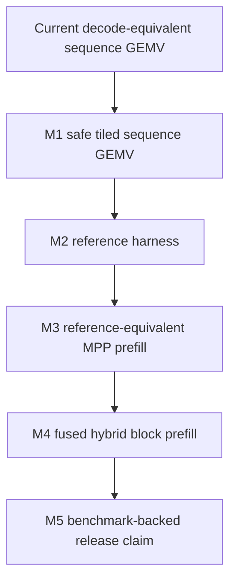

## Current Contract

| Area | Contract |
|---|---|
| Hybrid BF16 sequence prefill | Must match decode-equivalent prompt ingestion token trace |
| Q3 sequence prefill | Enabled only through reference-backed packed and batched Q3 sequence GEMV plus quantized sequence embedding |
| Speed claims | Forbidden unless the same path has green correctness evidence |
| Fallback | Silent fallback is not allowed |

## Milestone Status

| Milestone | Status | Notes |
|---|---|---|
| M1 safe tiled sequence GEMV | Done / not default | Tile4 kernels compile and pass decode-equivalence tests; Qwen profile regressed when defaulted, so production planner stays on base sequence GEMV |
| M2 reference harness | Done / hardened | LFM and Qwen3.5 both have reference dump scripts and manifest coverage; Qwen3.5 validates snapshot identity, prefill state, decode0 state, and KV cache |
| M3 reference-equivalent MPP prefill | Pending | Requires M2 before adopting non decode-equivalent math |
| M4 fused hybrid block prefill | Pending | Requires M2 and block-level reference probes |
| M5 benchmark-backed release claim | Pending | Requires real-bundle correctness gates first |
| External implementation review | Done / active input | llama.cpp/ggml Metal reviewed on 2026-05-12 as a baseline to beat, not a target to copy |

## M1 Design

The M1 kernel changes the scheduling unit but not the numeric unit:

```text
Numeric contract: one output row x one token keeps the same SIMD lane reduction.
Scheduling unit: one threadgroup may cover several tokens for the same row group.
```

| Parameter | Current | M1 target |
|---|---:|---:|
| Rows per threadgroup | 2 | 2 |
| Sequence tile | 1 | tile4 implemented as non-default experiment |
| Dot-product lane order | decode-equivalent | unchanged |
| Storage rounding | inside projection kernel | unchanged |
| MPP | not used for stateful hybrid sequence projection | unchanged |

## M2 Design

M2 changes the future correctness oracle from decode-only to reference-aware.
It does not yet authorize MPP or fused non-decode-equivalent kernels.

| Component | Status | Source |
|---|---|---|
| LFM reference dump script | Existing | `scripts/hf/dump_lfm2_reference.py` |
| LFM Swift reference comparison | Existing | `Tests/MetalCompilerTests/Models/LFM2/ReferenceComparisonTests.swift` |
| Qwen reference dump script | Done / extended | `scripts/hf/dump_qwen35_reference.py`; schema v5 supports multiple reference cases, version metadata, and selected linear-attention block boundary tensors |
| Qwen Swift reference comparison | Done / extended | `Tests/MetalCompilerTests/Models/Qwen35/Qwen35ReferenceComparisonTests.swift`; validates every schema v5 case plus selected early/middle/late linear-attention block boundaries |
| Reference manifest | Done | `Tests/MetalCompilerTests/Core/ReferenceHarnessManifestTests.swift` |

## Confidence Audit

The current strategy is not treated as mathematically complete. It is treated as
release-safe only for the explicitly covered model, prompt, precision, and
optimizer path. Every known hole is either closed by a hard gate or listed as a
remaining scope limit.

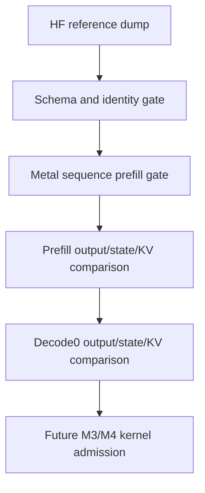

| Potential hole | Status | Gate / decision |
|---|---|---|
| Reference snapshot generated from a different bundle | Closed | Snapshot stores `config.json` SHA-256 and the Swift test compares it with the local bundle |
| Swift prompt does not match reference prompt | Closed | Snapshot stores `ref.meta.input_tokens`; Swift test requires exact token equality |
| Sequence prefill silently falls back to sequential decode | Closed | Qwen reference test requires `requiresSequentialPromptIngestion == false` and no fallback reason |
| Only early linear states are checked | Closed | Qwen reference test checks every `linear_ordinal_*` conv and recurrent state |
| Decode post-state is not checked | Closed | Qwen reference test checks `decode_0` logits, next token, conv state, and recurrent state |
| KV cache corruption can pass | Closed | Qwen reference test checks prefill and `decode_0` key/value caches for all attention ordinals |
| Metal readback failure can look like a numeric match | Closed | Buffer readback now throws on allocation, command-buffer, or range failure; length mismatch produces infinite error |
| Single prompt / sequence length only | Closed | Qwen schema v5 stores multiple reference cases; Swift validates each case independently |
| Q3 sequence prefill | Closed for current Qwen3.5 Q3 path | Q3 G16/G32/G64 projection sequence GEMV and embedding lookup have CPU-reference tests; real Q3 prompt ingestion uses sequence prefill and matches sequential ingestion trace |
| HuggingFace backend variance | Closed for traceability | Qwen schema v5 records PyTorch version, Transformers version, and fast-backend availability |

## Evidence Log

| Date | Command / check | Result |
|---|---|---|
| 2026-05-07 | `swift build` | Pass before M1/M2 edits |
| 2026-05-07 | `MetalCompilerTests/Qwen35PromptIngestionTests` | Pass after reverting failed MPP gate/up experiment |
| 2026-05-07 | `MetalCompilerTests/Qwen35PrefillProfileTests` | Pass, current default remains sequence GEMV |
| 2026-05-07 | `swift build` | Pass after M1/M2 edits |
| 2026-05-07 | `MetalCompilerTests/SequenceProjectionEquivalenceTests` | Pass; includes base batched, tiled batched, tiled single sequence GEMV |
| 2026-05-07 | `MetalCompilerTests/ReferenceHarnessManifestTests` | Pass |
| 2026-05-07 | `MetalCompilerTests/GeneratedLibraryTests` | Pass |
| 2026-05-07 | `MetalCompilerTests/Qwen35PromptIngestionTests` with `ENABLE_METAL_PROBES=1` | Pass |
| 2026-05-07 | `MetalCompilerTests/Qwen35PrefillProfileTests` with `ENABLE_METAL_PROBES=1` | Pass; production planner uses base sequence GEMV |
| 2026-05-07 | `python3 scripts/hf/dump_qwen35_reference.py --output TestData/qwen35_reference.safetensors --decode-steps 2` | Pass; wrote schema v2 Qwen3.5 HF reference snapshot with config hash and input token metadata |
| 2026-05-07 | `MetalCompilerTests/Qwen35ReferenceComparisonTests` with `ENABLE_METAL_PROBES=1` | Pass; HF prefill/decode0 argmax, logits, final hidden, all linear states, and KV cache gates are green |
| 2026-05-07 | `MetalCompilerTests/Qwen35ReferenceComparisonTests` with `ENABLE_METAL_PROBES=1` | Pass after hardening Metal readback to throw instead of returning empty arrays |
| 2026-05-07 | `python3 scripts/hf/dump_qwen35_reference.py --output TestData/qwen35_reference.safetensors --decode-steps 2` | Pass; wrote schema v3 multi-case Qwen3.5 HF reference snapshot with 1328 tensors |
| 2026-05-07 | `MetalCompilerTests/Qwen35ReferenceComparisonTests` with `ENABLE_METAL_PROBES=1` | Pass; validates schema v3 case 0 and case 1 for prefill/decode0 logits, token trace, all linear states, and KV cache |
| 2026-05-07 | `python3 scripts/hf/dump_qwen35_reference.py --output TestData/qwen35_reference.safetensors --decode-steps 2` | Pass; wrote schema v4 multi-case Qwen3.5 HF reference snapshot with version and backend metadata |
| 2026-05-07 | `MetalCompilerTests/Qwen35ReferenceComparisonTests` with `ENABLE_METAL_PROBES=1` | Pass; validates schema v4 metadata plus both reference cases |
| 2026-05-07 | `MetalCompilerTests/QuantizationPlanningTests` | Pass; all Q3 prefill projection and embedding schemes require explicit sequential ingestion |
| 2026-05-07 | `MetalCompilerTests/Qwen35PromptIngestionTests` with `ENABLE_METAL_PROBES=1` | Pass; BF16 sequence path and Q3 explicit sequential ingestion trace gates are green |
| 2026-05-07 | `MetalCompilerTests/ReferenceHarnessManifestTests` | Pass after marking Qwen3.5 ready |
| 2026-05-07 | `swift build` | Pass after enabling Q3 sequence prefill |
| 2026-05-07 | `MetalCompilerTests/MetalSourceGeneratorTests` | Pass; Q3 G16/G32/G64 dequant→MPP and packed sequence GEMV match CPU references |
| 2026-05-07 | `MetalCompilerTests/QuantizedEmbeddingKernelTests` | Pass; Q3 G16/G32/G64 sequence embedding lookup matches affine CPU reference |
| 2026-05-07 | `MetalCompilerTests/QuantizationPlanningTests` | Pass; Q3 prefill projection and embedding schemes no longer require sequential ingestion |
| 2026-05-07 | `MetalCompilerTests/Qwen35PromptIngestionTests` with `ENABLE_METAL_PROBES=1` | Pass; Q3 real bundle sequence prefill trace matches decode-equivalent sequential ingestion |
| 2026-05-07 | `MetalCompilerTests/Qwen35BenchmarkTests` with `ENABLE_METAL_PROBES=1` | Pass; Q3 smoke benchmark confirms 186 packed Q3 sequence GEMV kernels and sequence prefill faster than sequential ingestion for lengths 16/64/128 |
| 2026-05-07 | `MetalCompilerTests/MetalSourceGeneratorTests` | Pass; batched Q3 sequence GEMV for counts 2/3/4 and groups 16/32/64 matches decode-rounded CPU references |
| 2026-05-07 | `MetalCompilerTests/Qwen35PromptIngestionTests` with `ENABLE_METAL_PROBES=1` | Pass; Q3 real bundle sequence prefill remains trace-equivalent after batched Q3 projection routing |
| 2026-05-07 | `MetalCompilerTests/Qwen35BenchmarkTests` with `ENABLE_METAL_PROBES=1` | Pass; Q3 smoke benchmark confirms 96 total Q3 sequence GEMV entries, 48 batched Q3 sequence GEMV entries, and sequence prefill faster than sequential ingestion for lengths 16/64/128 |
| 2026-05-09 | `MetalCompilerTests/Qwen35PrefillProfileTests` with `ENABLE_METAL_PROBES=1` (re-run) | Pass; projection share confirmed at 75.8-76.4%, single `gemv_seq_bf16_f32s` confirmed as 26.5% of projection time (48 dependent output projections), pass count remains 1 |
| 2026-05-09 | `MetalCompilerTests/SequenceProjectionEquivalenceTests` | Pass; 5 tests including `BF16 tile2 single sequence GEMV matches repeated decode GEMV` and `BF16 tiled single sequence GEMV matches repeated decode GEMV` |
| 2026-05-09 | `MetalCompilerTests/Qwen35ReferenceComparisonTests` with `SWIFTLM_PREFILL_BF16_SINGLE_TILE2=1` | Pass; 4/4 cases remain reference-equivalent with feature-flagged tile2 single sequence GEMV routing |
| 2026-05-09 | `MetalCompilerTests/Qwen35PrefillProfileTests` with `SWIFTLM_PREFILL_BF16_SINGLE_TILE2=1` | Pass; tile2 routed 48 BF16 single sequence GEMV dispatches but did not improve prefill timing, so default routing remains disabled |
| 2026-05-09 | `MetalCompilerTests/SequenceGEMVMicrobenchmarkTests` | Pass; synthetic real-shape BF16 single GEMV benchmark covers base/tile2/tile4 for output-projection shapes |
| 2026-05-09 | `MetalCompilerTests/Qwen35PrefillProfileTests` | Pass; prints BF16 single sequence GEMV role breakdown, with `mlp.down_proj` taking 63.6% of single GEMV time at seqLen 128 |
| 2026-05-10 | `MetalCompilerTests/FusedSwigluDownEquivalenceTests` | Pass; fused SwiGLU+down kernel keeps the materialized F32 intermediate contract and matches the unfused `swiglu_seq_f32 + gemv_seq_bf16_f32s` path |
| 2026-05-10 | `xcrun xctest -XCTest MetalCompilerTests.Qwen35ReferenceComparisonTests` with `SWIFTLM_PREFILL_BF16_FUSED_MLP_DOWN=1 ENABLE_METAL_PROBES=1` | Pass; 4/4 Qwen reference checks remain green with opt-in fused MLP down routing |
| 2026-05-10 | `xcrun xctest -XCTest MetalCompilerTests.Qwen35PrefillProfileTests` with `SWIFTLM_PREFILL_BF16_FUSED_MLP_DOWN=1 ENABLE_METAL_PROBES=1` | Pass; routing fires (`293 -> 269` steps, 24 fused dispatches), but end-to-end prefill regresses, so default routing remains disabled |
| 2026-05-10 | `MetalCompilerTests/FusedSwigluDownEquivalenceTests` | Pass; adds an eight-rows-per-threadgroup fused scheduling contract |
| 2026-05-10 | `xcrun xctest -XCTest MetalCompilerTests.Qwen35PrefillProfileTests` with `SWIFTLM_PREFILL_BF16_FUSED_MLP_DOWN=1 SWIFTLM_PREFILL_BF16_FUSED_MLP_DOWN_ROWS=8 ENABLE_METAL_PROBES=1` | Pass; rows=8 fused route fires and improves the same-run Qwen profile at seqLen 64/128, but remains opt-in |
| 2026-05-10 | `xcrun xctest -XCTest MetalCompilerTests.Qwen35ReferenceComparisonTests` with `SWIFTLM_PREFILL_BF16_FUSED_MLP_DOWN=1 SWIFTLM_PREFILL_BF16_FUSED_MLP_DOWN_ROWS=8 ENABLE_METAL_PROBES=1` | Pass; 4/4 reference checks remain green with rows=8 fused scheduling |
| 2026-05-10 | `swift test --filter SequenceGEMVMicrobenchmarkTests/bf16FusedSwigluDownRowsMicrobench` | Pass; writes fused rows-per-threadgroup microbenchmark artifact for rows 2/4/8 |
| 2026-05-10 | `swift test --filter Qwen35PrefillProfileTests` with `ENABLE_METAL_PROBES=1` | Pass; same SwiftPM/probe baseline is 43.383/159.741/315.186 ms for seqLen 16/64/128 |
| 2026-05-10 | `swift test --filter Qwen35PrefillProfileTests` with `ENABLE_METAL_PROBES=1 SWIFTLM_PREFILL_BF16_FUSED_MLP_DOWN=1 SWIFTLM_PREFILL_BF16_FUSED_MLP_DOWN_ROWS=2/4/8` | Pass; rows=8 is the best full-model fused variant and improves seqLen 64/128 in the same SwiftPM/probe run |
| 2026-05-10 | `swift test --filter Qwen35ReferenceComparisonTests` with `ENABLE_METAL_PROBES=1 SWIFTLM_PREFILL_BF16_FUSED_MLP_DOWN=1 SWIFTLM_PREFILL_BF16_FUSED_MLP_DOWN_ROWS=8` | Pass; 4/4 reference checks remain green with the best observed fused scheduling |
| 2026-05-10 | `xcodebuild build-for-testing` with `OTHER_SWIFT_FLAGS='$(inherited) -DENABLE_METAL_PROBES'` | Pass; probe-enabled Xcode test bundle builds inside the 120-second release gate |
| 2026-05-10 | `xcodebuild test-without-building -xctestrun rows8-release-validation.xctestrun -only-testing:MetalCompilerTests/Qwen35ReferenceComparisonTests` | Pass; rows=8 environment injected through the xctestrun, 4/4 reference checks pass |
| 2026-05-10 | `xcodebuild test-without-building ... Qwen35PrefillProfileTests` baseline and rows=8 xctestruns | Pass; rows=8 improves seqLen 64/128 but regresses seqLen 16, so it stays opt-in |
| 2026-05-10 | `swift test --filter PrefillProfileHarnessTests` | Pass; validates `PrefillStepExecutionCondition` contract and profile artifact encoding |
| 2026-05-10 | `swift test --filter Qwen35PrefillProfileTests` with `ENABLE_METAL_PROBES=1 SWIFTLM_PREFILL_BF16_FUSED_MLP_DOWN=1 SWIFTLM_PREFILL_BF16_FUSED_MLP_DOWN_ROWS=8 SWIFTLM_PREFILL_BF16_FUSED_MLP_DOWN_MIN_SEQUENCE_LENGTH=64` | Pass; runtime-gated adaptive route executes unfused steps at seqLen 16 and fused rows=8 steps at seqLen 64/128 |
| 2026-05-10 | `swift test --filter Qwen35ReferenceComparisonTests` with the same adaptive fused rows=8 environment | Pass; 4/4 Qwen reference checks remain green |
| 2026-05-10 | `xcodebuild build-for-testing` with `OTHER_SWIFT_FLAGS='$(inherited) -DENABLE_METAL_PROBES'` | Pass; probe-enabled Xcode test bundle builds inside the 120-second release gate for adaptive fused rows=8 validation |
| 2026-05-10 | `xcodebuild test-without-building -xctestrun adaptive-min64-release-validation.xctestrun -only-testing:MetalCompilerTests/Qwen35ReferenceComparisonTests` | Pass; adaptive rows=8 environment injected through the xctestrun, 4/4 reference checks pass |
| 2026-05-10 | `xcodebuild test-without-building -xctestrun adaptive-min64-release-validation.xctestrun -only-testing:MetalCompilerTests/Qwen35PrefillProfileTests` | Pass; active routing is correct (`seqLen=16` unfused, `seqLen=64/128` fused rows=8), but timing remains noisy and does not justify default promotion |
| 2026-05-10 | `swift build` | Pass after adding the experimental rows-per-SIMD fused MLP kernel generator and opt-in routing selector |
| 2026-05-10 | `swift test --filter FusedSwigluDownEquivalenceTests` | Pass; 4/4, including the two-output-rows-per-SIMD-group fused kernel against the unfused path |
| 2026-05-10 | `swift test --filter MetalSourceGeneratorTests` | Pass; 24/24, complete generated library still compiles with the additional rps2 fused kernel |
| 2026-05-10 | `swift test --filter SequenceGEMVMicrobenchmarkTests/bf16FusedSwigluDownRowsMicrobench` | Pass; rows16/rps2 improves the isolated fused MLP microbench at seqLen 16/64, but not seqLen 128 |
| 2026-05-10 | `swift test --filter Qwen35ReferenceComparisonTests` with `ENABLE_METAL_PROBES=1 SWIFTLM_PREFILL_BF16_FUSED_MLP_DOWN=1 SWIFTLM_PREFILL_BF16_FUSED_MLP_DOWN_ROWS=16 SWIFTLM_PREFILL_BF16_FUSED_MLP_DOWN_ROWS_PER_SIMDGROUP=2` | Pass; 4/4 Qwen reference checks remain green with opt-in rps2 routing |
| 2026-05-10 | `swift test --filter Qwen35PrefillProfileTests` with the same rps2 environment | Pass; rps2 route fires (`269` steps) but full-model prefill regresses to 66.824/216.839/541.439 ms for seqLen 16/64/128 |
| 2026-05-10 | `swift test --filter Qwen35PrefillProfileTests` with `ENABLE_METAL_PROBES=1` | Pass; default production path remains unfused (`293` steps) with env flags absent |
| 2026-05-10 | `xcodebuild test -scheme swift-lm-Package -destination 'platform=macOS' -only-testing:MetalCompilerTests/FusedSwigluDownEquivalenceTests` | Pass; 4/4, Xcode package scheme also validates the rows-per-SIMD equivalence contract |
| 2026-05-10 | `swift build` | Pass after adding the opt-in shared-RMS SSM recurrence sequence variant |
| 2026-05-10 | `swift test --filter SSMRecurrenceSequenceEquivalenceTests` | Pass; default sequence SSM and shared-RMS sequence SSM both match repeated decode recurrence |
| 2026-05-10 | `swift test --filter MetalSourceGeneratorTests` | Pass; 24/24 after adding the shared-RMS sequence generator path |
| 2026-05-10 | `swift test --filter Qwen35ReferenceComparisonTests` with `ENABLE_METAL_PROBES=1 SWIFTLM_PREFILL_SSM_SHARED_RMS=1` | Pass; 4/4 Qwen reference checks remain green with the opt-in shared-RMS SSM route |
| 2026-05-10 | `swift test --filter Qwen35PrefillProfileTests` with `ENABLE_METAL_PROBES=1 SWIFTLM_PREFILL_SSM_SHARED_RMS=1` | Pass; route fires for all 18 SSM recurrence dispatches, but total improvement is within profile noise, so default routing remains disabled |
| 2026-05-10 | `swift test --filter SSMRecurrenceMicrobenchmarkTests` | Pass; isolated Qwen-shape SSM recurrence benchmark shows shared-RMS is faster than base for seqLen 16/64/128 and writes `.test-artifacts/ssm-recurrence-microbench/qwen35-bf16-ssm-recurrence.csv` |
| 2026-05-11 | `swift test --filter SSMRecurrenceSequenceEquivalenceTests` | Pass; default, shared-RMS, and narrow threadgroup-width SSM sequence routes match repeated decode recurrence |
| 2026-05-11 | `swift test --filter SSMRecurrenceMicrobenchmarkTests` | Pass; isolated benchmark now sweeps base/shared-RMS kernels across requested threadgroup widths 128/256/384 |
| 2026-05-11 | `swift build` | Pass after adding the opt-in SSM sequence threadgroup-width override |
| 2026-05-11 | `swift test --filter Qwen35ReferenceComparisonTests` with `ENABLE_METAL_PROBES=1 SWIFTLM_PREFILL_SSM_THREADGROUP_WIDTH=256` | Pass; 4/4 Qwen reference checks remain green with the opt-in narrower SSM dispatch geometry |
| 2026-05-11 | `swift test --filter Qwen35PrefillProfileTests` with `ENABLE_METAL_PROBES=1 SWIFTLM_PREFILL_SSM_THREADGROUP_WIDTH=256` | Pass; all 18 SSM recurrence dispatches use `tg=256`, but full-model timing is slightly slower/noisy, so default routing remains unchanged |
| 2026-05-12 | `swift test --filter PrefillProfileHarnessTests` | Pass; profile artifact writer now emits raw, category, kernel, layer, and weight-role CSVs |
| 2026-05-12 | `swift build` | Pass after adding aggregated prefill profile artifacts |
| 2026-05-12 | `swift test --filter Qwen35PrefillProfileTests` with `ENABLE_METAL_PROBES=1` | Pass; Qwen profile writes aggregate CSVs for both step and pass profiles at seqLen 16/64/128 |
| 2026-05-14 | `swift test --filter MLPFusionWindowTests` | Pass; profile scanner detects both unfused and fused SwiGLU-down producer-consumer windows |
| 2026-05-14 | `swift test --filter PrefillProfileHarnessTests` | Pass; profile artifact writer now emits `*-mlp-windows.csv` alongside recurrent block windows |
| 2026-05-14 | `swift test --filter Qwen35PrefillProfileTests` with `ENABLE_METAL_PROBES=1` | Pass; Qwen real-bundle profile writes `*-mlp-windows.csv` for seqLen 16/64/128 |
| 2026-05-12 | `swift test --filter PrefillProfileHarnessTests` | Pass; layer CSV now infers `layers.N` from weight tensor names and weight-role CSV supports batched semicolon-separated tensor groups |
| 2026-05-12 | `swift test --filter Qwen35PrefillProfileTests` with `ENABLE_METAL_PROBES=1` | Pass; batched projection dispatches now carry tensor-group metadata, reducing the blank projection bucket at seqLen 128 from 49 dispatches to only the output-head dispatch |
| 2026-05-12 | `swift test --filter SequenceGEMVMicrobenchmarkTests/bf16BatchedSequenceGEMVRealShapeMicrobench` | Pass; base batched sequence GEMV beats tile2/tile4 for the dominant Qwen3.5 BF16 batched projection shapes except small noisy cases |
| 2026-05-12 | `swift test --filter Qwen35ReferenceComparisonTests` with `ENABLE_METAL_PROBES=1 SWIFTLM_PREFILL_BF16_BATCHED_MPP=1` | Fail; forcing BF16 dense batched MPP before decode-equivalent sequence GEMV drifts prefill token, hidden state, conv/recurrent state, and KV cache, so the diagnostic route was removed instead of kept as an opt-in |
| 2026-05-13 | `swift test --filter PrefillProfileHarnessTests` | Pass; profile artifact schema v2 validates per-step byte estimates and block CSV rollups |
| 2026-05-13 | `swift test --filter Qwen35PrefillProfileTests` with `ENABLE_METAL_PROBES=1` | Pass; Qwen profile writes `*-blocks.csv` artifacts and shape-derived projection byte estimates for seqLen 16/64/128 |
| 2026-05-13 | `python3 scripts/hf/dump_qwen35_reference.py --output TestData/qwen35_reference.safetensors --decode-steps 2 --linear-block-ordinals 0,9,17` | Pass; wrote schema v5 Qwen3.5 HF reference snapshot with early/middle/late linear-attention block boundary tensors including conv+SiLU |
| 2026-05-13 | `swift test --filter Qwen35ReferenceComparisonTests` with `ENABLE_METAL_PROBES=1` | Pass; validates schema v5 metadata, existing prefill/decode gates, and selected `linear_ordinal_{0,9,17}` projected qkv/z/beta/alpha, conv+SiLU, gated recurrence output, and out projection against HF |
| 2026-05-13 | `swift test --filter SSMRecurrenceSequenceEquivalenceTests` | Pass; default, shared-RMS, prewrite-decay, and narrow threadgroup-width sequence SSM routes match repeated decode recurrence |
| 2026-05-13 | `swift test --filter Qwen35ReferenceComparisonTests` with `ENABLE_METAL_PROBES=1 SWIFTLM_PREFILL_SSM_PREWRITE_DECAY=1` | Pass; opt-in prewrite-decay SSM route keeps Qwen prefill/decode reference gates green |
| 2026-05-13 | `swift test --filter SSMRecurrenceMicrobenchmarkTests` | Pass; isolated Qwen-shape SSM recurrence benchmark now includes prewrite-decay variants |
| 2026-05-13 | `swift test --filter Qwen35PrefillProfileTests` with `ENABLE_METAL_PROBES=1` and with `ENABLE_METAL_PROBES=1 SWIFTLM_PREFILL_SSM_PREWRITE_DECAY=1` | Pass; same-session full-model profile shows prewrite-decay routes all 18 SSM dispatches but does not beat baseline at seqLen 64/128, so it stays opt-in |
| 2026-05-14 | `swift test --filter RecurrentBlockFusionWindowTests` | Pass; recurrent-block profile scanner treats `recurrent_block_partial_projection -> round_bf16 -> recurrent_block_partial_reduce` as one logical output projection |
| 2026-05-14 | `swift test --filter Qwen35PrefillProfileTests` with `SWIFTLM_PREFILL_BF16_RECURRENT_BLOCK_PARTIAL=1 ENABLE_METAL_PROBES=1` | Pass; opt-in partial route still detects 18 recurrent-block windows and writes partial projection/reduce step indices to `*-recurrent-windows.csv` |
| 2026-05-14 | `swift test --filter RecurrentBlockFusionWindowTests` | Pass; recurrent-window CSV now includes per-window GPU timing and estimated total bytes |
| 2026-05-14 | `swift test --filter Qwen35PrefillProfileTests` with `SWIFTLM_PREFILL_BF16_RECURRENT_BLOCK_PARTIAL=1 ENABLE_METAL_PROBES=1` | Pass; seqLen 128 recurrent-window artifact reports 18 timed windows with input projection, recurrence, bridge, and output projection timing columns |

## Failed Experiments

| Experiment | Result | Decision |
|---|---|---|
| Sequence GEMV `tileElements = 1024` | Regressed Qwen profile | Rejected |
| Generic sequence GEMV with 4 / 8 output rows per threadgroup | Regressed or unstable Qwen profile | Rejected |
| MPP for 2-way gate/up while keeping stateful projections sequence GEMV | Broke BF16 Qwen token trace | Rejected |
| Default tile4 sequence GEMV | Correctness passed but Qwen seqLen 16/64/128 regressed to 114.827/190.303/374.976 ms | Kept as non-default experiment; production planner reverted to base sequence GEMV |
| Feature-flagged tile2 single sequence GEMV | Correctness passed, but Qwen seqLen 16/64/128 changed from 44.572/158.280/314.697 ms to 44.768/160.643/317.498 ms | Kept behind `SWIFTLM_PREFILL_BF16_SINGLE_TILE2=1`; default production planner stays on base sequence GEMV |
| Feature-flagged fused SwiGLU + down projection with 2 rows/threadgroup | Correctness passed, but Qwen seqLen 16/64/128 changed from 44.373/158.926/308.411 ms to 44.658/211.582/479.223 ms | Rejected as the fused scheduling shape; it recomputes SwiGLU tiles too often |
| Feature-flagged fused SwiGLU + down projection with two output rows per SIMD group | Correctness passed and isolated microbench improved seqLen 16/64, but full-model Qwen profile regressed to 66.824/216.839/541.439 ms for seqLen 16/64/128 | Kept as an opt-in experiment behind `SWIFTLM_PREFILL_BF16_FUSED_MLP_DOWN_ROWS_PER_SIMDGROUP=2`; not eligible for default routing |
| Feature-flagged shared-RMS SSM recurrence | Correctness passed and removed redundant per-thread RMS scale recomputation, but same-session profile evidence was not stable enough to separate the effect from projection/thermal noise | Kept behind `SWIFTLM_PREFILL_SSM_SHARED_RMS=1`; default SSM sequence kernel remains unchanged |
| Feature-flagged SSM recurrence threadgroup-width override | Correctness passed at `tg=128` and `tg=256`, but Qwen full-model profile with `tg=256` was 43.813/160.583/315.422 ms for seqLen 16/64/128 and did not beat the default profile | Kept behind `SWIFTLM_PREFILL_SSM_THREADGROUP_WIDTH`; default SSM sequence kernel keeps the device-derived width |
| Batched BF16 sequence GEMV tile2/tile4 | Isolated real-shape benchmark passed, but base is faster for the dominant seqLen 64/128 MLP gate+up, SSM in-proj, and attention QKV shapes | Do not route tiled batched BF16 kernels by default; future batched work should change data movement or use a different math path, not just sequence tiling |
| BF16 dense batched MPP priority | Reference comparison failed immediately: case 0 prefill token drifted from HF `760` to Metal `120905`, final hidden max error was `26.9375`, and state/KV drift propagated through decode0 | Rejected and not retained as an opt-in runtime route; any future MPP work must first make the MPP math/storage contract reference-equivalent in isolation |

## Open Decisions

| Decision | Status |
|---|---|
| Best sequence tile size for M1 | tile4 is not acceptable as default; smaller or different tiling remains future work |
| Whether M1 should default to tile4 or stay opt-in | Stay non-default |
| Whether M2 should route tile2 for dependent single projections | Stay non-default; correctness passed but Qwen3.5 BF16 profile was noise/slower |
| Qwen reference dump schema for M2 | Implemented and validated as schema v5 multi-case with selected block-boundary capture |
| Q3 sequence prefill support | Implemented for current packed and batched Q3 projection paths plus Q3 embedding lookup |
| Whether fused SwiGLU + down should default | No; rows=8 is correctness-green and remains the best current full-model fused shape, but default stays off. The lower-recompute rows-per-SIMD rps2 shape is correctness-green but regresses the full model |
| Whether shared-RMS SSM recurrence should default | No; correctness is green but profile evidence is marginal/noisy, so it remains opt-in |
| Whether narrower SSM threadgroup width should default | No; correctness is green at narrower widths, but `tg=256` did not improve the full Qwen prefill profile |

## Current Production Prefill Profile

Latest focused Qwen profile (2026-05-09 re-run), with production planner using
base decode-equivalent sequence GEMV:

| Sequence length | Total prefill time | Steps | Pass count |
|---:|---:|---:|---:|
| 16 | 44.373 ms | 293 | 1 |
| 64 | 158.926 ms | 293 | 1 |
| 128 | 308.411 ms | 293 | 1 |

Category share at seqLen=128:

| Category | Steps | Time | Share |
|---|---:|---:|---:|
| `projection` | 97 | 233.408 ms | 75.7% |
| `ssm_recurrence` | 18 | 68.643 ms | 22.3% |
| `attention` | 6 | 3.840 ms | 1.2% |
| `other` | 129 | 2.179 ms | 0.7% |
| remaining | 43 | 0.342 ms | 0.1% |

Kernel families confirmed in the plan:

| Kernel | Count |
|---|---:|
| `gemv_seq_bf16_f32s` | 48 |
| `batched_gemv2_seq_bf16_f32s` | 24 |
| `batched_gemv4_seq_bf16_f32s` | 18 |
| `batched_gemv3_seq_bf16_f32s` | 6 |
| `gemv_bf16_f32s` (output head) | 1 |

## Projection Bottleneck Breakdown (seqLen 128, 2026-05-09)

Aggregated from `.test-artifacts/prefill-profile/qwen35-prefill-steps-seq128.csv`.
Average per-dispatch time at seqLen 128 reveals which projection family dominates.

| Kernel | Role | n | avg µs | total µs | per-output µs | tg |
|---|---|---:|---:|---:|---:|---:|
| `batched_gemv2_seq_bf16_f32s` | MLP gate+up batched (gridWidth 3584) | 24 | 3657.6 | 87782.0 | 1.02 | 64 |
| `batched_gemv4_seq_bf16_f32s` | SSM in_proj batched (gridWidth 4112) | 18 | 4224.7 | 76044.4 | 1.03 | 64 |
| `gemv_seq_bf16_f32s` | dependent output projections (gridWidth 512) | 48 | 1360.2 | 65288.6 | 2.66 | 64 |
| `batched_gemv3_seq_bf16_f32s` | Attention Q+K+V batched (gridWidth 2560) | 6 | 2595.7 | 15574.4 | 1.01 | 64 |
| `gemv_bf16_f32s` | last-token output head (gridWidth 62080) | 1 | 1618.4 | 1618.4 | 0.03 | 128 |

Per-output time is `avg µs / gridWidth` and is a memory-bandwidth efficiency proxy.
The single-projection kernel is 2.6x less efficient per output element than the
batched variants, so input-staging amortization across tokens is the next lever
for the dependent-projection path.

### Single-projection entries are 100% dependent (no missed batching)

The 48 `gemv_seq_bf16_f32s` entries decompose into output projections that
cannot be batched with sibling projections because they consume an
intermediate activation produced by their own block:

| Projection role | Layers | Notes |
|---|---:|---|
| `mlp.down_proj` | 24 | Reads SwiGLU activation (intermediate dim 1792), writes hidden 2048 |
| `linear_attn.out_proj` | 18 | Reads SSM recurrence output, writes hidden 2048 |
| `self_attn.o_proj` | 6 | Reads attention output, writes hidden 2048 |

This count (24+18+6=48) and the entry pattern (every block ends with a
single output projection) match the per-entry profile data, so M1 missed
batching is exhausted: the planner already groups every batchable sibling
projection (gate+up, Q+K+V, SSM in_proj quartet) into a single dispatch.
Single output projections remain because their input is intermediate-only.

The next prefill speed lever is therefore **per-token amortization inside the
single-projection kernel** (M2 territory), not additional batching.

The live profile test now also prints the BF16 single sequence GEMV role
breakdown directly, so the dominant dependent projection can be identified
without post-processing the CSV artifact:

| Projection role | Count | Total time | Average dispatch | Share of single GEMV |
|---|---:|---:|---:|---:|
| `mlp.down_proj` | 24 | 39.458 ms | 1644.1 us | 63.6% |
| `linear_attn.out_proj` | 18 | 16.921 ms | 940.0 us | 27.3% |
| `self_attn.o_proj` | 6 | 5.643 ms | 940.5 us | 9.1% |

## BF16 Single GEMV Microbenchmark (2026-05-09)

`SequenceGEMVMicrobenchmarkTests` isolates the real Qwen3.5 dependent
output-projection shapes outside the full model and measures base/tile2/tile4
sequence GEMV variants. It is an exploratory harness, not a release benchmark,
because full-model correctness and end-to-end profile remain the routing gates.

| Shape | SeqLen | Base | Tile2 | Tile4 | Local decision |
|---|---:|---:|---:|---:|---|
| `attn_or_ssm.out_proj` | 16 | 574.4 us | 652.1 us | 632.4 us | base |
| `attn_or_ssm.out_proj` | 64 | 1551.6 us | 2209.6 us | 2278.0 us | base |
| `attn_or_ssm.out_proj` | 128 | 2578.5 us | 2408.7 us | 3201.1 us | tile2 is interesting but not decisive |
| `mlp.down_proj` | 16 | 1030.6 us | 1124.8 us | 1125.4 us | base |
| `mlp.down_proj` | 64 | 2479.4 us | 2590.9 us | 2594.6 us | base |
| `mlp.down_proj` | 128 | 3210.4 us | 2695.5 us | 2404.1 us | tile4 is interesting in isolation |

The isolated harness confirms that token tiling can help some long-sequence
single-projection shapes, especially `mlp.down_proj` at seqLen 128, but it does
not produce a uniform win and contradicts the full-model default-routing gate.
Therefore tile2/tile4 remain experiments. The next design should target either
an `mlp.down_proj`-specific long-sequence variant or producer-consumer fusion
around `swiglu -> down_proj`, with full-model profile as the promotion gate.

## BF16 Batched GEMV Microbenchmark (2026-05-12)

`SequenceGEMVMicrobenchmarkTests/bf16BatchedSequenceGEMVRealShapeMicrobench`
isolates the three dominant batched projection families from the Qwen3.5 BF16
profile and compares the existing base sequence GEMV against tile2/tile4
variants. This benchmark uses the same total output dimensions seen in the
profile artifacts:

| Role | Projection count | Output dimensions | Profile bucket |
|---|---:|---|---|
| `mlp.gate_up` | 2 | `3584+3584` | `mlp.gate_proj+mlp.up_proj` |
| `self_attn.qkv` | 3 | `4096+512+512` | `self_attn.q_proj+self_attn.k_proj+self_attn.v_proj` |
| `linear_attn.in_proj` | 4 | `6144+2048+16+16` | `linear_attn.in_proj_qkv+linear_attn.in_proj_z+linear_attn.in_proj_b+linear_attn.in_proj_a` |

The result does not support promoting tiled batched kernels:

| Role | SeqLen | Base | Tile2 | Tile4 | Local decision |
|---|---:|---:|---:|---:|---|
| `mlp.gate_up` | 16 | 2653.9 us | 2434.5 us | 2425.9 us | noisy small-seq win |
| `mlp.gate_up` | 64 | 3894.1 us | 4261.9 us | 4595.8 us | base |
| `mlp.gate_up` | 128 | 7169.6 us | 7875.9 us | 8459.3 us | base |
| `linear_attn.in_proj` | 16 | 1700.5 us | 2433.9 us | 2705.1 us | base |
| `linear_attn.in_proj` | 64 | 4468.6 us | 5314.1 us | 5571.0 us | base |
| `linear_attn.in_proj` | 128 | 8123.7 us | 9722.0 us | 10654.1 us | base |
| `self_attn.qkv` | 16 | 1936.4 us | 2629.6 us | 2381.5 us | base |
| `self_attn.qkv` | 64 | 3062.7 us | 2995.9 us | 3708.4 us | noisy tile2 |
| `self_attn.qkv` | 128 | 5164.0 us | 6059.6 us | 6617.2 us | base |

The conclusion is now stronger than the single-GEMV result alone: simple
sequence tiling is not the right default-speed lever for the current BF16
prefill projection kernels. The next batched-projection work should target one
of these larger structural changes:

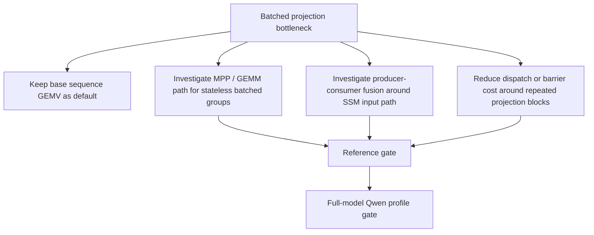

## Current Q3 Prefill Smoke

Latest focused Qwen3.5 Q3 smoke benchmark compares the enabled sequence prefill
path against the old sequential prompt-ingestion path in the same test run.
The run was intentionally short and should be treated as a regression smoke,
not a release-grade throughput claim.

| Sequence length | Sequence prefill | Sequential ingestion | Speedup |
|---:|---:|---:|---:|
| 16 | 206.76 ms | 322.11 ms | 1.56x |
| 64 | 769.38 ms | 1343.48 ms | 1.75x |
| 128 | 1510.55 ms | 2829.22 ms | 1.87x |

Kernel families confirmed in the Q3 plan:

| Kernel | Count |
|---|---:|
| `batched_gemv2_seq_q3_g64_f32s` | 24 |
| `batched_gemv3_seq_q3_g64_f32s` | 6 |
| `batched_gemv4_seq_q3_g64_f32s` | 18 |
| `gemv_seq_q3_g64_f32s` | 48 |

The remaining single Q3 sequence GEMV entries are dependent projections, not
missed sibling batches:

| Projection role | Count |
|---|---:|
| `linear_attn.out_proj` | 18 |
| `mlp.down_proj` | 24 |
| `self_attn.o_proj` | 6 |

This closes the current BatchedProjection routing gap for Q3 sequence prefill.
The next Q3 speed target is the single-projection kernel/fusion path rather
than additional sibling batching.

A Q3 single sequence tile4 kernel was added and reference-tested, then tried as
the production routing for the single projection entries. It stayed
decode-equivalent but did not improve the Qwen3.5 Q3 smoke profile:

| Sequence length | Base sequence prefill | Tile4 sequence prefill | Decision |
|---:|---:|---:|---|
| 16 | 206.76 ms | 207.48 ms | keep base |
| 64 | 769.38 ms | 773.49 ms | keep base |
| 128 | 1510.55 ms | 1523.47 ms | keep base |

The tile4 kernel remains in the generator as a tested experiment, but planner
routing stays on the base Q3 sequence GEMV path.

## Prefill Profile Harness

The profiling path is now shared instead of Qwen-specific. `MetalPrefillProfileHarness`
records both step-level and pass-level prefill timing with:

| Field group | Contents |
|---|---|
| Timing | GPU feedback time and wall-clock submit+wait time |
| Dispatch shape | grid, threadgroup size, threadgroup memory, estimated dispatch count |
| Routing | kernel name, category, mode, layer index, entry index, weight tensor name |
| Binding size | buffer binding count, inline constant bytes, unique bound buffer bytes |
| Artifacts | JSON plus raw, category, kernel, layer, and weight-role CSVs under `.test-artifacts/prefill-profile/` |

The focused Qwen profile test writes one step profile and one pass profile per
sequence length. The artifacts are diagnostic evidence only; performance claims
still require a correctness-green run for the same model path.

The aggregate CSVs are generated by the shared writer, so every profile run has
the same post-processing contract:

| Artifact suffix | Purpose |
|---|---|
| `.csv` | Raw per-entry profile records |
| `-categories.csv` | Category share without hand aggregation |
| `-kernels.csv` | Kernel-family totals for scaling and dispatch-count checks |
| `-layers.csv` | Layer/category totals for block-level fusion triage |
| `-weights.csv` | Weight-role totals such as `mlp.down_proj` and `linear_attn.out_proj` |
| `-recurrent-windows.csv` | Linear-attention recurrent-block fusion admission windows |

Layer aggregation uses explicit `layerIndex` metadata when available and falls
back to `layers.N` parsed from `weightTensorName`. Batched projection steps
store their participating tensor names as a semicolon-separated group, and
weight-role aggregation summarizes them with `+`. This keeps sibling batches
visible in the profile instead of hiding them in an unlabeled projection bucket.

Latest Qwen artifact-generation smoke (2026-05-12, default route) produced:

| Sequence length | Total prefill time | Projection share | SSM share | Artifact set |
|---:|---:|---:|---:|---|
| 16 | 102.734 ms | 75.0% | 20.0% | step + pass aggregate CSVs |
| 64 | 162.248 ms | 76.4% | 21.5% | step + pass aggregate CSVs |
| 128 | 318.643 ms | 76.2% | 21.8% | step + pass aggregate CSVs |

The seqLen 128 weight-role aggregate now exposes all major projection groups:

| Weight role | Count | Total time | Notes |
|---|---:|---:|---|
| `mlp.gate_proj+mlp.up_proj` | 24 | 86.707 ms | batched MLP input projections |
| `linear_attn.in_proj_qkv+linear_attn.in_proj_z+linear_attn.in_proj_b+linear_attn.in_proj_a` | 18 | 75.093 ms | batched SSM input projections |
| `mlp.down_proj` | 24 | 40.827 ms | dependent output projection |
| `linear_attn.out_proj` | 18 | 17.334 ms | dependent output projection |
| `self_attn.q_proj+self_attn.k_proj+self_attn.v_proj` | 6 | 15.304 ms | batched attention projections |
| `self_attn.o_proj` | 6 | 5.832 ms | dependent output projection |

The remaining unlabeled projection bucket is now the single output-head dispatch
(`gemv_bf16_f32s`, 1.586 ms at seqLen 128), not a hidden group of layer
projections.

## M1 Outcome

Tile4 sequence GEMV is now available and tested, but it is not selected by the
production planner. The profile showed it reduces grid height but loses enough
occupancy/locality that Qwen prefill regresses. This keeps the codebase honest:
correctness assets are retained, but runtime does not claim or ship a slower
path.

## M2 Status (2026-05-09)

Phase 1 + Phase 2 of the prefill speed plan are confirmed:

| Phase | Confirmed | Evidence |
|---|---|---|
| Phase 1 profile re-run | Yes | `Qwen35PrefillProfileTests` 2 runs, projection 75.8-76.4% |
| Phase 2 dependent-projection judgment | Yes | All 48 single GEMV entries are output projections (24 down + 18 ssm_out + 6 o) |
| Phase 4 reference equivalence (BF16 single tile2) | Yes | `BF16 tile2 single sequence GEMV matches repeated decode GEMV` passes |
| Phase 4 reference equivalence (BF16 single tile4) | Yes | `BF16 tiled single sequence GEMV matches repeated decode GEMV` passes |
| Phase 5 routing decision (tile2 / tile4) | Yes | tile4 already rejected at 2026-05-07; tile2 stays feature-flagged because real-shape Qwen3.5 profile was noise/slower |

The base sequence GEMV kernel uses one threadgroup per `(rowGroup, token)` pair
with `tileElements = 256` input staging. The tile2 kernel halves grid height by
covering 2 tokens per threadgroup, sharing input staging across the two tokens.
It is implemented and reference-equivalent, but the real Qwen3.5 dependent
projection shapes did not benefit.

| Sequence length | Baseline | Tile2 flag enabled | Delta | Decision |
|---:|---:|---:|---:|---|
| 16 | 44.572 ms | 44.768 ms | +0.44% | noise |
| 64 | 158.280 ms | 160.643 ms | +1.49% | slower |
| 128 | 314.697 ms | 317.498 ms | +0.89% | noise |

The planner keeps tile2 behind `SWIFTLM_PREFILL_BF16_SINGLE_TILE2=1`. The
structural `SequenceGEMVKernelSelection` refactor remains because it makes
future tiled experiments derive grid height, threadgroup shape, diagnostics,
and sequence-length policy from one explicit tile descriptor instead of parsing
kernel-name suffixes. Production default routing stays on the base sequence
GEMV path and no speed claim is made for tile2.

M2 is complete as a measurement and correctness harness, but not as a faster
production route. The next milestone should not try more global sequence tiles.
It should split the single-projection problem by role:

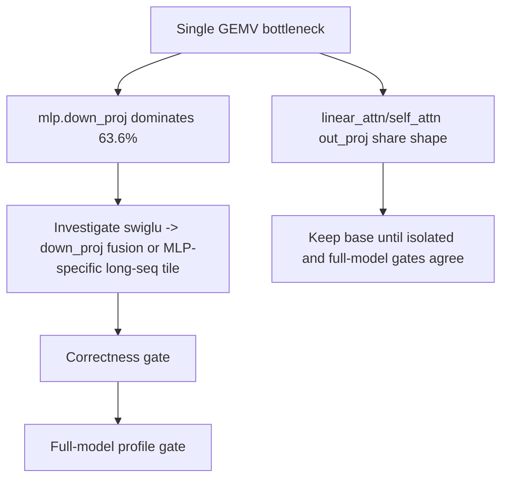

## External Implementation Review: llama.cpp / ggml Metal (2026-05-12)

This work is no longer guided only by local kernel experiments. llama.cpp /
ggml Metal is treated as an external baseline to beat, not as the target
architecture. Ollama delegates model execution to llama.cpp-family backends
rather than providing the relevant Metal prefill kernels itself, so the useful
comparison point is ggml Metal's prompt-processing and hybrid-kernel design.

Reviewed source snapshot:

| Source | Commit / file |
|---|---|
| llama.cpp repository | `ef93e98d01d7c04dae1ebb145793a5e397a57133` |
| Prompt batch execution | `src/llama-context.cpp`, `src/llama-batch.cpp`, `src/llama-graph.cpp` |
| Metal matmul routing | `ggml/src/ggml-metal/ggml-metal-ops.cpp`, `ggml/src/ggml-metal/ggml-metal.metal` |
| Hybrid Qwen3Next graph | `src/models/qwen3next.cpp` |
| SSM / gated delta kernels | `ggml/src/ggml-metal/ggml-metal-ops.cpp`, `ggml/src/ggml-metal/ggml-metal.metal` |

Key comparison:

| Area | llama.cpp / ggml Metal observation | swift-lm implication for a faster design |
|---|---|---|
| Prompt execution unit | `llama_decode` accepts many tokens, splits them into `ubatch`, and computes a graph with `batched = ubatch.n_tokens > 1` | Prefill should stay a sequence graph, not token-by-token decode, but correctness gates must own state updates |
| Graph reuse | `process_ubatch` reuses graph topology when the ubatch shape and memory context match | swift-lm should go further by compiling a static dispatch plan with stable argument layout for known model shapes |
| Matmul selection | `GGML_OP_MUL_MAT` routes small `ne11` batches to extended mat-vec, larger prompt batches to simdgroup matrix-matrix | The next projection route should be shape-gated GEMM/MPP, but only as an input to compiler-level fusion |
| Hybrid Qwen3Next | Q/K/V/Z and beta/alpha are projected as sequence tensors, convolution state is concatenated with prompt tokens, then state cache is updated from the tail | swift-lm can specialize this exact family and fuse across graph boundaries that ggml keeps as generic ops |
| SSM convolution | ggml uses a batched SSM conv kernel when token count is greater than one | swift-lm should make conv batching a sub-kernel inside a larger recurrent-block fusion, not stop at a standalone conv dispatch |
| Gated delta recurrence | ggml has a dedicated `kernel_gated_delta_net_*` that loops over sequence tokens inside the kernel and emits both output and final state | M4 should target a fused recurrent block kernel with reference probes, reducing intermediate traffic and dispatch count beyond ggml |
| Quantized matmul | ggml has both matrix-matrix and matrix-vector families for many quantized block types | Q3 sequence support in swift-lm should remain reference-backed; Q4/Q8 should aim at packed fused projection families, not generic parity |

Design consequence:

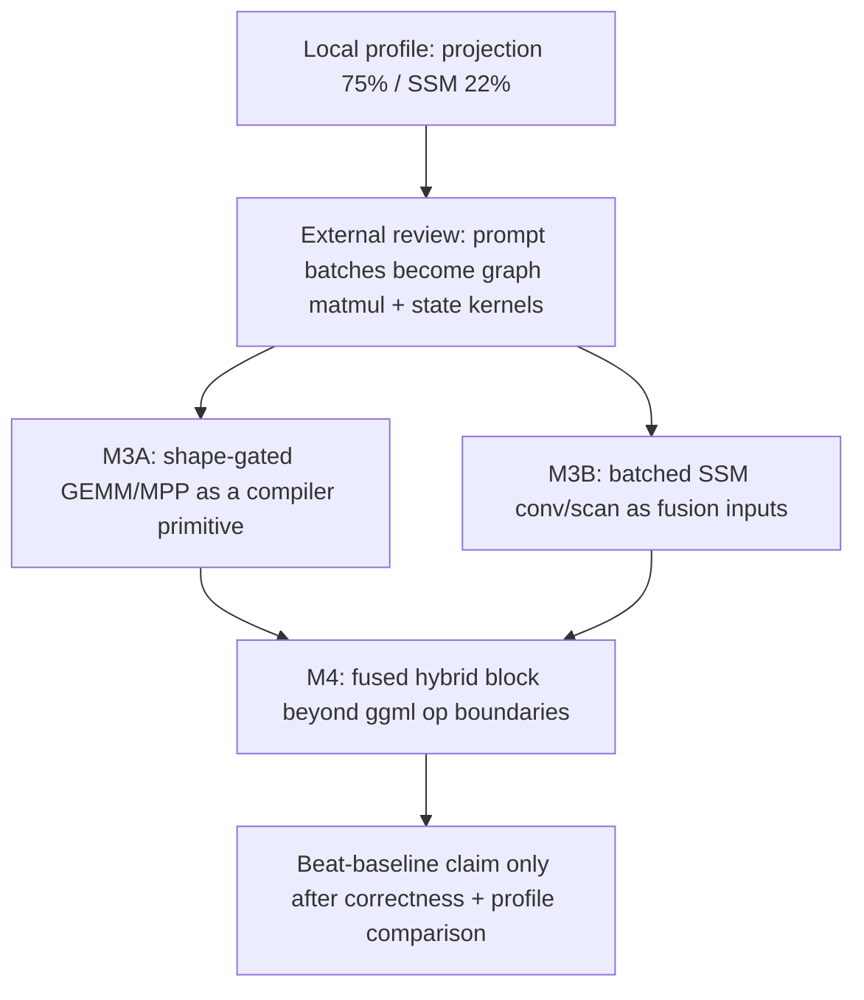

The rejected tile2/tile4 and fused-down experiments are still useful because
they proved that the bottleneck is not a missing sibling batch. The external
review changes the next bet: do not clone ggml's generic graph executor.
Instead, use its successful shape decisions as lower-bound evidence, then use
swift-lm's model-family compiler to specialize and fuse across op boundaries
that a generic runtime cannot safely assume. The reference harness remains the
admission gate that prevents the state drift that broke earlier MPP attempts.

Next implementation order:

| Step | Scope | Admission gate |
|---|---|---|
| M3A.1 | Add a reference-equivalent BF16 GEMM/MPP compiler primitive for stateless attention/MLP input projections | Fragment CPU reference, Qwen reference trace, full-model profile |
| M3A.2 | Route GEMM/MPP only where it is a building block for future fusion, not as a generic replacement for all GEMV | Same gates plus role-specific profile win |
| M3B.1 | Prototype batched SSM conv with exact final conv-state extraction as a reusable fused-block subroutine | Conv-state reference comparison across multiple prompt lengths |
| M3B.2 | Prototype recurrent block scan/gated-delta fusion behind an explicit experiment flag | Recurrent-state and decode0 reference comparison |
| M4 | Fuse a complete Qwen hybrid recurrent block where projections, conv, recurrence, norm/gate, and output projection can share layout and reduce intermediate memory traffic | Block-level reference dump plus end-to-end token trace plus baseline comparison |

## Deep External Baseline Investigation (2026-05-12)

The goal of the external review is to identify baseline techniques to beat, not
to port another runtime. The useful comparison set is llama.cpp/ggml Metal for
Ollama-style execution, MLX/MLX-LM for Apple Silicon kernels and Qwen-family
model code, and MLC-LLM for compiler-pass fusion patterns.

Reviewed snapshots:

| Project | Snapshot | Files reviewed | Useful signal |
|---|---|---|---|
| llama.cpp / ggml Metal | `ef93e98d01d7c04dae1ebb145793a5e397a57133` | `src/llama-context.cpp`, `src/llama-batch.cpp`, `src/models/qwen3next.cpp`, `ggml/src/ggml-metal/ggml-metal-ops.cpp`, `ggml/src/ggml-metal/ggml-metal.metal` | Prompt batches are graph-level work; Metal routes matmul by shape and has explicit SSM / gated-delta kernels |
| MLX | `8f4099d8243dfbc814b07ca6b4606196f0c490ce` | `mlx/backend/metal/matmul.cpp`, `mlx/backend/metal/scaled_dot_product_attention.cpp`, `mlx/backend/metal/kernels/steel/gemm/gemm.h`, `mlx/compile.cpp` | Steel GEMM uses simdgroup matrix tiles; graph compile fuses generic fusable tapes |
| MLX-LM | `df1d3f3c9a7aae402dcbb8f41d4c36bcc13a50ae` | `mlx_lm/generate.py`, `mlx_lm/models/qwen3_5.py`, `mlx_lm/models/qwen3_next.py`, `mlx_lm/models/gated_delta.py` | Qwen prefill is chunked; gated delta has a sequence Metal kernel; Qwen3Next reduces projection groups to `qkvz` and `ba` |
| MLC-LLM | `2008fe8343e1f40ef89ee57b9287aebcf1b86c98` | `python/mlc_llm/compiler_pass/fuse_dequantize_matmul_ewise.py`, `python/mlc_llm/compiler_pass/fuse_ft_dequantize_matmul_epilogue.py`, `cpp/serve/engine_actions/batch_prefill_base.cc` | Dequantize, matmul, and epilogue fusion is a compiler-pass concern; serving prefill is chunked and scheduled |

Current swift-lm profile evidence still points to projection and recurrent
block traffic, not attention:

| Qwen3.5 BF16 seqLen 128 profile | Steps | Time | Share |
|---|---:|---:|---:|
| Projection | 97 | 242.683 ms | 76.2% |
| SSM recurrence | 18 | 69.381 ms | 21.8% |
| Attention | 6 | 3.943 ms | 1.2% |
| Other / elementwise / structural | 166 | 2.637 ms | 0.8% |

Projection time by semantic role:

| Role | Dispatches | Time | Interpretation |
|---|---:|---:|---|
| `mlp.gate_proj+mlp.up_proj` | 24 | 86.707 ms | Already sibling-batched; remaining cost is large memory-bound sequence projection |
| `linear_attn.in_proj_qkv+linear_attn.in_proj_z+linear_attn.in_proj_b+linear_attn.in_proj_a` | 18 | 75.093 ms | Main recurrent-block admission point; external Qwen3Next suggests this grouping deserves a family-level contract |
| `ssm_recurrence_seq_bf16_f32` | 18 | 69.381 ms | Stateful sequence loop is correct but still standalone, with recurrent state and activation intermediates crossing memory |
| `mlp.down_proj` | 24 | 40.827 ms | Producer-consumer fusion can help only if SwiGLU tiles are reused across enough output rows |
| `linear_attn.out_proj` | 18 | 17.334 ms | Dependent projection; best candidate for block-level epilogue fusion after recurrence |
| `self_attn.q_proj+k_proj+v_proj` | 6 | 15.304 ms | Attention is already not the primary bottleneck for this model/length |

The fastest-design direction is therefore not a generic "replace GEMV with
GEMM" change. The rejected BF16 MPP experiment showed that accumulation order
and compact-layout assumptions can break the Qwen trace. The next design must
use external implementations as lower-bound evidence, then specialize beyond
their generic graph boundaries:

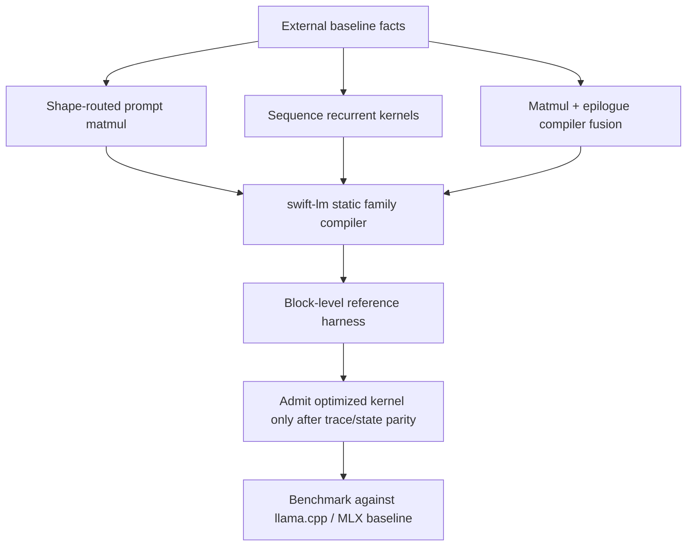

Gaps found during the review:

| Gap | Why it matters | Required fix before optimization |
|---|---|---|
| Projection profile lacks byte-traffic accounting | Dispatch time alone cannot distinguish compute throughput from scratch materialization and redundant reads | Extend the profile artifact with estimated input, weight, output, and scratch bytes per step and per semantic block |
| Reference harness is layer-oriented, not block-stage-oriented | MPP or block fusion can be correct at final logits while hiding state-local drift until later prompts | Add Qwen linear-attention block snapshots for projected `qkv`, `z`, `beta`, `alpha`, conv output, recurrent output, final recurrent state, and out projection |
| MPP admission is still a kernel-family decision | The forced MPP route failed because layout and numerical contract were not owned by the consuming block | Make MPP a candidate inside a block contract, not a global projection replacement |
| Current SSM sequence kernel already fuses conv, recurrence, RMS, and gate, but not surrounding projections | External gated-delta kernels show the recurrence loop belongs in one Metal kernel; swift-lm can go further by eliminating the projection/recurrent/out-proj memory round trips | Design a Qwen recurrent-block kernel family where projections feed recurrence through compiler-owned layout |
| MLX-LM Qwen3.5 keeps `in_proj_qkv`, `in_proj_z`, `in_proj_b`, and `in_proj_a` separate while Qwen3Next groups `qkvz` and `ba` | Qwen3Next is a design hint, not proof that Qwen3.5 weights can be repacked without changing semantics | Add a model-family lowering audit before changing weight packing; do not assume Qwen3.5 and Qwen3Next are interchangeable |

Decision: the next production-grade milestone is not another tile variant. It is
a block-profile and block-reference harness, followed by a Qwen recurrent-block
prototype. A single-kernel GEMM microbenchmark is only useful if it feeds this
block-level admission path.

Next implementation order:

| Step | Deliverable | Gate |
|---|---|---|
| M3C.1 | Done: extend prefill profile artifacts with per-step byte estimates and per-block rollups | `PrefillProfileHarnessTests` plus Qwen profile artifact sanity check |
| M3C.2 | Done for selected blocks: add Qwen recurrent-block reference dump and Swift comparison for boundary tensors | Focused `Qwen35ReferenceComparisonTests` case is green for every ordinal listed in `ref.meta.linear_block_ordinals`; conv+SiLU is materialized only when `SWIFTLM_PREFILL_DEBUG_SSM_CONV=1` is enabled by the reference harness |
| M3C.3 | Done as opt-in experiment: prewrite decayed recurrent state inside the current `ssm_recurrence_seq_bf16_f32` contract | Isolated sequence equivalence, Qwen reference gate, and SSM microbenchmark |
| M3C.4 | Done / rejected for default: same-session full-model Qwen profile did not beat baseline at seqLen 64/128 | Correctness stayed green, but benchmark gate did not justify promotion |
| M3D.1 | Done: add recurrent-block fusion window scanner | Synthetic contract test plus Qwen profile assertion identify all 18 linear-attention windows |

### M3C.1 Profile Artifact Status (2026-05-13)

M3C.1 is complete. The prefill profile artifact schema is now v2 and records
estimated read bytes, write bytes, total bytes, and semantic block aggregates.
The estimates are shape-derived for projection and SSM recurrence kernels, and
fall back to binding-size accounting for kernels without a stable semantic
traffic contract.

Artifact flow:

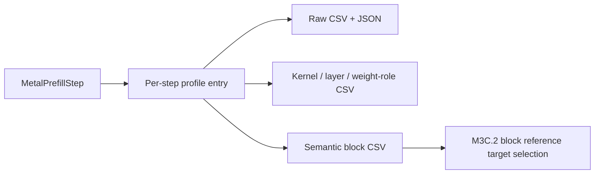

Latest Qwen3.5 BF16 seqLen 128 block profile signal:

| Semantic view | Evidence | Interpretation |
|---|---:|---|
| Projection byte estimates | `batched_gemv2_seq_bf16_f32s` totals 452,984,832 bytes; `gemv_seq_bf16_f32s` totals 371,195,904 bytes | Projection estimates now come from kernel dimensions instead of full resident buffer sizes |
| Linear-attention recurrence | 18 `ssm_recurrence_seq_bf16_f32` entries total about 5.34 GB estimated traffic | Recurrent block fusion remains the next high-impact target |
| Block CSV artifact | `qwen35-prefill-steps-seq128-blocks.csv` generated | M3C.2 can choose block-stage reference tensors from profile evidence instead of kernel-name guessing |

### M3C.2 Block Reference Status (2026-05-13)

M3C.2 now has a selected-block-stage reference gate for Qwen3.5 BF16 prefill.
The HF dump schema is v5 and accepts `--linear-block-ordinals`; the Swift test
reads `ref.meta.linear_block_ordinals` and verifies every selected ordinal. The
default checked contract captures ordinals 0, 9, and 17, covering early, middle,
and late recurrent blocks without dumping every layer boundary.

Block boundary gate:

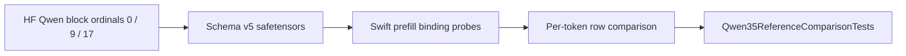

Current coverage:

| Boundary | HF tensor | Metal probe source | Status |
|---|---|---|---|
| `in_proj_qkv` output | `projected_qkv` | batched projection binding 5 | Pass |
| `in_proj_z` output | `projected_z` | batched projection binding 6 | Pass |
| `in_proj_b` output | `projected_beta` | batched projection binding 7 | Pass |
| `in_proj_a` output | `projected_alpha` | batched projection binding 8 | Pass |
| conv+SiLU output | `conv_silu` | SSM recurrence debug binding 18 | Pass |
| gated recurrent output | `gated_recurrent_output` | SSM recurrence binding 10 | Pass |
| linear-attention output projection | `out_projection` | output projection binding 2 | Pass |
| final conv / recurrent state | existing cache tensors | existing state comparison gate | Pass |

### M3C.3 SSM Prewrite-Decay Experiment (2026-05-13)

M3C.3 adds an opt-in recurrence variant that materializes the decayed recurrent
state during the first recurrence pass, then reuses that materialized value for
the final state update. This keeps the public kernel contract unchanged:
`projectedQKV`, `projectedZ`, `projectedBeta`, `projectedAlpha`, conv state,
recurrent state, and output bindings are identical to the base sequence kernel.

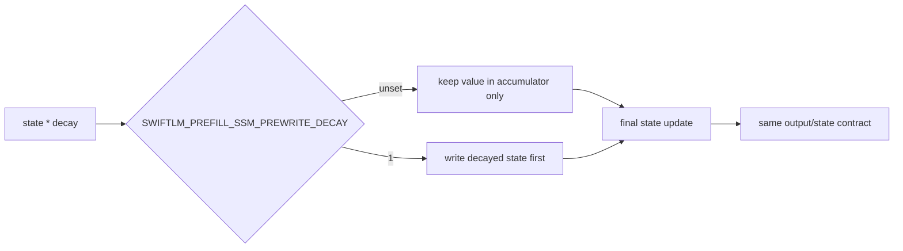

| Property | Base sequence SSM | Prewrite-decay opt-in |
|---|---|---|
| Kernel | `ssm_recurrence_seq_bf16_f32` | `ssm_recurrence_seq_bf16_f32_prewrite_decay` |
| Routing flag | none | `SWIFTLM_PREFILL_SSM_PREWRITE_DECAY=1` |
| Production default | enabled | disabled |
| Combination with shared-RMS | allowed by default route | explicitly rejected when both flags are set |

Correctness evidence is green:

| Gate | Result |
|---|---|
| `SSMRecurrenceSequenceEquivalenceTests` | prewrite-decay output, recurrent state, and conv state match repeated decode recurrence |
| `Qwen35ReferenceComparisonTests` with `SWIFTLM_PREFILL_SSM_PREWRITE_DECAY=1` | pass; selected block boundaries, prefill output/state/KV, and decode0 gates remain green |
| `MetalSourceGeneratorTests/ssmRecurrence` | pass; generated kernel names and prewrite source shape are covered |

The isolated SSM recurrence benchmark shows this variant is not a default
promotion candidate. It improves some short/mid sequence cases but regresses
the long prompt case that currently matters most for prefill:

| Sequence length | Best base | Best prewrite-decay | Decision |
|---:|---:|---:|---|
| 16 | 763.8 us | 522.5 us | favorable |
| 64 | 2244.8 us | 2010.3 us | favorable |
| 128 | 3737.5 us | 3850.9 us | reject default |

Decision: keep `SWIFTLM_PREFILL_SSM_PREWRITE_DECAY=1` as a correctness-gated
experiment only. The next useful recurrence work should target larger structural
savings, especially a scan/chunk formulation or recurrent-block fusion that
eliminates projection/recurrence/out-projection memory traffic.

### M3C.4 Prewrite-Decay Promotion Gate (2026-05-13)

M3C.4 is closed. The opt-in route fired in the full Qwen3.5 prefill plan, but
same-session profile evidence does not support default promotion.

| Sequence length | Baseline | Prewrite-decay | Delta | Decision |
|---:|---:|---:|---:|---|
| 16 | 75.826 ms | 56.833 ms | -25.0% | favorable but noisy |
| 64 | 158.707 ms | 158.740 ms | +0.0% | no promotion |
| 128 | 311.184 ms | 311.769 ms | +0.2% | reject default |

The prewrite plan correctly replaces all 18 `ssm_recurrence_seq_bf16_f32`
dispatches with `ssm_recurrence_seq_bf16_f32_prewrite_decay`, so this is not a
routing failure. The experiment is correctness-gated and useful for future
kernel-shape comparison, but it does not change production routing.

### M3D.1 Recurrent-Block Fusion Admission Windows (2026-05-13)

M3D.1 adds a structural scanner for linear-attention recurrent-block windows.
The scanner uses semantic weight roles and recurrence kernels, not suffix-only
kernel-name matching, to identify the dispatch window that future block fusion
is allowed to replace.

The contract now exists at two levels:

| Level | Input | Purpose |
|---|---|---|
| Admission | `[DispatchEntry]` before prefill step lowering | Proves the compiler can identify the replaceable IR/fragment window before any runtime routing is added |
| Prototype planning | Admission window plus fragment shapes | Rejects unsafe single-dispatch routes before kernel work begins |
| Evidence | `MetalPrefillProfile.Entry` after step lowering | Proves the emitted plan still exposes the same block shape and records the measured window as artifacts |


Admission contract:

| Field | Requirement |
|---|---|
| Input projection | Batched projection whose tensor group contains `linear_attn.in_proj_qkv`, `in_proj_z`, `in_proj_b`, and `in_proj_a` |
| Recurrence | `ssm_recurrence_seq*` step before the matching output projection |
| Output projection | `linear_attn.out_proj` for the same `layers.N` tensor group |
| Bridge steps | Preserved explicitly as step indices; the current Qwen path has a round step between recurrence and out projection |
| Rejection | Incomplete windows or cross-layer output projections are not paired |

Single-dispatch fusion decision:

| Shape | Decision | Reason |
|---|---|---|
| Single recurrent group with matching projection dimensions | Eligible for a one-dispatch prototype |
| Multi-group recurrent block such as Qwen | Reject single-dispatch fusion | SSM recurrence is partitioned by group, while `linear_attn.out_proj` consumes all recurrent heads; replacing the whole block with one dispatch would require unsafe cross-group fan-in without a grid-wide synchronization point |

Two-stage fusion decision:


| Shape | Decision | Numerical contract |
|---|---|---|
| Multi-group recurrent block with matching projection dimensions | Candidate | `referenceGated`; scratch-compatible partition partial sums change the output-projection reduction association |
| Single recurrent group | Reject two-stage | single-dispatch path is structurally preferable |

M3D.2 starts the two-stage kernel work from the safer second stage:
`recurrent_block_partial_reduce` reduces a per-token, per-partition partial-hidden
buffer into the final hidden row. This kernel does not route in production yet;
it exists so the partial buffer layout and padded-stride semantics are fixed
before the harder SSM+partial-GEMV stage is attempted.

The source catalog now emits `recurrent_block_partial_reduce_seq_f32` whenever a
sequence SSM recurrence is present, so future opt-in routing can fail with an
explicit contract error instead of a missing-pipeline surprise.

M3D.3 adds the first-stage partial projection kernel:
`recurrent_block_partial_projection_seq_bf16_f32` computes one partial hidden
row per `(token, partition, output row)` from a contiguous recurrent-output
slice and the matching `linear_attn.out_proj` weight slice. The standalone harness
runs partial projection followed by partial reduce and compares the full hidden
row against a CPU reference.

The two-stage plan uses existing scratch storage: recurrence output remains in
slot 0, and partial hidden rows occupy slots `1..<1+partialPartitionCount`.
The runtime chooses the largest divisor of the recurrent group count that fits
the available scratch slots. Qwen's 16 recurrent groups therefore route as four
contiguous partial partitions and consume the existing five prefill scratch
slots without a new runtime buffer.

The partial buffer layout is slot-major so production routing can bind the
existing prefill scratch buffer without reshaping:
`partial[partition * maximumSequenceLength * slotDimension + token * slotDimension + row]`.

Validation:

| Gate | Result |
|---|---|
| `swift test --filter RecurrentBlockFusionWindowTests` | Pass; detects complete dispatch-entry and profile windows, rejects incomplete/cross-layer windows, rejects Qwen-style multi-group single-dispatch fusion, and creates a reference-gated two-stage plan |
| `swift test --filter RecurrentBlockFusionKernelTests` | Pass; stage1 partial projection plus stage2 partial reduce matches CPU reference with padded input, partial, and output strides |
| `swift test --filter Qwen35PrefillProfileTests` with `ENABLE_METAL_PROBES=1` | Pass; seqLen 128 profile detects 18 recurrent-block windows, first `3..<7`, last `263..<267` |

This is intentionally not a speed change. It is the routing precondition for
the next recurrent-block kernel prototype: any future fused route should prove
that it replaces exactly these windows before correctness and benchmark gates
are considered.

The profile writer now persists the same admission result as
`*-recurrent-windows.csv`, so future analysis and routing experiments can
consume the window list without scraping test logs.

M3D.4 hardens that profile window contract for the opt-in partial output route.
The logical `linear_attn.out_proj` replacement window is now allowed to span the
two output stages and the storage round between them:


| Route | Window output step indices | Decision |
|---|---|---|
| Default out projection | final `gemv_seq_bf16_f32s` only | unchanged |
| Opt-in partial route | `recurrent_block_partial_projection_seq_bf16_f32`; `recurrent_block_partial_reduce_seq_f32` | tracked as one logical output projection |

Validation with `SWIFTLM_PREFILL_BF16_RECURRENT_BLOCK_PARTIAL=1` detects all 18
Qwen3.5 linear-attention windows at seqLen 128. The first window is `3..<9` and
the last is `314..<320`, reflecting the extra partial projection, partial round,
and partial reduce steps. This is still not a production speed win; it is a
harness fix so future block-fusion work measures the real replaceable window.

The same artifact now includes timing columns for each replaceable window:

| Column group | Meaning |
|---|---|
| `windowEntryCount`, `totalGpuMicroseconds` | Whole replaceable window cost |
| `inputProjectionGpuMicroseconds` | Batched `linear_attn.in_proj_*` cost |
| `recurrenceGpuMicroseconds` | SSM recurrence cost |
| `bridgeGpuMicroseconds` | Rounds and other non-core steps inside the window |
| `outputProjectionGpuMicroseconds` | Final output projection cost, including partial projection and reduce when routed |
| `estimatedTotalBytes` | Estimated traffic for the window entries |

## Fused SwiGLU Down Projection Experiment (2026-05-10)

The first role-specific producer-consumer fusion targets only Qwen/LFM-style
SwiGLU MLP blocks:

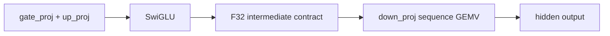

Routing is controlled by `SWIFTLM_PREFILL_BF16_FUSED_MLP_DOWN=1`. Production
default remains off.

| Gate | Requirement |
|---|---|
| Fragment pair | `ElementwiseFragment(.swiglu)` followed by `LinearFragment(field: "down_proj")` |
| Scope | Same `compositeID` and same `layerIndex` |
| Shape | `swiglu.count == down_proj.inputDimension`, `down_proj.outputDimension <= hiddenSize` |
| Precision | BF16 dense row-major weight only |
| Quantization | Q3/Q4/Q8 excluded |
| Mode | Sequence prefill `.batch` only |
| Failure mode | Missing fused kernel is an explicit `kernelNotFound`, not a silent fallback |

Current routing effect from the opt-in Qwen profile:

| Metric | Default | Fused flag enabled |
|---|---:|---:|
| Total prefill steps | 293 | 269 |
| `swiglu_seq_f32` | 24 | 0 |
| `gemv_seq_bf16_f32s` | 48 | 24 |
| `mlp_fused_swiglu_down_seq_bf16_f32s` | 0 | 24 |

The first local rerun confirmed routing and correctness but rejected the
original 2-row scheduling. The feature flag reaches the test runner when run
through `xcrun xctest`; passing the environment only to `xcodebuild` is not
reliable for this gate.

| Sequence length | Default route | Fused rows=2 | Delta | Decision |
|---:|---:|---:|---:|---|
| 16 | 44.373 ms | 44.658 ms | +0.6% | noise / no promotion |
| 64 | 158.926 ms | 211.582 ms | +33.1% | reject as default |
| 128 | 308.411 ms | 479.223 ms | +55.4% | reject as default |

At seqLen 128, the fused plan reports 24
`mlp_fused_swiglu_down_seq_bf16_f32s` dispatches and removes all 24
`swiglu_seq_f32` dispatches, but the fused kernel consumes 80.747 ms. This
more than outweighs the dispatch-count reduction. The result is a useful
correctness-gated experiment, not a production speed path.

The root cause is repeated SwiGLU tile computation. With 2 rows per
threadgroup, each `(sequence, output-row-group)` threadgroup recomputes
`silu(gate) * up`; this happens 256 times per token for a 512-row down
projection. The rows=8 variant amortizes the same tile over 8 output rows and
reduces the recomputation factor to 64 groups per token without changing the
per-row SIMD reduction contract.

Same-run profile after switching the opt-in fused route to rows=8:

| Sequence length | Baseline flag off | Fused rows=8 | Delta | Decision |
|---:|---:|---:|---:|---|
| 16 | 68.705 ms | 42.615 ms | -38.0% | noisy but favorable |
| 64 | 158.646 ms | 156.447 ms | -1.4% | favorable |
| 128 | 312.070 ms | 306.569 ms | -1.8% | favorable |

At seqLen 128, the rows=8 fused kernel reports 35.997 ms for 24 fused
dispatches versus 39.870 ms for the 24 baseline `mlp.down_proj` GEMV dispatches
plus 0.198 ms for 24 baseline `swiglu_seq_f32` dispatches. This is now a
plausible opt-in speed path, but the margin is small and must be repeated
before default promotion.

The standalone fused rows-per-threadgroup microbenchmark is now available in
`SequenceGEMVMicrobenchmarkTests`. It is intentionally narrower than the
full-model profile: it uses shared buffers and isolates only the fused
`mlp.down_proj` shape, so it is a direction-finding harness rather than a
promotion gate.

| Sequence length | rows=2 | rows=4 | rows=8 | Standalone result |
|---:|---:|---:|---:|---|
| 16 | 1292.3 us | 1064.3 us | 888.5 us | rows=8 fastest |
| 64 | 2008.5 us | 2217.8 us | 2563.2 us | rows=2 fastest |
| 128 | 2596.0 us | 3066.0 us | 3293.9 us | rows=2 fastest |

This contradicts the same-run full-model profile where rows=8 is favorable at
seqLen 64/128. The likely reason is that the standalone harness does not
reproduce full-model residency, cache pressure, surrounding barriers, and
private-buffer behavior. Therefore the standalone microbenchmark is useful for
kernel-shape exploration, but full-model Qwen profile remains the route
promotion authority.

Important numerical note: the fused kernel now keeps the same F32 intermediate
contract as the current materialized two-kernel path. It removes the scratch
round-trip for the SwiGLU output, but it does not change the precision of the
down-projection input. `FusedSwigluDownEquivalenceTests` directly compares the
fused kernel against the unfused path with zero tolerance.

The repeated SwiftPM/probe full-model run now closes the rows=4 comparison.
SwiftPM was used because `ENABLE_METAL_PROBES=1` is wired into `Package.swift`
and avoids rebuilding the Xcode test bundle under the 120-second timeout. The
artifacts and logs are under `.test-artifacts/prefill-row-profiles/`.

| Sequence length | Baseline | Fused rows=2 | Fused rows=4 | Fused rows=8 | Current decision |
|---:|---:|---:|---:|---:|---|
| 16 | 43.383 ms | 44.967 ms | 44.379 ms | 42.729 ms | rows=8 best |
| 64 | 159.741 ms | 166.295 ms | 161.185 ms | 157.677 ms | rows=8 best |
| 128 | 315.186 ms | 328.924 ms | 311.268 ms | 305.918 ms | rows=8 best |

Rows=8 also passed the Qwen reference comparison in the same SwiftPM/probe
environment: 4/4 checks green, including prefill final hidden/logits, prefill
state, KV cache, and decode step zero. This makes rows=8 the only fused MLP
candidate worth carrying forward. It should still remain opt-in until the
same result is reproduced through the release validation path.

Rows=8 was then reproduced through the Xcode release-validation path by
building with `OTHER_SWIFT_FLAGS='$(inherited) -DENABLE_METAL_PROBES'` and
injecting the fused-route environment into the `MetalCompilerTests` entry of
the xctestrun. This confirms the env-injected path works and the correctness
gate is green, but it does not justify default promotion.

| Sequence length | Xcode baseline | Xcode fused rows=8 | Delta | Promotion decision |
|---:|---:|---:|---:|---|
| 16 | 43.639 ms | 47.833 ms | +9.6% | reject default |
| 64 | 158.869 ms | 157.344 ms | -1.0% | favorable |
| 128 | 313.777 ms | 308.725 ms | -1.6% | favorable |

Next decision: keep rows=8 behind
`SWIFTLM_PREFILL_BF16_FUSED_MLP_DOWN=1 SWIFTLM_PREFILL_BF16_FUSED_MLP_DOWN_ROWS=8`
and do not promote it as a default Qwen route. The next speed design should
target a sequence-length-aware admission rule, a different short-sequence
schedule, or a lower-recompute fused kernel. Default promotion still requires
model-level correctness and a stable end-to-end prefill improvement across the
release-relevant sequence lengths.

### Runtime-gated rows=8 admission (2026-05-10)

The planner can now emit both the existing unfused MLP route and the rows=8
fused MLP route into the same prefill plan when all of these flags are present:

```text
SWIFTLM_PREFILL_BF16_FUSED_MLP_DOWN=1
SWIFTLM_PREFILL_BF16_FUSED_MLP_DOWN_ROWS=8
SWIFTLM_PREFILL_BF16_FUSED_MLP_DOWN_MIN_SEQUENCE_LENGTH=64
```

This is explicit runtime admission, not fallback. Each step carries a
`PrefillStepExecutionCondition`; the executor and profiler encode only the
steps admitted for the current sequence length. The synthesized storage
rounding steps inherit the same condition as their producer so inactive
branches do not leave extra rounding work in the active profile.

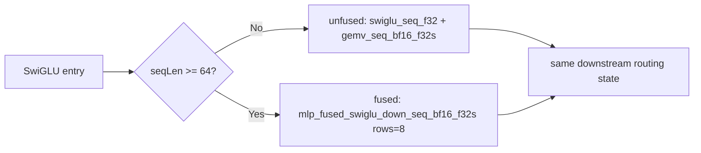

The same SwiftPM/probe validation run produced the expected active step counts:

| Sequence length | Active route | Active steps | Total prefill time | Notes |
|---:|---|---:|---:|---|
| 16 | unfused | 293 | 43.511 ms | protects the short-prompt case that regressed under unconditional rows=8 |
| 64 | fused rows=8 | 269 | 158.106 ms | removes 24 `swiglu_seq_f32` and 24 `mlp.down_proj` GEMV dispatches |
| 128 | fused rows=8 | 269 | 305.809 ms | long prompt uses the best observed fused route |

The raw plan has 341 steps because it contains both branches. Diagnostics and
profile summaries must therefore distinguish raw plan size from active steps.
The profile harness now reports active steps for the measured sequence length.

The same adaptive route was then validated through the Xcode release path by
injecting the environment into the xctestrun. Correctness remained green and
the active branch selection matched the contract, but the timing was not stable
enough for default promotion.

| Sequence length | Xcode adaptive min64 | Active steps | Active route | Baseline comparator | Decision |
|---:|---:|---:|---|---:|---|
| 16 | 68.220 ms | 293 | unfused | 43.639 ms | reject default; unfused active route still measured noisy/regressed in this run |
| 64 | 157.996 ms | 269 | fused rows=8 | 158.869 ms | favorable but marginal |
| 128 | 310.846 ms | 269 | fused rows=8 | 313.777 ms | favorable but marginal |

Current decision: keep the adaptive route opt-in. It is structurally better
than unconditional rows=8 because it avoids emitting fused work for short
prompts, but the Xcode release-path timing is not stable enough to make it a
production default. The next speed step should target a lower-recompute fused
kernel or a broader benchmark set before changing default routing.

### Rows-per-SIMD lower-recompute experiment (2026-05-10)

The next fused-shape experiment keeps the same per-output-row reduction
contract but lets one SIMD group compute two independent output rows. The
staged SwiGLU tile is then shared by two row accumulators, reducing activation
recompute without changing each row's accumulation order.

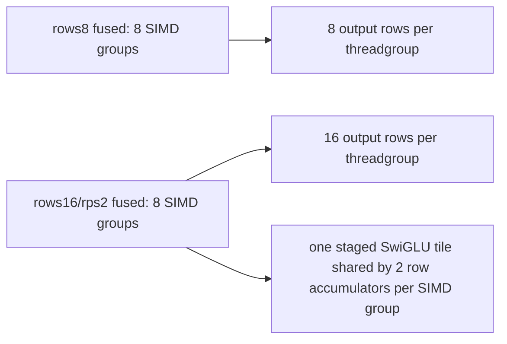

The generator and router support this only as an opt-in experiment:

```text
SWIFTLM_PREFILL_BF16_FUSED_MLP_DOWN=1
SWIFTLM_PREFILL_BF16_FUSED_MLP_DOWN_ROWS=16
SWIFTLM_PREFILL_BF16_FUSED_MLP_DOWN_ROWS_PER_SIMDGROUP=2
```

Correctness is green: the standalone equivalence test matches the unfused
`swiglu_seq_f32 + gemv_seq_bf16_f32s` path exactly, and Qwen reference
comparison passes 4/4 with the route enabled. The isolated microbench looked
promising for shorter sequences:

| Sequence length | rows8 avg | rows16/rps2 avg | Microbench decision |
|---:|---:|---:|---|
| 16 | 930.3 us | 670.6 us | favorable |
| 64 | 2235.5 us | 1906.1 us | favorable |
| 128 | 1941.3 us | 2467.8 us | reject for long prompt |

Full-model Qwen profile rejected the shape despite the microbench:

| Sequence length | Default unfused same session | rows16/rps2 fused | Decision |
|---:|---:|---:|---|
| 16 | 62.410 ms | 66.824 ms | slower |
| 64 | 168.373 ms | 216.839 ms | slower |
| 128 | 392.324 ms | 541.439 ms | slower |

Current decision: keep rps2 available only as an opt-in diagnostic. It proves
the correctness contract can support multiple rows per SIMD group, but the
full-model profile shows that register pressure or occupancy loss dominates
the saved SwiGLU recompute. Do not promote it without a new full-model profile
that beats rows8 and the unfused baseline in the same release-validation run.

## SSM Shared RMS Experiment (2026-05-10)

After the MLP fused routes failed to produce a stable default-speed win, the
next bottleneck examined was SSM recurrence. The Qwen profile consistently
shows 18 `ssm_recurrence_seq_bf16_f32` dispatches taking roughly 20-22% of
prefill time at seqLen 128.

The first safe SSM experiment targets only the RMS scale computation in phase
3. The default sequence kernel has every active thread in a head recompute the
same `totalNormSq` over `threadsPerHead` partials. The opt-in variant lets one
thread per head compute that scale in the same summation order, stores it in
threadgroup memory, and lets all threads reuse the cached scale.

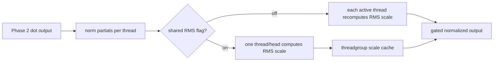

| Property | Default | Shared-RMS opt-in |
|---|---|---|
| Kernel | `ssm_recurrence_seq_bf16_f32` | `ssm_recurrence_seq_bf16_f32_shared_rms` |
| Routing flag | none | `SWIFTLM_PREFILL_SSM_SHARED_RMS=1` |
| Decode-equivalence | Required | Required |
| Reduction order for RMS scale | thread-local loop over partials | same loop, executed by `localTid == 0` |
| Production default | enabled | disabled |

Correctness evidence is green:

| Gate | Result |
|---|---|
| `SSMRecurrenceSequenceEquivalenceTests` | default sequence and shared-RMS sequence both match repeated decode recurrence |
| `Qwen35ReferenceComparisonTests` with `SWIFTLM_PREFILL_SSM_SHARED_RMS=1` | 4/4 pass; prefill output/state/KV and decode0 gates remain green |
| `SSMRecurrenceMicrobenchmarkTests` | pass; records isolated real-shape SSM timing for base and shared-RMS variants |

The isolated SSM microbenchmark uses the Qwen3.5 recurrence shape
(`headCount=16`, `groupCount=16`, `keyDimension=128`,
`valueDimension=128`, `convKernelSize=4`) and resets recurrent/conv/output
state between iterations. It measures only the recurrence kernel, so it is
useful for kernel-shape direction but not sufficient for route promotion.

| Sequence length | Base SSM | Shared-RMS SSM | Local result |
|---:|---:|---:|---|
| 16 | 1607.6 us | 814.4 us | favorable |
| 64 | 3526.4 us | 2700.1 us | favorable |
| 128 | 4345.9 us | 3721.4 us | favorable |

The opt-in Qwen profile confirms routing and shows no regression in the
correctness path, but the timing is not strong enough for default promotion:

| Sequence length | Shared-RMS total | Shared-RMS SSM time | Decision |
|---:|---:|---:|---|
| 16 | 43.149 ms | 9.063 ms | favorable but noisy |
| 64 | 157.261 ms | 34.788 ms | favorable but marginal |
| 128 | 309.603 ms | 69.306 ms | marginal |

Current decision: keep the variant as an opt-in diagnostic. The next SSM speed
work should target larger structural savings, such as reducing repeated state
reads/writes or fusing adjacent linear-attention output work, rather than
promoting this micro-optimization.

## SSM Threadgroup Width Experiment (2026-05-11)

The default SSM sequence dispatch uses the device-derived threadgroup width
(`tg=384` for the current Qwen3.5 BF16 profile). A second opt-in experiment
tests whether lower inactive-lane pressure at `tg=128` or `tg=256` can improve
occupancy without changing the recurrence math.

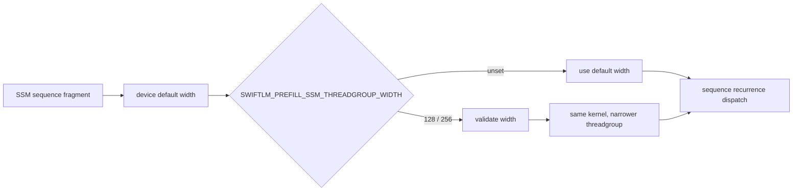

| Property | Default | Threadgroup-width opt-in |
|---|---|---|
| Kernel | `ssm_recurrence_seq_bf16_f32` | same kernel |
| Routing flag | none | `SWIFTLM_PREFILL_SSM_THREADGROUP_WIDTH=<width>` |
| Validated widths | device-derived default | `128`, `256` in sequence equivalence tests |
| Validation rules | compiler-derived | integer, at least active phase-2 threads, not above default, SIMD-width aligned |
| Production default | enabled | disabled |

Correctness evidence is green:

| Gate | Result |
|---|---|
| `SSMRecurrenceSequenceEquivalenceTests` | default, shared-RMS, `tg=128`, and `tg=256` sequence routes match repeated decode recurrence |
| `Qwen35ReferenceComparisonTests` with `SWIFTLM_PREFILL_SSM_THREADGROUP_WIDTH=256` | 4/4 pass; prefill output/state/KV and decode0 gates remain green |

The isolated recurrence sweep shows that no single width dominates across all
sequence lengths or kernel variants:

| Sequence length | Variant | Average | Per token | Threadgroup |
|---:|---|---:|---:|---:|
| 16 | base | 1959.0 us | 122.439 us | 128 |
| 16 | shared-RMS | 525.7 us | 32.858 us | 128 |
| 16 | base | 663.9 us | 41.496 us | 256 |
| 16 | shared-RMS | 515.4 us | 32.216 us | 256 |
| 16 | base | 809.8 us | 50.612 us | 384 |
| 16 | shared-RMS | 878.3 us | 54.896 us | 384 |
| 64 | base | 3065.3 us | 47.896 us | 128 |
| 64 | shared-RMS | 1957.3 us | 30.584 us | 128 |
| 64 | base | 2545.7 us | 39.777 us | 256 |
| 64 | shared-RMS | 1971.5 us | 30.804 us | 256 |
| 64 | base | 2129.7 us | 33.277 us | 384 |
| 64 | shared-RMS | 1931.3 us | 30.177 us | 384 |
| 128 | base | 4241.8 us | 33.139 us | 128 |
| 128 | shared-RMS | 3891.2 us | 30.400 us | 128 |
| 128 | base | 3804.8 us | 29.725 us | 256 |
| 128 | shared-RMS | 3825.2 us | 29.884 us | 256 |
| 128 | base | 3724.1 us | 29.095 us | 384 |
| 128 | shared-RMS | 3772.3 us | 29.471 us | 384 |

The full Qwen prefill profile with `SWIFTLM_PREFILL_SSM_THREADGROUP_WIDTH=256`
confirms the route fires for all 18 SSM recurrence dispatches, but the result
does not justify default promotion:

| Sequence length | Total prefill time | SSM time | Decision |
|---:|---:|---:|---|
| 16 | 43.813 ms | 9.203 ms | noise |
| 64 | 160.583 ms | 35.392 ms | slower |
| 128 | 315.422 ms | 70.439 ms | slower/noisy |

Current decision: keep the width override as an opt-in diagnostic only. It is
valuable for future sweeps because it proves narrower dispatch geometry is
decode-equivalent, but the production route stays on the device-derived default
width until a full-model profile shows a stable win.

## Batched MPP Equivalence Harness (2026-05-12)

The forced BF16 batched-MPP routing experiment was rejected after Qwen3.5
reference comparison showed token and hidden-state drift. The follow-up
isolated harness now separates three contracts:

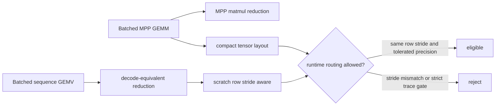

| Contract | Evidence | Decision |
|---|---|---|
| Batched MPP math | `SequenceProjectionEquivalenceTests/bf16BatchedMPPGEMMMatchesBatchedSequenceGEMVWithinMPPPrecision` passes for count 2 and 3 with uniform output dimensions | MPP is usable only under an MPP precision tolerance, not as a strict decode-equivalent replacement |
| Input layout | `buildBatchedMPPGEMMStep` requires `inputRowStride == inputDimension` | keep |
| Output layout | batched and single-projection MPP admission now requires every compact MPP output dimension to match the runtime output row stride | keep |
| Qwen runtime promotion | forced experiment produced reference drift | rejected |

The important result is that MPP is not a drop-in replacement for the
decode-equivalent sequence GEMV path. It may still be useful for projection
groups whose input and output tensors are compact and whose correctness gate
allows MPP-level numerical tolerance, but it must not be routed through padded
scratch slots unless the kernel gains explicit output-row-stride support.

Follow-up hardening extended the same guard to single projection MPP and added a
planning regression for dense batched prefill projections whose scratch outputs
are padded. The positive MPP paths remain available when the compact output
dimension and runtime output row stride are identical.

## GEMM Output Row Stride Hardening (2026-05-12)

The next correctness pass closed the non-MPP side of the same layout contract:
standard sequence GEMM and direct Q4/Q8 prefill GEMM now bind
`outputRowStride` explicitly and write rows using the runtime stride. Batched
Q4 direct GEMM gets the same stride binding for each scratch output slot. The
dense and direct quantized sequence kernels also keep inactive SIMD groups
alive through threadgroup barriers, so odd output dimensions no longer let the
final partially active row group exit before its paired active group reaches a
barrier.

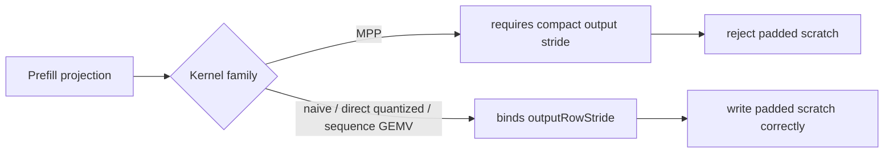

Evidence:

| Gate | Result |
|---|---|
| `NaiveGEMMArgumentTableTests` | 13/13 pass, including padded output-row-stride execution |
| `MetalSourceGeneratorTests/quantizedQ4GEMMMatchesCPUReferenceWithPaddedScratchInputAndOutputStride` | Pass; direct Q4 GEMM writes padded scratch output rows correctly |
| `MetalSourceGeneratorTests/quantizedQ8GEMMMatchesCPUReferenceWithPaddedScratchInputAndOutputStride` | Pass; direct Q8 GEMM writes padded odd-row scratch outputs correctly without early barrier exit |
| `MetalSourceGeneratorTests/batchedQuantizedQ4GEMM2MatchesCPUReferenceWithPaddedScratchOutputStride` | Pass; two-way direct Q4 batched GEMM writes each padded scratch output independently |
| `MetalSourceGeneratorTests/batchedQuantizedQ4GEMM3MatchesCPUReferenceWithPaddedScratchOutputStride` | Pass; three-way direct Q4 batched GEMM writes each padded scratch output independently |
| `MetalSourceGeneratorTests/decodeGEMVMatchesCPUReferenceWithOddOutputTail` | Pass; dense single decode GEMV keeps inactive row groups through barriers and preserves output tail sentinels |
| `MetalSourceGeneratorTests/batchedDecodeGEMVMatchesCPUReferenceWithOddTotalRowTail` | Pass; dense batched decode GEMV count 2/3/4 keeps inactive row groups through barriers and preserves output tail sentinels |
| `MetalSourceGeneratorTests/decodeGEMVArgumentTableMatchesCPUReferenceWithOddOutputTail` | Pass; dense single decode GEMV argument-table variant keeps inactive row groups through barriers and preserves output tail sentinels |
| `MetalSourceGeneratorTests/batchedDecodeGEMVArgumentTableMatchesCPUReferenceWithOddTotalRowTail` | Pass; dense batched decode GEMV argument-table variants count 2/3/4 keep inactive row groups through barriers and preserve output tail sentinels |
| `MetalSourceGeneratorTests/specializedDecodeGEMVMatchesCPUReferenceWithOddOutputTail` | Pass; specialized 2048-input and 8192-input decode GEMV variants keep inactive row groups through barriers and preserve output tail sentinels |
| `MetalSourceGeneratorTests/specializedDecodeGEMVArgumentTableMatchesCPUReferenceWithOddOutputTail` | Pass; vocab, specialized 2048-input, and specialized 8192-input argument-table variants require explicit resource usage and match CPU reference with odd output tails |
| `MetalSourceGeneratorTests/unifiedQuantizedGEMVMatchesCPUReferenceWithOddOutputTail` | Pass; unified Q4 decode GEMV keeps inactive row groups through barriers and preserves output tail sentinels |
| `MetalSourceGeneratorTests/qkNormDecodeOverdispatchUpdatesOnlyValidHeads` | Pass; QK norm decode and argument-table variants update valid heads only under over-dispatch |
| `MetalSourceGeneratorTests/batchedQKNormDecodeOverdispatchUpdatesOnlyValidHeads` | Pass; batched QK norm decode and argument-table variants update valid heads only under over-dispatch |
| `MetalSourceGeneratorTests/ropeDecodeOverdispatchUpdatesOnlyValidHeadsAndLanes` | Pass; RoPE decode and argument-table variants update valid Q/K heads and lanes only under over-dispatch |
| `MetalSourceGeneratorTests` | 37/37 pass after adding Q8, batched Q4, dense decode GEMV, argument-table decode GEMV, specialized decode GEMV, unified quantized decode GEMV, QK norm, batched QK norm, and RoPE over-dispatch coverage |
| `SequenceProjectionEquivalenceTests/bf16SingleSequenceGEMVHandlesOddOutputTailWithPaddedStride` | Pass; dense single sequence GEMV keeps inactive row groups through barriers and preserves padded output rows |
| `SequenceProjectionEquivalenceTests/bf16BatchedSequenceGEMVHandlesOddTotalRowTailWithPaddedStride` | Pass; dense batched sequence GEMV keeps inactive row groups through barriers and preserves each padded output |
| `SequenceProjectionEquivalenceTests` | 8/8 pass after adding dense odd-row tail coverage |
| `QuantizationPlanningTests` | 14/14 pass, diagnostics now include `outputRowStride` |
| `Qwen35ReferenceComparisonTests` with probes | 4/4 pass; prefill/decode token gates unchanged |

Current decision: keep MPP admission conservative, but allow non-MPP GEMM
families to handle padded scratch layouts directly through their row-stride
binding.

## BF16 Single Sequence GEMV Row2 Experiment (2026-05-14)

After the sequence-tile experiments failed to produce a stable full-model win,
the next single-projection variant keeps the sequence tile at 1 and changes only
the row mapping inside each SIMD group:

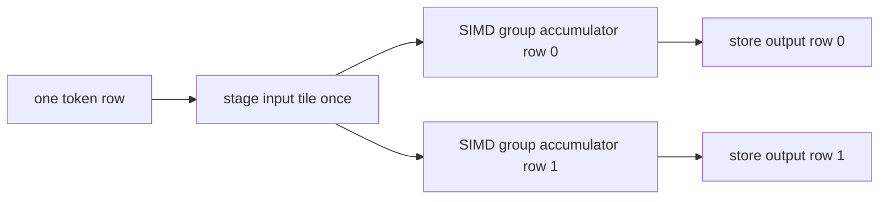

| Property | Base sequence GEMV | Row2 opt-in |
|---|---|---|
| Kernel | `gemv_seq_bf16_f32s` | `gemv_seq_bf16_f32s_rps2` |
| Routing flag | none | `SWIFTLM_PREFILL_BF16_SINGLE_RPS2=1` |
| Sequence tile | 1 | 1 |
| Rows per SIMD group | 1 | 2 |
| Reduction contract | one row x one token | same per output row |
| Production default | enabled | disabled |

The kernel keeps a separate F32 accumulator per output row and reduces each row
with the same `simd_sum` pattern as the base sequence GEMV. It shares the staged
input tile across two row accumulators, reducing input staging and grid width
without changing the order of the dot-product loop for either output row.

Correctness evidence is green:

| Gate | Result |
|---|---|
| `SequenceProjectionEquivalenceTests` | 9/9 pass, including row2 vs repeated decode GEMV |
| `Qwen35ReferenceComparisonTests` with `SWIFTLM_PREFILL_BF16_SINGLE_RPS2=1 ENABLE_METAL_PROBES=1` | 5/5 pass; prefill block, final hidden/logits, state, and decode0 gates remain green |

Isolated real-shape microbench shows row2 is directionally favorable:

| Role | Seq 16 | Seq 64 | Seq 128 |
|---|---:|---:|---:|
| `attn_or_ssm.out_proj` base | 803.8 us | 1877.2 us | 2452.3 us |
| `attn_or_ssm.out_proj` row2 | 726.5 us | 1426.7 us | 1914.8 us |
| `mlp.down_proj` base | 1394.3 us | 2731.9 us | 2916.8 us |
| `mlp.down_proj` row2 | 1292.3 us | 2195.9 us | 2450.1 us |

Full Qwen3.5 BF16 prefill profile confirms the route fires for all 48 single
sequence projections, but it is not a promotion candidate yet:

| Sequence length | Total prefill | Single GEMV kernel | Decision |
|---:|---:|---|---|
| 16 | 52.232 ms | `48x gemv_seq_bf16_f32s_rps2` | slower |
| 64 | 165.676 ms | `48x gemv_seq_bf16_f32s_rps2` | slower |
| 128 | 320.294 ms | `48x gemv_seq_bf16_f32s_rps2` | slower/noisy |

Current decision: keep row2 as an opt-in diagnostic only. The isolated kernel
shape is useful evidence that row packing can help, but full-model timing says
the next production path should combine row packing with a larger structural
change, such as producer-consumer fusion for the specific dependent projections
or a real batched matmul path that passes the reference gate.

## MLP Fusion Window Profile Harness (2026-05-14)

The profile harness now emits a first-class MLP producer-consumer window artifact:

```text
<basename>-mlp-windows.csv
```

This records each `gate_proj + up_proj -> swiglu -> down_proj` region as one
logical window. It also supports the opt-in fused route, where the activation
step is absent and `mlp_fused_swiglu_down_seq_bf16_f32s*` replaces the
materialized `swiglu_seq_f32 + gemv_seq_bf16_f32s` pair.

```mermaid
flowchart LR
  A["batched gate/up projection"] --> B["SwiGLU activation"]
  B --> C["down projection"]
  A --> D["fused SwiGLU down projection"]
```

| CSV field group | Purpose |
|---|---|
| step indices | Confirms which dispatches were replaced or retained |
| kernel names | Separates base, row-tuned, and fused variants without manual log parsing |
| route | `unfused_swiglu_down` or `fused_swiglu_down` |
| timing split | Separates gate/up, activation, and down projection time |
| estimated bytes | Tracks whether a fusion saves traffic or only changes scheduling |

Current decision: use this harness before promoting any MLP fusion flag. The
next promotion check should compare baseline and fused profiles using
`*-mlp-windows.csv`, then require the existing Qwen reference gates before
changing defaults.

The first Qwen3.5 BF16 profile run confirms the artifact is populated on the
default production route:

| Sequence length | MLP windows | Route |
|---:|---:|---|
| 16 | 24 | `unfused_swiglu_down` |
| 64 | 24 | `unfused_swiglu_down` |
| 128 | 24 | `unfused_swiglu_down` |
