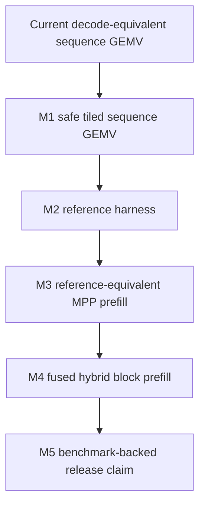
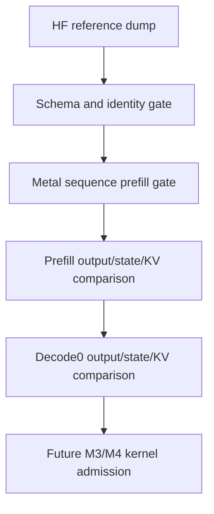
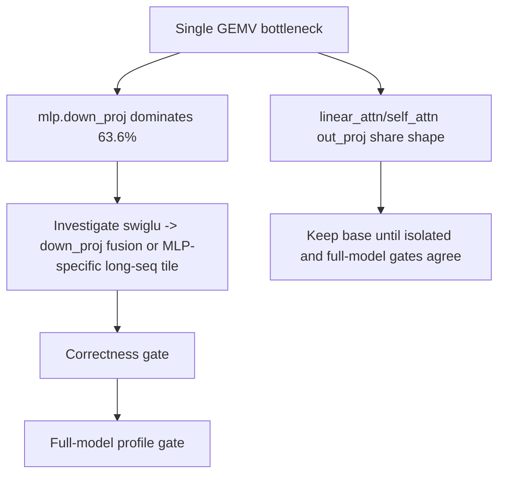
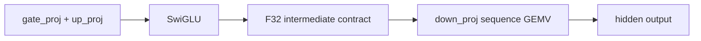

# Hybrid Prefill Fast Path Progress

Last updated: 2026-05-10

This file is the single progress ledger for the hybrid prefill fast-path work.
It tracks the current milestone, implementation status, validation evidence,
failed experiments, and next decisions.

## Goal

Move hybrid Qwen/LFM prefill from the current decode-equivalent sequence GEMV
path toward the final fastest design without losing production correctness.



## Current Contract

| Area | Contract |
|---|---|
| Hybrid BF16 sequence prefill | Must match decode-equivalent prompt ingestion token trace |
| Q3 sequence prefill | Enabled only through reference-backed packed and batched Q3 sequence GEMV plus quantized sequence embedding |
| Speed claims | Forbidden unless the same path has green correctness evidence |
| Fallback | Silent fallback is not allowed |

## Milestone Status

| Milestone | Status | Notes |
|---|---|---|
| M1 safe tiled sequence GEMV | Done / not default | Tile4 kernels compile and pass decode-equivalence tests; Qwen profile regressed when defaulted, so production planner stays on base sequence GEMV |
| M2 reference harness | Done / hardened | LFM and Qwen3.5 both have reference dump scripts and manifest coverage; Qwen3.5 validates snapshot identity, prefill state, decode0 state, and KV cache |
| M3 reference-equivalent MPP prefill | Pending | Requires M2 before adopting non decode-equivalent math |
| M4 fused hybrid block prefill | Pending | Requires M2 and block-level reference probes |
| M5 benchmark-backed release claim | Pending | Requires real-bundle correctness gates first |

## M1 Design

The M1 kernel changes the scheduling unit but not the numeric unit:

```text
Numeric contract: one output row x one token keeps the same SIMD lane reduction.
Scheduling unit: one threadgroup may cover several tokens for the same row group.
```

| Parameter | Current | M1 target |
|---|---:|---:|
| Rows per threadgroup | 2 | 2 |
| Sequence tile | 1 | tile4 implemented as non-default experiment |
| Dot-product lane order | decode-equivalent | unchanged |
| Storage rounding | inside projection kernel | unchanged |
| MPP | not used for stateful hybrid sequence projection | unchanged |

## M2 Design

M2 changes the future correctness oracle from decode-only to reference-aware.
It does not yet authorize MPP or fused non-decode-equivalent kernels.

| Component | Status | Source |
|---|---|---|
| LFM reference dump script | Existing | `scripts/hf/dump_lfm2_reference.py` |
| LFM Swift reference comparison | Existing | `Tests/MetalCompilerTests/Models/LFM2/ReferenceComparisonTests.swift` |
| Qwen reference dump script | Done | `scripts/hf/dump_qwen35_reference.py`; schema v4 supports multiple reference cases plus version metadata |
| Qwen Swift reference comparison | Done | `Tests/MetalCompilerTests/Models/Qwen35/Qwen35ReferenceComparisonTests.swift`; validates every schema v4 case |
| Reference manifest | Done | `Tests/MetalCompilerTests/Core/ReferenceHarnessManifestTests.swift` |

## Confidence Audit

The current strategy is not treated as mathematically complete. It is treated as
release-safe only for the explicitly covered model, prompt, precision, and
optimizer path. Every known hole is either closed by a hard gate or listed as a
remaining scope limit.



| Potential hole | Status | Gate / decision |
|---|---|---|
| Reference snapshot generated from a different bundle | Closed | Snapshot stores `config.json` SHA-256 and the Swift test compares it with the local bundle |
| Swift prompt does not match reference prompt | Closed | Snapshot stores `ref.meta.input_tokens`; Swift test requires exact token equality |
| Sequence prefill silently falls back to sequential decode | Closed | Qwen reference test requires `requiresSequentialPromptIngestion == false` and no fallback reason |
| Only early linear states are checked | Closed | Qwen reference test checks every `linear_ordinal_*` conv and recurrent state |
| Decode post-state is not checked | Closed | Qwen reference test checks `decode_0` logits, next token, conv state, and recurrent state |
| KV cache corruption can pass | Closed | Qwen reference test checks prefill and `decode_0` key/value caches for all attention ordinals |
| Metal readback failure can look like a numeric match | Closed | Buffer readback now throws on allocation, command-buffer, or range failure; length mismatch produces infinite error |
| Single prompt / sequence length only | Closed | Qwen schema v4 stores multiple reference cases; Swift validates each case independently |
| Q3 sequence prefill | Closed for current Qwen3.5 Q3 path | Q3 G16/G32/G64 projection sequence GEMV and embedding lookup have CPU-reference tests; real Q3 prompt ingestion uses sequence prefill and matches sequential ingestion trace |
| HuggingFace backend variance | Closed for traceability | Qwen schema v4 records PyTorch version, Transformers version, and fast-backend availability |

## Evidence Log

| Date | Command / check | Result |
|---|---|---|
| 2026-05-07 | `swift build` | Pass before M1/M2 edits |
| 2026-05-07 | `MetalCompilerTests/Qwen35PromptIngestionTests` | Pass after reverting failed MPP gate/up experiment |
| 2026-05-07 | `MetalCompilerTests/Qwen35PrefillProfileTests` | Pass, current default remains sequence GEMV |
| 2026-05-07 | `swift build` | Pass after M1/M2 edits |
| 2026-05-07 | `MetalCompilerTests/SequenceProjectionEquivalenceTests` | Pass; includes base batched, tiled batched, tiled single sequence GEMV |
| 2026-05-07 | `MetalCompilerTests/ReferenceHarnessManifestTests` | Pass |
| 2026-05-07 | `MetalCompilerTests/GeneratedLibraryTests` | Pass |
| 2026-05-07 | `MetalCompilerTests/Qwen35PromptIngestionTests` with `ENABLE_METAL_PROBES=1` | Pass |
| 2026-05-07 | `MetalCompilerTests/Qwen35PrefillProfileTests` with `ENABLE_METAL_PROBES=1` | Pass; production planner uses base sequence GEMV |
| 2026-05-07 | `python3 scripts/hf/dump_qwen35_reference.py --output TestData/qwen35_reference.safetensors --decode-steps 2` | Pass; wrote schema v2 Qwen3.5 HF reference snapshot with config hash and input token metadata |
| 2026-05-07 | `MetalCompilerTests/Qwen35ReferenceComparisonTests` with `ENABLE_METAL_PROBES=1` | Pass; HF prefill/decode0 argmax, logits, final hidden, all linear states, and KV cache gates are green |
| 2026-05-07 | `MetalCompilerTests/Qwen35ReferenceComparisonTests` with `ENABLE_METAL_PROBES=1` | Pass after hardening Metal readback to throw instead of returning empty arrays |
| 2026-05-07 | `python3 scripts/hf/dump_qwen35_reference.py --output TestData/qwen35_reference.safetensors --decode-steps 2` | Pass; wrote schema v3 multi-case Qwen3.5 HF reference snapshot with 1328 tensors |
| 2026-05-07 | `MetalCompilerTests/Qwen35ReferenceComparisonTests` with `ENABLE_METAL_PROBES=1` | Pass; validates schema v3 case 0 and case 1 for prefill/decode0 logits, token trace, all linear states, and KV cache |
| 2026-05-07 | `python3 scripts/hf/dump_qwen35_reference.py --output TestData/qwen35_reference.safetensors --decode-steps 2` | Pass; wrote schema v4 multi-case Qwen3.5 HF reference snapshot with version and backend metadata |
| 2026-05-07 | `MetalCompilerTests/Qwen35ReferenceComparisonTests` with `ENABLE_METAL_PROBES=1` | Pass; validates schema v4 metadata plus both reference cases |
| 2026-05-07 | `MetalCompilerTests/QuantizationPlanningTests` | Pass; all Q3 prefill projection and embedding schemes require explicit sequential ingestion |
| 2026-05-07 | `MetalCompilerTests/Qwen35PromptIngestionTests` with `ENABLE_METAL_PROBES=1` | Pass; BF16 sequence path and Q3 explicit sequential ingestion trace gates are green |
| 2026-05-07 | `MetalCompilerTests/ReferenceHarnessManifestTests` | Pass after marking Qwen3.5 ready |
| 2026-05-07 | `swift build` | Pass after enabling Q3 sequence prefill |
| 2026-05-07 | `MetalCompilerTests/MetalSourceGeneratorTests` | Pass; Q3 G16/G32/G64 dequant→MPP and packed sequence GEMV match CPU references |
| 2026-05-07 | `MetalCompilerTests/QuantizedEmbeddingKernelTests` | Pass; Q3 G16/G32/G64 sequence embedding lookup matches affine CPU reference |
| 2026-05-07 | `MetalCompilerTests/QuantizationPlanningTests` | Pass; Q3 prefill projection and embedding schemes no longer require sequential ingestion |
| 2026-05-07 | `MetalCompilerTests/Qwen35PromptIngestionTests` with `ENABLE_METAL_PROBES=1` | Pass; Q3 real bundle sequence prefill trace matches decode-equivalent sequential ingestion |
| 2026-05-07 | `MetalCompilerTests/Qwen35BenchmarkTests` with `ENABLE_METAL_PROBES=1` | Pass; Q3 smoke benchmark confirms 186 packed Q3 sequence GEMV kernels and sequence prefill faster than sequential ingestion for lengths 16/64/128 |
| 2026-05-07 | `MetalCompilerTests/MetalSourceGeneratorTests` | Pass; batched Q3 sequence GEMV for counts 2/3/4 and groups 16/32/64 matches decode-rounded CPU references |
| 2026-05-07 | `MetalCompilerTests/Qwen35PromptIngestionTests` with `ENABLE_METAL_PROBES=1` | Pass; Q3 real bundle sequence prefill remains trace-equivalent after batched Q3 projection routing |
| 2026-05-07 | `MetalCompilerTests/Qwen35BenchmarkTests` with `ENABLE_METAL_PROBES=1` | Pass; Q3 smoke benchmark confirms 96 total Q3 sequence GEMV entries, 48 batched Q3 sequence GEMV entries, and sequence prefill faster than sequential ingestion for lengths 16/64/128 |
| 2026-05-09 | `MetalCompilerTests/Qwen35PrefillProfileTests` with `ENABLE_METAL_PROBES=1` (re-run) | Pass; projection share confirmed at 75.8-76.4%, single `gemv_seq_bf16_f32s` confirmed as 26.5% of projection time (48 dependent output projections), pass count remains 1 |
| 2026-05-09 | `MetalCompilerTests/SequenceProjectionEquivalenceTests` | Pass; 5 tests including `BF16 tile2 single sequence GEMV matches repeated decode GEMV` and `BF16 tiled single sequence GEMV matches repeated decode GEMV` |
| 2026-05-09 | `MetalCompilerTests/Qwen35ReferenceComparisonTests` with `SWIFTLM_PREFILL_BF16_SINGLE_TILE2=1` | Pass; 4/4 cases remain reference-equivalent with feature-flagged tile2 single sequence GEMV routing |
| 2026-05-09 | `MetalCompilerTests/Qwen35PrefillProfileTests` with `SWIFTLM_PREFILL_BF16_SINGLE_TILE2=1` | Pass; tile2 routed 48 BF16 single sequence GEMV dispatches but did not improve prefill timing, so default routing remains disabled |
| 2026-05-09 | `MetalCompilerTests/SequenceGEMVMicrobenchmarkTests` | Pass; synthetic real-shape BF16 single GEMV benchmark covers base/tile2/tile4 for output-projection shapes |
| 2026-05-09 | `MetalCompilerTests/Qwen35PrefillProfileTests` | Pass; prints BF16 single sequence GEMV role breakdown, with `mlp.down_proj` taking 63.6% of single GEMV time at seqLen 128 |
| 2026-05-10 | `MetalCompilerTests/FusedSwigluDownEquivalenceTests` | Pass; fused SwiGLU+down kernel keeps the materialized F32 intermediate contract and matches the unfused `swiglu_seq_f32 + gemv_seq_bf16_f32s` path |
| 2026-05-10 | `xcrun xctest -XCTest MetalCompilerTests.Qwen35ReferenceComparisonTests` with `SWIFTLM_PREFILL_BF16_FUSED_MLP_DOWN=1 ENABLE_METAL_PROBES=1` | Pass; 4/4 Qwen reference checks remain green with opt-in fused MLP down routing |
| 2026-05-10 | `xcrun xctest -XCTest MetalCompilerTests.Qwen35PrefillProfileTests` with `SWIFTLM_PREFILL_BF16_FUSED_MLP_DOWN=1 ENABLE_METAL_PROBES=1` | Pass; routing fires (`293 -> 269` steps, 24 fused dispatches), but end-to-end prefill regresses, so default routing remains disabled |
| 2026-05-10 | `MetalCompilerTests/FusedSwigluDownEquivalenceTests` | Pass; adds an eight-rows-per-threadgroup fused scheduling contract |
| 2026-05-10 | `xcrun xctest -XCTest MetalCompilerTests.Qwen35PrefillProfileTests` with `SWIFTLM_PREFILL_BF16_FUSED_MLP_DOWN=1 SWIFTLM_PREFILL_BF16_FUSED_MLP_DOWN_ROWS=8 ENABLE_METAL_PROBES=1` | Pass; rows=8 fused route fires and improves the same-run Qwen profile at seqLen 64/128, but remains opt-in |
| 2026-05-10 | `xcrun xctest -XCTest MetalCompilerTests.Qwen35ReferenceComparisonTests` with `SWIFTLM_PREFILL_BF16_FUSED_MLP_DOWN=1 SWIFTLM_PREFILL_BF16_FUSED_MLP_DOWN_ROWS=8 ENABLE_METAL_PROBES=1` | Pass; 4/4 reference checks remain green with rows=8 fused scheduling |

## Failed Experiments

| Experiment | Result | Decision |
|---|---|---|
| Sequence GEMV `tileElements = 1024` | Regressed Qwen profile | Rejected |
| Generic sequence GEMV with 4 / 8 output rows per threadgroup | Regressed or unstable Qwen profile | Rejected |
| MPP for 2-way gate/up while keeping stateful projections sequence GEMV | Broke BF16 Qwen token trace | Rejected |
| Default tile4 sequence GEMV | Correctness passed but Qwen seqLen 16/64/128 regressed to 114.827/190.303/374.976 ms | Kept as non-default experiment; production planner reverted to base sequence GEMV |
| Feature-flagged tile2 single sequence GEMV | Correctness passed, but Qwen seqLen 16/64/128 changed from 44.572/158.280/314.697 ms to 44.768/160.643/317.498 ms | Kept behind `SWIFTLM_PREFILL_BF16_SINGLE_TILE2=1`; default production planner stays on base sequence GEMV |
| Feature-flagged fused SwiGLU + down projection with 2 rows/threadgroup | Correctness passed, but Qwen seqLen 16/64/128 changed from 44.373/158.926/308.411 ms to 44.658/211.582/479.223 ms | Rejected as the fused scheduling shape; it recomputes SwiGLU tiles too often |

## Open Decisions

| Decision | Status |
|---|---|
| Best sequence tile size for M1 | tile4 is not acceptable as default; smaller or different tiling remains future work |
| Whether M1 should default to tile4 or stay opt-in | Stay non-default |
| Whether M2 should route tile2 for dependent single projections | Stay non-default; correctness passed but Qwen3.5 BF16 profile was noise/slower |
| Qwen reference dump schema for M2 | Implemented and validated as schema v4 multi-case |
| Q3 sequence prefill support | Implemented for current packed and batched Q3 projection paths plus Q3 embedding lookup |
| Whether fused SwiGLU + down should default | Not yet; rows=8 has a green reference gate and promising same-run profile, but needs repeated profile evidence before default promotion |

## Current Production Prefill Profile

Latest focused Qwen profile (2026-05-09 re-run), with production planner using
base decode-equivalent sequence GEMV:

| Sequence length | Total prefill time | Steps | Pass count |
|---:|---:|---:|---:|
| 16 | 44.373 ms | 293 | 1 |
| 64 | 158.926 ms | 293 | 1 |
| 128 | 308.411 ms | 293 | 1 |

Category share at seqLen=128:

| Category | Steps | Time | Share |
|---|---:|---:|---:|
| `projection` | 97 | 233.408 ms | 75.7% |
| `ssm_recurrence` | 18 | 68.643 ms | 22.3% |
| `attention` | 6 | 3.840 ms | 1.2% |
| `other` | 129 | 2.179 ms | 0.7% |
| remaining | 43 | 0.342 ms | 0.1% |

Kernel families confirmed in the plan:

| Kernel | Count |
|---|---:|
| `gemv_seq_bf16_f32s` | 48 |
| `batched_gemv2_seq_bf16_f32s` | 24 |
| `batched_gemv4_seq_bf16_f32s` | 18 |
| `batched_gemv3_seq_bf16_f32s` | 6 |
| `gemv_bf16_f32s` (output head) | 1 |

## Projection Bottleneck Breakdown (seqLen 128, 2026-05-09)

Aggregated from `.test-artifacts/prefill-profile/qwen35-prefill-steps-seq128.csv`.
Average per-dispatch time at seqLen 128 reveals which projection family dominates.

| Kernel | Role | n | avg µs | total µs | per-output µs | tg |
|---|---|---:|---:|---:|---:|---:|
| `batched_gemv2_seq_bf16_f32s` | MLP gate+up batched (gridWidth 3584) | 24 | 3657.6 | 87782.0 | 1.02 | 64 |
| `batched_gemv4_seq_bf16_f32s` | SSM in_proj batched (gridWidth 4112) | 18 | 4224.7 | 76044.4 | 1.03 | 64 |
| `gemv_seq_bf16_f32s` | dependent output projections (gridWidth 512) | 48 | 1360.2 | 65288.6 | 2.66 | 64 |
| `batched_gemv3_seq_bf16_f32s` | Attention Q+K+V batched (gridWidth 2560) | 6 | 2595.7 | 15574.4 | 1.01 | 64 |
| `gemv_bf16_f32s` | last-token output head (gridWidth 62080) | 1 | 1618.4 | 1618.4 | 0.03 | 128 |

Per-output time is `avg µs / gridWidth` and is a memory-bandwidth efficiency proxy.
The single-projection kernel is 2.6x less efficient per output element than the
batched variants, so input-staging amortization across tokens is the next lever
for the dependent-projection path.

### Single-projection entries are 100% dependent (no missed batching)

The 48 `gemv_seq_bf16_f32s` entries decompose into output projections that
cannot be batched with sibling projections because they consume an
intermediate activation produced by their own block:

| Projection role | Layers | Notes |
|---|---:|---|
| `mlp.down_proj` | 24 | Reads SwiGLU activation (intermediate dim 1792), writes hidden 2048 |
| `linear_attn.out_proj` | 18 | Reads SSM recurrence output, writes hidden 2048 |
| `self_attn.o_proj` | 6 | Reads attention output, writes hidden 2048 |

This count (24+18+6=48) and the entry pattern (every block ends with a
single output projection) match the per-entry profile data, so M1 missed
batching is exhausted: the planner already groups every batchable sibling
projection (gate+up, Q+K+V, SSM in_proj quartet) into a single dispatch.
Single output projections remain because their input is intermediate-only.

The next prefill speed lever is therefore **per-token amortization inside the
single-projection kernel** (M2 territory), not additional batching.

The live profile test now also prints the BF16 single sequence GEMV role
breakdown directly, so the dominant dependent projection can be identified
without post-processing the CSV artifact:

| Projection role | Count | Total time | Average dispatch | Share of single GEMV |
|---|---:|---:|---:|---:|
| `mlp.down_proj` | 24 | 39.458 ms | 1644.1 us | 63.6% |
| `linear_attn.out_proj` | 18 | 16.921 ms | 940.0 us | 27.3% |
| `self_attn.o_proj` | 6 | 5.643 ms | 940.5 us | 9.1% |

## BF16 Single GEMV Microbenchmark (2026-05-09)

`SequenceGEMVMicrobenchmarkTests` isolates the real Qwen3.5 dependent
output-projection shapes outside the full model and measures base/tile2/tile4
sequence GEMV variants. It is an exploratory harness, not a release benchmark,
because full-model correctness and end-to-end profile remain the routing gates.

| Shape | SeqLen | Base | Tile2 | Tile4 | Local decision |
|---|---:|---:|---:|---:|---|
| `attn_or_ssm.out_proj` | 16 | 574.4 us | 652.1 us | 632.4 us | base |
| `attn_or_ssm.out_proj` | 64 | 1551.6 us | 2209.6 us | 2278.0 us | base |
| `attn_or_ssm.out_proj` | 128 | 2578.5 us | 2408.7 us | 3201.1 us | tile2 is interesting but not decisive |
| `mlp.down_proj` | 16 | 1030.6 us | 1124.8 us | 1125.4 us | base |
| `mlp.down_proj` | 64 | 2479.4 us | 2590.9 us | 2594.6 us | base |
| `mlp.down_proj` | 128 | 3210.4 us | 2695.5 us | 2404.1 us | tile4 is interesting in isolation |

The isolated harness confirms that token tiling can help some long-sequence
single-projection shapes, especially `mlp.down_proj` at seqLen 128, but it does
not produce a uniform win and contradicts the full-model default-routing gate.
Therefore tile2/tile4 remain experiments. The next design should target either
an `mlp.down_proj`-specific long-sequence variant or producer-consumer fusion
around `swiglu -> down_proj`, with full-model profile as the promotion gate.

## Current Q3 Prefill Smoke

Latest focused Qwen3.5 Q3 smoke benchmark compares the enabled sequence prefill
path against the old sequential prompt-ingestion path in the same test run.
The run was intentionally short and should be treated as a regression smoke,
not a release-grade throughput claim.

| Sequence length | Sequence prefill | Sequential ingestion | Speedup |
|---:|---:|---:|---:|
| 16 | 206.76 ms | 322.11 ms | 1.56x |
| 64 | 769.38 ms | 1343.48 ms | 1.75x |
| 128 | 1510.55 ms | 2829.22 ms | 1.87x |

Kernel families confirmed in the Q3 plan:

| Kernel | Count |
|---|---:|
| `batched_gemv2_seq_q3_g64_f32s` | 24 |
| `batched_gemv3_seq_q3_g64_f32s` | 6 |
| `batched_gemv4_seq_q3_g64_f32s` | 18 |
| `gemv_seq_q3_g64_f32s` | 48 |

The remaining single Q3 sequence GEMV entries are dependent projections, not
missed sibling batches:

| Projection role | Count |
|---|---:|
| `linear_attn.out_proj` | 18 |
| `mlp.down_proj` | 24 |
| `self_attn.o_proj` | 6 |

This closes the current BatchedProjection routing gap for Q3 sequence prefill.
The next Q3 speed target is the single-projection kernel/fusion path rather
than additional sibling batching.

A Q3 single sequence tile4 kernel was added and reference-tested, then tried as
the production routing for the single projection entries. It stayed
decode-equivalent but did not improve the Qwen3.5 Q3 smoke profile:

| Sequence length | Base sequence prefill | Tile4 sequence prefill | Decision |
|---:|---:|---:|---|
| 16 | 206.76 ms | 207.48 ms | keep base |
| 64 | 769.38 ms | 773.49 ms | keep base |
| 128 | 1510.55 ms | 1523.47 ms | keep base |

The tile4 kernel remains in the generator as a tested experiment, but planner
routing stays on the base Q3 sequence GEMV path.

## Prefill Profile Harness

The profiling path is now shared instead of Qwen-specific. `MetalPrefillProfileHarness`
records both step-level and pass-level prefill timing with:

| Field group | Contents |
|---|---|
| Timing | GPU feedback time and wall-clock submit+wait time |
| Dispatch shape | grid, threadgroup size, threadgroup memory, estimated dispatch count |
| Routing | kernel name, category, mode, layer index, entry index, weight tensor name |
| Binding size | buffer binding count, inline constant bytes, unique bound buffer bytes |
| Artifacts | JSON and CSV under `.test-artifacts/prefill-profile/` |

The focused Qwen profile test writes one step profile and one pass profile per
sequence length. The artifacts are diagnostic evidence only; performance claims
still require a correctness-green run for the same model path.

## M1 Outcome

Tile4 sequence GEMV is now available and tested, but it is not selected by the
production planner. The profile showed it reduces grid height but loses enough
occupancy/locality that Qwen prefill regresses. This keeps the codebase honest:
correctness assets are retained, but runtime does not claim or ship a slower
path.

## M2 Status (2026-05-09)

Phase 1 + Phase 2 of the prefill speed plan are confirmed:

| Phase | Confirmed | Evidence |
|---|---|---|
| Phase 1 profile re-run | Yes | `Qwen35PrefillProfileTests` 2 runs, projection 75.8-76.4% |
| Phase 2 dependent-projection judgment | Yes | All 48 single GEMV entries are output projections (24 down + 18 ssm_out + 6 o) |
| Phase 4 reference equivalence (BF16 single tile2) | Yes | `BF16 tile2 single sequence GEMV matches repeated decode GEMV` passes |
| Phase 4 reference equivalence (BF16 single tile4) | Yes | `BF16 tiled single sequence GEMV matches repeated decode GEMV` passes |
| Phase 5 routing decision (tile2 / tile4) | Yes | tile4 already rejected at 2026-05-07; tile2 stays feature-flagged because real-shape Qwen3.5 profile was noise/slower |

The base sequence GEMV kernel uses one threadgroup per `(rowGroup, token)` pair
with `tileElements = 256` input staging. The tile2 kernel halves grid height by
covering 2 tokens per threadgroup, sharing input staging across the two tokens.
It is implemented and reference-equivalent, but the real Qwen3.5 dependent
projection shapes did not benefit.

| Sequence length | Baseline | Tile2 flag enabled | Delta | Decision |
|---:|---:|---:|---:|---|
| 16 | 44.572 ms | 44.768 ms | +0.44% | noise |
| 64 | 158.280 ms | 160.643 ms | +1.49% | slower |
| 128 | 314.697 ms | 317.498 ms | +0.89% | noise |

The planner keeps tile2 behind `SWIFTLM_PREFILL_BF16_SINGLE_TILE2=1`. The
structural `SequenceGEMVKernelSelection` refactor remains because it makes
future tiled experiments derive grid height, threadgroup shape, diagnostics,
and sequence-length policy from one explicit tile descriptor instead of parsing
kernel-name suffixes. Production default routing stays on the base sequence
GEMV path and no speed claim is made for tile2.

M2 is complete as a measurement and correctness harness, but not as a faster
production route. The next milestone should not try more global sequence tiles.
It should split the single-projection problem by role:



## Fused SwiGLU Down Projection Experiment (2026-05-10)

The first role-specific producer-consumer fusion targets only Qwen/LFM-style
SwiGLU MLP blocks:



Routing is controlled by `SWIFTLM_PREFILL_BF16_FUSED_MLP_DOWN=1`. Production
default remains off.

| Gate | Requirement |
|---|---|
| Fragment pair | `ElementwiseFragment(.swiglu)` followed by `LinearFragment(field: "down_proj")` |
| Scope | Same `compositeID` and same `layerIndex` |
| Shape | `swiglu.count == down_proj.inputDimension`, `down_proj.outputDimension <= hiddenSize` |
| Precision | BF16 dense row-major weight only |
| Quantization | Q3/Q4/Q8 excluded |
| Mode | Sequence prefill `.batch` only |
| Failure mode | Missing fused kernel is an explicit `kernelNotFound`, not a silent fallback |

Current routing effect from the opt-in Qwen profile:

| Metric | Default | Fused flag enabled |
|---|---:|---:|
| Total prefill steps | 293 | 269 |
| `swiglu_seq_f32` | 24 | 0 |
| `gemv_seq_bf16_f32s` | 48 | 24 |
| `mlp_fused_swiglu_down_seq_bf16_f32s` | 0 | 24 |

The first local rerun confirmed routing and correctness but rejected the
original 2-row scheduling. The feature flag reaches the test runner when run
through `xcrun xctest`; passing the environment only to `xcodebuild` is not
reliable for this gate.

| Sequence length | Default route | Fused rows=2 | Delta | Decision |
|---:|---:|---:|---:|---|
| 16 | 44.373 ms | 44.658 ms | +0.6% | noise / no promotion |
| 64 | 158.926 ms | 211.582 ms | +33.1% | reject as default |
| 128 | 308.411 ms | 479.223 ms | +55.4% | reject as default |

At seqLen 128, the fused plan reports 24
`mlp_fused_swiglu_down_seq_bf16_f32s` dispatches and removes all 24
`swiglu_seq_f32` dispatches, but the fused kernel consumes 80.747 ms. This
more than outweighs the dispatch-count reduction. The result is a useful
correctness-gated experiment, not a production speed path.

The root cause is repeated SwiGLU tile computation. With 2 rows per
threadgroup, each `(sequence, output-row-group)` threadgroup recomputes
`silu(gate) * up`; this happens 256 times per token for a 512-row down
projection. The rows=8 variant amortizes the same tile over 8 output rows and
reduces the recomputation factor to 64 groups per token without changing the
per-row SIMD reduction contract.

Same-run profile after switching the opt-in fused route to rows=8:

| Sequence length | Baseline flag off | Fused rows=8 | Delta | Decision |
|---:|---:|---:|---:|---|
| 16 | 68.705 ms | 42.615 ms | -38.0% | noisy but favorable |
| 64 | 158.646 ms | 156.447 ms | -1.4% | favorable |
| 128 | 312.070 ms | 306.569 ms | -1.8% | favorable |

At seqLen 128, the rows=8 fused kernel reports 35.997 ms for 24 fused
dispatches versus 39.870 ms for the 24 baseline `mlp.down_proj` GEMV dispatches
plus 0.198 ms for 24 baseline `swiglu_seq_f32` dispatches. This is now a
plausible opt-in speed path, but the margin is small and must be repeated
before default promotion.

Important numerical note: the fused kernel now keeps the same F32 intermediate
contract as the current materialized two-kernel path. It removes the scratch
round-trip for the SwiGLU output, but it does not change the precision of the
down-projection input. `FusedSwigluDownEquivalenceTests` directly compares the
fused kernel against the unfused path with zero tolerance.

Next decision: repeat the rows=8 Qwen profile and add a focused rows-per-
threadgroup microbenchmark for 2/4/8. Default promotion still requires
model-level correctness and a stable end-to-end prefill improvement, not only
dispatch-count reduction.
