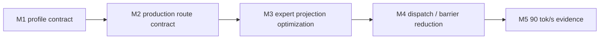

# LFM2.5 8B-A1B M5 Optimization Progress

This file is the single status ledger for the LFM2.5 8B-A1B optimization
workstream targeting a 90 tok/s decode timing gate.

## Goal



| Field | Value |
|---|---|
| Model | `LiquidAI/LFM2.5-8B-A1B` |
| Current release baseline | `0.8.7` |
| Baseline evidence | `85.2` wall tok/s / `89.3` GPU tok/s on 64-token exact trace; lightweight release executable observed `85.2` median wall tok/s over 3 measured release runs after 1 warmup run |
| Target | `>= 90.0` wall tok/s on the same exact-trace decode timing gate |
| Correctness gate | HF 64-token strict-capital trace remains exact |
| Production route | split Sparse MoE with parallel router and BF16 packed4 expert projections |

## Milestone Status

| Milestone | Status | Evidence |
|---|---:|---|
| M1 profile contract | done | A1B config and graph contract tests pass |
| M2 production route contract | done | Default route exposes 22 parallel router, 22 packed gate/up, and 22 packed down decode steps |
| M3 expert projection optimization | done | Vectorized packed4 input/activation loads; packed8 remains opt-in after slower timing |
| M4 dispatch / barrier reduction | done | Unsafe barrier elision can clear the speed target but fails trace parity; the family is closed |
| M5 90 tok/s evidence | pending | Direct Q8 Sparse MoE for the MLX 8-bit A1B bundle is now loadable and route-gated, but the focused timing remains below the 90 wall tok/s gate |

## A1B Structural Contract

| Property | Required value | Reason |
|---|---:|---|
| hidden size | `2048` | Decode hidden vector width |
| layers | `24` | Execution schedule length |
| full-attention layers | `[2, 6, 10, 14, 18, 21]` | Hybrid schedule contract |
| conv layers | `18` | Hybrid schedule contract |
| dense FFN layers | `2` | First two layers are dense, not Sparse MoE |
| Sparse MoE layers | `22` | Dominant decode path |
| experts | `32` | Router grid width |
| experts per token | `4` | Active expert work per token |
| MoE intermediate size | `1792` | Expert projection width |
| routing weights | normalized sigmoid top-k with expert bias | Matches HF A1B behavior |

## Current Bottleneck Interpretation

| Family | Current interpretation |
|---|---|
| `sparse_moe_bf16_gate_up_packed4` | Primary projection bottleneck |
| `sparse_moe_bf16_down_packed4` | Secondary projection bottleneck |
| `gemv_2048_6144_bf16` | Dense layer projection still material |
| vocab GEMV | Output projection remains material |
| `sparse_moe_bf16_router_parallel` | No longer the main bottleneck |

## M5 Evidence

| Candidate | Correctness | Timing evidence | Decision |
|---|---|---:|---|
| Greedy softcap host-read skip | HF strict-capital trace pass; host sampling logit reads `0` | `82.1` wall tok/s / `86.4` GPU tok/s | Keep; removes avoidable CPU read but does not move the main bottleneck |
| 2048→6144 BF16 GEMV 8 SIMDgroups with matching generated kernel policy | Multi-prompt HF traces pass | `82.6` wall tok/s / `86.4` GPU tok/s | Keep; safe structural improvement, below M5 target |
| vocab GEMV dispatch-only 32 SIMDgroups | HF strict-capital trace pass | `82.2` wall tok/s / `85.9` GPU tok/s | Reject; profile noise did not translate to timing |
| 2048→6144 dispatch-only 8 SIMDgroups | Failed HF strict-capital trace | `86.7` wall tok/s / `91.1` GPU tok/s before failure | Reject; dispatch width must match generated fixed-SIMD kernel assumptions |
| packed4 gate/up threadgroup input staging | HF strict-capital trace pass | `81.3` wall tok/s / `86.1` GPU tok/s | Reject; staging barrier and threadgroup traffic outweighed reduced input rereads |
| 2048→2048 square GEMV 16 rows/threadgroup | HF strict-capital trace pass | `81.7` wall tok/s / `85.6` GPU tok/s | Reject; local profile improvement did not survive full decode timing |
| packed4 down staged activation | HF strict-capital trace pass | `82.6` wall tok/s / `86.2` GPU tok/s | Reject; activation staging did not improve end-to-end timing |
| vocab GEMV argbuf packed4 BF16 read | CPU reference pass | profile `gemv_vocab_bf16` worsened to `1471us` | Reject; vectorized read increased pressure instead of reducing vocab time |
| gate/up 28 SIMDgroups only | HF strict-capital trace pass | `82.5` wall tok/s / `86.2` GPU tok/s | Reject; no clear gain over default |
| down 28 SIMDgroups only | HF strict-capital trace pass | `80.8` wall tok/s / `84.7` GPU tok/s | Reject; slower |
| gate/up 36 SIMDgroups request | HF strict-capital trace pass | `82.1` wall tok/s / `86.0` GPU tok/s | Reject; clamped/overwide request did not improve timing |
| F16 decode buffer override | HF strict-capital trace pass | `82.5` wall tok/s / `86.1` GPU tok/s | Reject; no material improvement over BF16-buffer default |
| gate/up packed4 `fast::exp` sigmoid | HF strict-capital trace pass | `81.9` wall tok/s / `85.5` GPU tok/s | Reject; approximation did not improve the bottleneck and should not remain as another route variant |
| decode sync host-overhead diagnostic on legacy LFM2.5-1.2B harness | diagnostic pass | `401us/token` host overhead, `4.7%` of total | Not an A1B gate; supports the interpretation that A1B M5 needs GPU kernel work, not only host submission work |
| vocab fixed-dimension GEMV source | HF strict-capital trace pass | `82.4` wall tok/s / `86.0` GPU tok/s; vocab profile unchanged at `1354us` | Reject; fixed bounds/barrier cleanup did not reduce output-head time |
| MoE BF16 activation scratch | HF strict-capital trace pass | `82.0` wall tok/s / `85.8` GPU tok/s | Reject; reduced scratch bandwidth was outweighed by activation conversion and BF16 reload cost |
| A1B static Sparse-MoE split kernels | HF strict-capital trace pass; route histogram switched to `_a1b` router/gate-up/down kernels | `82.6` wall tok/s / `86.5` GPU tok/s | Reject; removing runtime dimension checks did not reduce the dominant projection cost enough |
| output-head partial argmax | HF strict-capital trace pass; opt-in route emits `gemv_vocab_bf16_argmax_partial` and `argmax_partial_reduce` | `82.6` wall tok/s / `86.3` GPU tok/s | Keep opt-in only; useful route contract for avoiding a full-logit argmax reread, but not enough for M5 |
| direct Q8 Sparse MoE for MLX 8-bit A1B | Source-generation contract pass; real bundle loads; route histogram requires 22 `sparse_moe_q8_g64_router_parallel`, 22 `sparse_moe_q8_g64_gate_up`, and 22 `sparse_moe_q8_g64_down`; BF16 production route and multi-prompt HF trace remain green | `85.4` wall tok/s / `89.4` GPU tok/s on the focused 64-token route gate | Keep as a supported MLX 8-bit loading and direct-Q8 route milestone; it does not clear the M5 90 wall tok/s gate, so the next lever must reduce dispatch/barrier cost or fuse work across existing Q8 steps |
| Q8 output-head partial argmax | Q8 partial kernel compiles; route gate passes with `argmax_partial_reduce` | `83.5` wall tok/s / `87.8` GPU tok/s | Reject; avoiding the full-logit argmax reread does not pay for the extra partial-reduce route on the Q8 bundle |
| MTLSharedEvent completion wait | HF strict-capital trace pass under opt-in event wait | 64-token sweep `69.8` tok/s including prefill, matching the default route within noise | Reject; replacing commit feedback with event wait does not remove the remaining wall gap |
| release-build focused timing | validation incomplete | timed out at the 120-second outer build/test gate | Do not use release-only evidence for M5; keep the debug focused gate as the comparable metric |
| MTP / speculative decoding survey | LFM2.5 A1B and MLX 8-bit configs contain no MTP/draft-head metadata | not run | Not an M5 in-place kernel route; llama.cpp-style MTP requires a model with MTP heads or a separate draft model and should be treated as a new milestone |
| host sampling history pruning | `swift build` pass; strict-capital route still correct | `84.8` wall tok/s / `89.0` GPU tok/s after static env flag and no-penalty history pruning | Reject; the host-side history/env lookup path is not the missing M5 lever |
| specialized residual-add/copy/RMS synthesized kernel | `FusionVerificationTests` pass | real-bundle gate regressed to `68.2` wall tok/s / `83.6` GPU tok/s | Reject and revert; the generic synthesized kernel's threadgroup intermediate remains faster than reading the residual/output path back from device memory |
| greedy output-head argmax-only route | Dedicated in-process env gate fired `gemv_vocab_bf16_argmax_only` and `argmax_partial_reduce`; HF strict-capital trace pass | `85.3` wall tok/s / `89.3` GPU tok/s | Reject and revert; below M5, and omitting the full logits vector is only valid for greedy execution, not the general decode contract |
| production wall-only timing harness | HF strict-capital trace pass using the production `decodeSync` path without GPU timing feedback | `85.4` wall tok/s, `202` steps, `201` barriers | Keep as diagnostic; M5 is not just timing feedback overhead, so the next lever must reduce real decode work or command submission cost |
| dedicated Metal 4 feedback queue | `swift build` pass | focused production wall gate crashed with `unexpected signal code 5` before timing output | Reject and revert; command queue feedback plumbing is not a safe M5 lever without lower-level Metal 4 lifecycle proof |
| split2 Sparse MoE projection route | in-process env gate fired 22 `sparse_moe_bf16_gate_up_split2` and 22 `sparse_moe_bf16_down_split2`; HF strict-capital trace pass | `64.1` wall tok/s / `67.3` GPU tok/s | Reject and revert; splitting one row across two SIMDgroups adds reduction/shared-memory overhead and worsens the dominant MoE path |
| Sparse MoE packed4 argbuf variant | source generation compiles; focused route remains exact | route did not switch to `_argbuf`; timing `81.4` wall tok/s / `85.6` GPU tok/s | Reject and revert; packed expert weights live at non-zero STAF offsets, and the current prepared argument-buffer allocator intentionally leaves those bindings unmaterialized |
| prepared argument-buffer non-zero offsets | opt-in route materialized `_argbuf` kernels and reported `81.5` wall tok/s / `85.9` GPU tok/s | HF strict-capital trace failed after the first token and repeated token `3213` | Reject and revert; allowing non-zero STAF slice offsets in prepared argument buffers corrupts binding semantics and cannot be used as an M5 lever |
| gate/up row2 packed4 input sharing | `swift build`, `MetalSourceGeneratorTests`, default route contract, and 64-token HF strict-capital trace pass under `SWIFTLM_SPARSE_MOE_GATE_UP_ROW2=1` | debug timed `85.7` wall tok/s / `89.9` GPU tok/s; release median `86.6` wall tok/s | Keep opt-in only; sharing each input read across two gate/up rows is correct but does not improve the release median or clear the 90 wall tok/s M5 gate |
| gate/up row4 packed4 input sharing | `swift build`, `MetalSourceGeneratorTests`, and 64-token HF strict-capital trace pass under `SWIFTLM_SPARSE_MOE_GATE_UP_ROW4=1` | `79.9` wall tok/s / `87.7` GPU tok/s | Reject and revert; four-row input sharing increases register pressure enough to lose occupancy and erase the row2 gain |
| gate/up row2 production wall check | 64-token HF strict-capital trace pass using `debugRawGenerationWallTiming` under `SWIFTLM_SPARSE_MOE_GATE_UP_ROW2=1` | `80.4` wall tok/s, `202` steps, `201` barriers | Keep as diagnostic; GPU timestamp feedback is not the sole M5 gap, and row2 should not be promoted based on timed-GPU runs alone |
| row2 plus private decode logits | 64-token HF strict-capital trace pass under row2 plus private decode logits | `84.5` wall tok/s, `202` steps, `201` barriers | Reject and revert; private logits helps slightly but misses M5 and is unsafe for host sampling without a larger API/runtime contract |
| release-build focused production wall retry | `swift test -c release --disable-sandbox --filter defaultSparseMoERouteReportsProductionDecodeWallTiming` | timed out with code `-1` while compiling test targets under the 120-second outer gate | Do not use as M5 evidence; release measurement requires a separate build-for-testing pipeline or smaller release benchmark target |
| greedy multi-token command buffer | 64-token HF strict-capital trace pass after adding a `greedy_decode_roll_state` prototype and encoding 63 decode iterations into one Metal 4 command buffer | `85.6` wall tok/s, `202` steps, `201` barriers | Reject and revert; batching per-token submission/wait is correct but does not reduce the dominant GPU work, so M5 must target decode step count or projection math rather than host wait removal |
| lightweight release executable benchmark | `lfm25-a1b-benchmark` validates the 64-token HF strict-capital trace before reporting wall timing and runs outside the full xctest product | baseline median `86.6` with samples `[86.9,86.6,86.4]`; row2 median `86.6` with samples `[87.0,86.6,86.6]` | Keep as the release measurement gate; release mode and row2 opt-in are not enough to clear M5, so the remaining work must reduce GPU decode work or safe per-token barriers |
| release barrier histogram | `lfm25-a1b-benchmark` now reports top kernel families and top barrier-bearing kernel families from the same exact-trace release run | median `85.4`, top barrier families mirror top step families: residual `47`, square GEMV `24`, Sparse MoE down/gate/router `22` each, conv/dense `18` each | Keep as route evidence; barriers are not concentrated in one removable family, so future barrier work needs dependency-graph proof rather than another single-family elision |
| warmup-separated release benchmark | `lfm25-a1b-benchmark --warmup 1 --iterations 3` excludes the first exact-trace decode run from the production median and reports it separately | warmup `[85.2]`, measured samples `[85.1,85.2,85.4]`, median `85.2` wall tok/s | Keep as the release gate contract; warmup contamination is not the M5 gap, and the next lever must reduce decode steps, barriers, or dominant projection work |
| release barrier visibility histogram | `lfm25-a1b-benchmark` reports barrier visibility and unpatterned barrier families from the same exact-trace run | median `86.4`, barrier visibility `[execution:200,device:1,none:1]`, `unpatterned_barrier_kernels=[]` | Close shared-flush and conservative-pattern hypotheses; M5 needs dispatch-count reduction or a fused route that removes execution-order barriers |
| release adjacency histogram | `lfm25-a1b-benchmark` reports repeated kernel pairs/triples from the exact-trace decode plan | top triples: `router_parallel -> gate_up_packed4 -> down_packed4` `22x`, `rms/residual -> router_parallel -> gate_up_packed4` `22x`, `gate_up_packed4 -> down_packed4 -> rms/residual` `21x` | Treat Sparse MoE block-boundary fusion as the primary dispatch-count lever; the highest-frequency safe candidate is `rms/residual -> router`, not a blind all-MoE monolith |
| monolithic Sparse MoE route retry | `SWIFTLM_DIAGNOSTIC_SPARSE_MOE_MONOLITHIC=1 lfm25-a1b-benchmark --warmup 1 --iterations 3` | failed exact 64-token HF trace before timing | Reject; the existing monolithic route is not decode-equivalent for A1B and cannot be used as the dispatch-reduction path |
| split prefill packed4 projection route | `SparseMoEPrefillRoutingTests`, source-generation contract, and HF strict-capital trace pass; release executable exact-trace gate remains green | focused run reported `prefill=0.178s`, `202` decode steps unchanged | Keep; this improves the sequence prefill route and completes the packed4 contract, but it is not a decode M5 lever. Packed8, row2, and split2 stay decode-only experimental routes because extending them to prefill was slower |
| fused RMS/router rerun | exact 64-token HF trace pass; opt-in route reports 22 `residual_rms_router_parallel_bf16_sigmoid` kernels and 180 decode steps | baseline median `83.1`; fused median `64.1` after `--warmup 2 --iterations 5` | Keep opt-in only; dispatch-count reduction is real, but the fused kernel's threadgroup normalized-hidden traffic is not a stable default win |
| ShortConv in-projection/state fusion | exact 64-token HF trace pass; production route reports 18 `shortconv_inproj_update_bf16` kernels and no `gemv_2048_6144_bf16` / `conv_state_update_bf16` entries for the ShortConv block | latest clean release rerun measured median `83.7`, best `85.2`, `184` steps and `183` barriers | Keep as production default. It removes 36 dependent decode dispatches while preserving the BF16-rounded projection and state-update contract |
| ShortConv + opt-in RMS/router + packed8 route | exact 64-token HF trace pass under `SWIFTLM_LFM25_FUSED_RMS_ROUTER=1`, `SWIFTLM_SPARSE_MOE_ENABLE_PACKED8=1`, and `SWIFTLM_OUTPUT_HEAD_PARTIAL_ARGMAX=1` | clean release run measured median `85.6`, best `86.9`, `162` steps and `161` barriers | Keep as opt-in diagnostic evidence. The route is structurally best by dispatch count, but the latest clean median is still below the 90 tok/s gate |

## Latest Profile

| Gate | Result | Interpretation |
|---|---:|---|
| BF16 default 64-token decode timing | `85.8` wall tok/s / `89.8` GPU tok/s, `0.032s` host overhead, `202` steps, `201` barriers | GPU is already near 90 tok/s; wall target needs roughly `23ms` less over 64 tokens |
| BF16 per-kernel profile total | `10654us` per token | A 6% total reduction is enough for the gate if it is real and trace-safe |
| `sparse_moe_bf16_gate_up_packed4` | `3489us`, `32.7%` | Largest remaining GPU family |
| `sparse_moe_bf16_down_packed4` | `1743us`, `16.4%` | Second MoE projection family |
| `gemv_vocab_bf16` | `1339us`, `12.6%` | Output head remains material, but partial argmax did not improve wall timing |
| `gemv_2048_6144_bf16` | `1277us`, `12.0%` | Dense FFN projection remains material |
| 2026-05-31 profile contract refresh | focused profiles observed MoE projection in the `34.1-49.0%` range, residual boundary in the `2.5-13.6%` range, and router in the `6.7-11.7%` range | M5 optimization should treat MoE projection, residual boundary, and router as the primary route group instead of assuming MoE projection alone stays above 40% |
| 2026-05-31 release barrier histogram | top barrier-bearing families match top dispatch families: residual `47`, `gemv_2048_sq_bf16` `24`, Sparse MoE down/gate/router `22` each, conv/dense `18` each | M5 cannot be reached by guessing one barrier family; any barrier reduction must be backed by an explicit read/write dependency proof across the whole decode graph |
| 2026-05-31 warmup-separated release gate | warmup `[85.2]`; measured `[85.1,85.2,85.4]`; median `85.2` wall tok/s | Excluding the first run did not reveal hidden release headroom; the remaining gap is in the steady-state decode route |
| 2026-05-31 barrier visibility gate | release run reported `[execution:200,device:1,none:1]` and no unpatterned barrier kernels | The remaining barrier cost is order enforcement between dependent dispatches, not shared-memory flushing or missing access metadata |
| 2026-05-31 adjacency gate | repeated patterns show `sparse_moe_bf16_router_parallel -> sparse_moe_bf16_gate_up_packed4 -> sparse_moe_bf16_down_packed4` `22x` and `synthesized_3way_residualadd_copy_reduction_4p_row2048_f16_wbf16 -> sparse_moe_bf16_router_parallel -> sparse_moe_bf16_gate_up_packed4` `22x` | The next M5 implementation should target a trace-gated `rms/residual + router` fusion that preserves the normalized hidden output for gate/up |
| 2026-05-31 fused RMS/router gate | `SWIFTLM_LFM25_FUSED_RMS_ROUTER=1` reduced the decode route from `202` to `180` steps and replaced `22` router dispatches with `residual_rms_router_parallel_bf16_sigmoid`, but measured `38.1` median wall tok/s in the same noisy release window where default measured `41.3` | The narrow fusion is trace-safe and useful as an opt-in diagnostic, but it is not the current production best and must not be defaulted |
| 2026-05-31 split prefill packed4 route | prefill now shares the decode projection selection policy for the stable BF16 packed4 path; contract tests prove packed8, row2, and split2 do not leak into prefill | This closes the sequence-prefill inconsistency without changing the decode route. Future prefill experiments must carry their own speed gate before promotion |
| 2026-05-31 fused RMS/router rerun | baseline exact-trace release median `83.1`; fused exact-trace release median `64.1`, despite reducing decode steps from `202` to `180` | The fused route is a correctness-checked diagnostic, not a production default. The next fusion attempt should avoid staging the full normalized hidden vector in threadgroup memory |
| 2026-05-31 ShortConv fusion gate | exact-trace release median `83.7`, best `85.2`, with `shortconv_inproj_update_bf16` replacing the 18 ShortConv in-projection and state-update pairs | This is the accepted default route improvement for the current checkpoint. The M5 gap remains because square GEMV, Sparse MoE projection, and output-head work still dominate the 184-step plan |
| 2026-05-31 opt-in dispatch-minimized gate | exact-trace release median `85.6`, best `86.9`, under fused RMS/router, packed8 Sparse MoE, and partial output-head argmax | The 162-step route is the current best dispatch-count contract, but it is not enough to claim the 90 tok/s M5 goal |
| 2026-05-31 ShortConv review hardening | exact-trace release rerun reports default median `86.4` and opt-in dispatch-minimized median `87.2`; the fused ShortConv kernel now has bit-exact unfused equivalence coverage and rejects cross-composite or non-row-major BF16 admission | The review fixes preserve the accepted route while closing the unsafe layout/composite gaps. M5 remains open because the best exact route is still below `90` wall tok/s |

## Release Benchmark Gate

```bash
perl -e 'alarm shift; exec @ARGV' 120 \
  swift run -c release lfm25-a1b-benchmark --warmup 1 --iterations 3
```

| Contract | Value |
|---|---|
| Input bundle | HF cache snapshot for `LiquidAI/LFM2.5-8B-A1B` |
| Prompt | strict-capital chat prompt |
| Correctness | exact 64-token HF trace before reporting timing |
| Timing scope | decode wall time from `debugRawGenerationWallTiming` |
| M5 pass condition | `>= 90.0` wall tok/s |
| Latest result | default focused rerun median `86.4` wall tok/s and opt-in dispatch-minimized median `87.2` wall tok/s after 1 warmup and 1 measured run, so M5 remains open |
| Latest barrier interpretation | default route has `183` barriers over `184` decode steps; opt-in dispatch-minimized route has `161` barriers over `162` decode steps |
| Latest dispatch interpretation | ShortConv fusion is the accepted default dispatch reduction. The opt-in RMS/router + packed8 + partial-argmax route is exact-trace safe and smaller, but still below the 90 tok/s release gate |

## Decision Log

| Date | Milestone | Decision |
|---|---|---|
| 2026-05-31 | M1 | Fix the model-specific profile as a testable structural contract before adding more route variants |
| 2026-05-31 | M2 | Add a production-route histogram gate that requires 22 parallel router, 22 packed gate/up, and 22 packed down decode steps |
| 2026-05-31 | M3 | Add opt-in packed8 gate/up and down kernels for 8-aligned A1B expert projections; keep packed4 as default until timing evidence clears the gate |
| 2026-05-31 | M3 | Vectorize packed4 input and activation reads with `float4` dot products; default exact-trace timing remains green at `82.2` wall tok/s / `86.6` GPU tok/s in the focused run |
| 2026-05-31 | M4 | Rejected barrier elision: all-barrier removal reached `96.7` wall tok/s but corrupted the trace; router-only elision passed twice and then failed on a repeated 64-token trace, so the optimization was reverted |
| 2026-05-31 | M5 | Greedy final-logit softcap no longer forces host logits read because softcap is monotonic and preserves argmax; the focused timing gate reports `host_logit_reads=0` |
| 2026-05-31 | M5 | 2048→6144 BF16 GEMV now uses a matching 8-SIMDgroup generation and dispatch policy; this is trace-safe but not sufficient for the 90 wall tok/s gate |
| 2026-05-31 | M5 | Rejected more gate/up micro-variants after direct timing; the remaining route to 90 wall tok/s must reduce real GPU work or safe dispatch dependencies rather than adding another local kernel knob |
| 2026-05-31 | M5 | Rejected A1B static Sparse-MoE split kernels: exact trace stayed green, but timing remained at `82.6` wall tok/s / `86.5` GPU tok/s, so specialization alone is not the missing lever |
| 2026-05-31 | M5 | Added an opt-in output-head partial argmax route; correctness and route assertions pass, but the timing remains below the 90 wall tok/s gate, so it is not a production default |
| 2026-05-31 | M5 | Added direct Q8 Sparse MoE generation for the MLX 8-bit A1B bundle and a real-bundle gate that requires explicit `sparse_moe_q8_g64_*` kernels. The gate skips incomplete snapshots by checking every indexed safetensors shard before load, preventing partial STAF caches from being treated as valid evidence |
| 2026-05-31 | M5 | Completed MLX 8-bit A1B STAF ingestion for dense FFN `gate_proj` / `up_proj` / `down_proj` names and bulk `switch_mlp` quantized expert tensors. Direct Q8 Sparse MoE now passes the real-bundle route gate at `85.4` wall tok/s / `89.4` GPU tok/s on 64 generated tokens, but remains below the M5 wall-speed target |
| 2026-05-31 | M5 | Rejected Q8 output-head partial argmax: it compiles and routes correctly, but the 64-token timing regressed to `83.5` wall tok/s / `87.8` GPU tok/s |
| 2026-05-31 | M5 | Rejected MTLSharedEvent completion wait: the strict-capital route remains correct, but the 64-token sweep remains within noise of the default route |
| 2026-05-31 | M5 | Checked the llama.cpp MTP direction against the local A1B bundles. The local configs expose no MTP/draft-head metadata, so MTP/speculative decoding is not an in-place M5 kernel route and requires a separate draft-model milestone |
| 2026-05-31 | M5 | Rejected host sampling history pruning and a specialized residual-add/copy/RMS synthesized kernel after focused timing. The refreshed profile contract now tracks MoE projection, residual boundary, and router as the combined primary route group |
| 2026-05-31 | M5 | Added an opt-in gate/up row2 packed4 route that shares input reads across two intermediate rows. It is trace-safe and improves the focused route to `85.7` wall tok/s / `89.9` GPU tok/s, but remains below the 90 wall tok/s release gate |
| 2026-05-31 | M5 | Rejected gate/up row4 packed4 input sharing after a trace-safe run regressed to `79.9` wall tok/s / `87.7` GPU tok/s. The row-sharing family is capped at row2 unless a different register-allocation strategy is introduced |
| 2026-05-31 | M5 | Added a row2 production-wall diagnostic gate. It passed correctness but reported only `80.4` wall tok/s, so row2 remains opt-in and M5 still requires a structural reduction in dispatches or dominant projection work |
| 2026-05-31 | M5 | Rejected private decode logits as an M5 lever. The greedy trace stayed correct and reached `84.5` wall tok/s with row2, but the route remains below target and would require explicit host-sampling safeguards before it could be kept |
| 2026-05-31 | M5 | Retried the focused release production-wall gate, but it timed out during release test-target compilation. M5 evidence remains tied to the focused debug/Metal timing gates until a lighter release benchmark target exists |
| 2026-05-31 | M5 | Rejected greedy multi-token command-buffer batching. The prototype kept the 64-token HF trace exact and removed per-token completion waits, but still measured only `85.6` wall tok/s, confirming that the remaining gap is dominated by GPU decode work and barriers inside each token rather than CPU wait feedback alone |
| 2026-05-31 | M5 | Added a lightweight `lfm25-a1b-benchmark` release executable. It removes the full xctest build bottleneck and verifies the exact 64-token HF trace before reporting timing. The gate now reports median as the production criterion. Release mode did not clear M5: baseline median was `86.6` wall tok/s, and row2 gate/up also measured `86.6` median wall tok/s |
| 2026-05-31 | M5 | Extended the release benchmark to print kernel and barrier histograms. The latest exact-trace release run measured `85.4` median wall tok/s and showed barrier-bearing kernels are distributed across the full decode route, not isolated to one family |
| 2026-05-31 | M5 | Completed the split-prefill Sparse MoE projection route by promoting BF16 packed4 gate/up and down kernels to prefill, while keeping packed8, row2, and split2 decode-only. The route is covered by fragment contract tests and exact HF trace checks; it improves TTFT/prefill consistency but does not reduce the 202-step decode plan |
| 2026-05-31 | M5 | Re-ran the fused RMS/router decode route under the lightweight exact-trace benchmark. The opt-in route remains correct and reduces the plan to 180 steps, but median wall throughput regressed versus baseline, so the production route contract explicitly excludes `residual_rms_router_parallel_bf16_sigmoid` by default |
| 2026-05-31 | M5 | Separated warmup from measured release runs. The first warmup exact-trace decode measured `85.2` wall tok/s and the measured median remained `85.2` wall tok/s, so release warmup effects are not masking a 90 tok/s route |
| 2026-05-31 | M5 | Added release barrier visibility and access-pattern diagnostics. The measured route has `200` execution-only barriers, `1` device-visibility barrier, and no unpatterned barrier kernels, so the next implementation should reduce dependent dispatches rather than chase shared-buffer visibility or conservative metadata gaps |
| 2026-05-31 | M5 | Added decode adjacency histograms to the release benchmark. The dominant repeated windows are the Sparse MoE block boundary and the internal router/gate/down chain. The existing monolithic Sparse MoE diagnostic route fails the exact HF trace, so M5 should proceed with a narrower `rms/residual + router` fusion candidate |
| 2026-05-31 | M5 | Added an opt-in fused residual/RMS/router decode route. It is exact-trace safe and reduces dispatches from `202` to `180`, but the focused release comparison did not improve wall throughput, so production default stays on the baseline route |
| 2026-05-31 | M5 | Promoted a trace-gated ShortConv in-projection/state-update fusion for the LFM2.5 A1B decode shape. The production decode plan drops from `202` to `184` steps, with exact 64-token HF trace validation in the release benchmark |
| 2026-05-31 | M5 | Rechecked the most aggressive exact route after cleanup: ShortConv fusion plus opt-in RMS/router, packed8 Sparse MoE, and partial output-head argmax reports `162` decode steps, but the latest clean release median is `85.6` tok/s, below the 90 tok/s completion gate |
| 2026-05-31 | M5 | Hardened ShortConv fusion admission after review. The fused route now requires same composite/layer and confirmed BF16 row-major STAF accesses for both `in_proj` and `conv_weight`, with bit-exact kernel equivalence coverage against the unfused projection + conv-state route |

## Rejected M3 Routes

| Candidate | Result | Decision |
|---|---|---|
| split2 gate/up + down | `63.8` wall tok/s / `66.7` GPU tok/s | Do not promote |
| 16 simdgroups | `27.3` wall tok/s / `80.6` GPU tok/s with high host overhead | Do not promote |
| 24 simdgroups | `77.6` wall tok/s / `81.5` GPU tok/s | Do not promote |
| packed8 opt-in | `79.2` wall tok/s / `83.3` GPU tok/s | Keep opt-in only |

## Rejected M4 Routes

| Candidate | Result | Decision |
|---|---|---|
| all decode barriers removed | `96.7` wall tok/s / `102.1` GPU tok/s but wrong token trace | Reject |
| `sparse_moe_bf16_router_parallel` barrier elision | reduced barriers from `201` to `179`, but repeated 64-token exact trace was nondeterministic | Reverted |
| `synthesized_3way*` barrier elision | wrong token trace | Reject |
| `sparse_moe_bf16_gate_up_packed4` barrier elision | wrong token trace | Reject |
| `sparse_moe_bf16_down_packed4` barrier elision | wrong token trace | Reject |
| `conv_state_update_bf16` barrier elision | wrong token trace | Reject |
| `gemv_2048_sq_bf16` barrier elision | wrong token trace | Reject |
| `gemv_2048_6144_bf16` barrier elision | wrong token trace | Reject |
