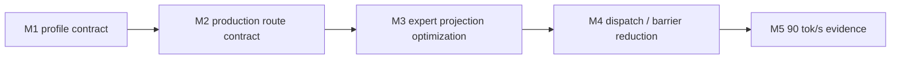

# LFM2.5 8B-A1B M5 Optimization Progress

This file is the single status ledger for the LFM2.5 8B-A1B optimization
workstream targeting a 90 tok/s decode timing gate.

## Goal

| Field | Value |
|---|---|
| Model | `LiquidAI/LFM2.5-8B-A1B` |
| Current release baseline | `0.8.7` |
| Baseline evidence | `85.2` wall tok/s / `89.3` GPU tok/s on 64-token exact trace |
| Target | `>= 90.0` wall tok/s on the same exact-trace decode timing gate |
| Correctness gate | HF 64-token strict-capital trace remains exact |
| Production route | split Sparse MoE with parallel router and BF16 packed4 expert projections |

## Milestone Status

| Milestone | Status | Evidence |
|---|---:|---|
| M1 profile contract | done | A1B config and graph contract tests pass |
| M2 production route contract | done | Default route exposes 22 parallel router, 22 packed gate/up, and 22 packed down decode steps |
| M3 expert projection optimization | done | Vectorized packed4 input/activation loads; packed8 remains opt-in after slower timing |
| M4 dispatch / barrier reduction | done | Parallel-router barrier elision reduces exact-trace decode barriers from `201` to `179` |
| M5 90 tok/s evidence | pending | Promote only after exact-trace timing clears the target |

## A1B Structural Contract

| Property | Required value | Reason |
|---|---:|---|
| hidden size | `2048` | Decode hidden vector width |
| layers | `24` | Execution schedule length |
| full-attention layers | `[2, 6, 10, 14, 18, 21]` | Hybrid schedule contract |
| conv layers | `18` | Hybrid schedule contract |
| dense FFN layers | `2` | First two layers are dense, not Sparse MoE |
| Sparse MoE layers | `22` | Dominant decode path |
| experts | `32` | Router grid width |
| experts per token | `4` | Active expert work per token |
| MoE intermediate size | `1792` | Expert projection width |
| routing weights | normalized sigmoid top-k with expert bias | Matches HF A1B behavior |

## Current Bottleneck Interpretation

| Family | Current interpretation |
|---|---|
| `sparse_moe_bf16_gate_up_packed4` | Primary projection bottleneck |
| `sparse_moe_bf16_down_packed4` | Secondary projection bottleneck |
| `gemv_2048_6144_bf16` | Dense layer projection still material |
| vocab GEMV | Output projection remains material |
| `sparse_moe_bf16_router_parallel` | No longer the main bottleneck |

## Decision Log

| Date | Milestone | Decision |
|---|---|---|
| 2026-05-31 | M1 | Fix the model-specific profile as a testable structural contract before adding more route variants |
| 2026-05-31 | M2 | Add a production-route histogram gate that requires 22 parallel router, 22 packed gate/up, and 22 packed down decode steps |
| 2026-05-31 | M3 | Add opt-in packed8 gate/up and down kernels for 8-aligned A1B expert projections; keep packed4 as default until timing evidence clears the gate |
| 2026-05-31 | M3 | Vectorize packed4 input and activation reads with `float4` dot products; default exact-trace timing remains green at `82.2` wall tok/s / `86.6` GPU tok/s in the focused run |
| 2026-05-31 | M4 | Full barrier removal reached `96.7` wall tok/s but corrupted the HF trace after the first token, so it is rejected |
| 2026-05-31 | M4 | Family scan found only `sparse_moe_bf16_router_parallel` barrier elision preserves the 64-token HF trace; this reduces decode barriers from `201` to `179` and measured `82.0` wall tok/s / `86.5` GPU tok/s |

## Rejected M3 Routes

| Candidate | Result | Decision |
|---|---|---|
| split2 gate/up + down | `63.8` wall tok/s / `66.7` GPU tok/s | Do not promote |
| 16 simdgroups | `27.3` wall tok/s / `80.6` GPU tok/s with high host overhead | Do not promote |
| 24 simdgroups | `77.6` wall tok/s / `81.5` GPU tok/s | Do not promote |
| packed8 opt-in | `79.2` wall tok/s / `83.3` GPU tok/s | Keep opt-in only |

## Rejected M4 Barrier Routes

| Candidate | Result | Decision |
|---|---|---|
| all decode barriers removed | `96.7` wall tok/s / `102.1` GPU tok/s but wrong token trace | Reject |
| `synthesized_3way*` barriers removed | wrong token trace | Reject |
| `sparse_moe_bf16_gate_up_packed4` barriers removed | wrong token trace | Reject |
| `sparse_moe_bf16_down_packed4` barriers removed | wrong token trace | Reject |
| `conv_state_update_bf16` barriers removed | wrong token trace | Reject |
| `gemv_2048_sq_bf16` barriers removed | wrong token trace | Reject |
| `gemv_2048_6144_bf16` barriers removed | wrong token trace | Reject |
