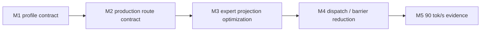

# LFM2.5 8B-A1B M5 Optimization Progress

This file is the single status ledger for the LFM2.5 8B-A1B optimization
workstream targeting a 90 tok/s decode timing gate.

## Goal

| Field | Value |
|---|---|
| Model | `LiquidAI/LFM2.5-8B-A1B` |
| Current release baseline | `0.8.7` |
| Baseline evidence | `85.2` wall tok/s / `89.3` GPU tok/s on 64-token exact trace |
| Target | `>= 90.0` wall tok/s on the same exact-trace decode timing gate |
| Correctness gate | HF 64-token strict-capital trace remains exact |
| Production route | split Sparse MoE with parallel router and BF16 packed4 expert projections |

## Milestone Status

| Milestone | Status | Evidence |
|---|---:|---|
| M1 profile contract | done | A1B config and graph contract tests pass |
| M2 production route contract | done | Default route exposes 22 parallel router, 22 packed gate/up, and 22 packed down decode steps |
| M3 expert projection optimization | done | Vectorized packed4 input/activation loads; packed8 remains opt-in after slower timing |
| M4 dispatch / barrier reduction | pending | Reduce decode step or barrier cost without weakening trace parity |
| M5 90 tok/s evidence | pending | Promote only after exact-trace timing clears the target |

## A1B Structural Contract

| Property | Required value | Reason |
|---|---:|---|
| hidden size | `2048` | Decode hidden vector width |
| layers | `24` | Execution schedule length |
| full-attention layers | `[2, 6, 10, 14, 18, 21]` | Hybrid schedule contract |
| conv layers | `18` | Hybrid schedule contract |
| dense FFN layers | `2` | First two layers are dense, not Sparse MoE |
| Sparse MoE layers | `22` | Dominant decode path |
| experts | `32` | Router grid width |
| experts per token | `4` | Active expert work per token |
| MoE intermediate size | `1792` | Expert projection width |
| routing weights | normalized sigmoid top-k with expert bias | Matches HF A1B behavior |

## Current Bottleneck Interpretation

| Family | Current interpretation |
|---|---|
| `sparse_moe_bf16_gate_up_packed4` | Primary projection bottleneck |
| `sparse_moe_bf16_down_packed4` | Secondary projection bottleneck |
| `gemv_2048_6144_bf16` | Dense layer projection still material |
| vocab GEMV | Output projection remains material |
| `sparse_moe_bf16_router_parallel` | No longer the main bottleneck |

## M5 Evidence

| Candidate | Correctness | Timing evidence | Decision |
|---|---|---:|---|
| Greedy softcap host-read skip | HF strict-capital trace pass; host sampling logit reads `0` | `82.1` wall tok/s / `86.4` GPU tok/s | Keep; removes avoidable CPU read but does not move the main bottleneck |
| 2048→6144 BF16 GEMV 8 SIMDgroups with matching generated kernel policy | Multi-prompt HF traces pass | `82.6` wall tok/s / `86.4` GPU tok/s | Keep; safe structural improvement, below M5 target |
| vocab GEMV dispatch-only 32 SIMDgroups | HF strict-capital trace pass | `82.2` wall tok/s / `85.9` GPU tok/s | Reject; profile noise did not translate to timing |
| 2048→6144 dispatch-only 8 SIMDgroups | Failed HF strict-capital trace | `86.7` wall tok/s / `91.1` GPU tok/s before failure | Reject; dispatch width must match generated fixed-SIMD kernel assumptions |
| packed4 gate/up threadgroup input staging | HF strict-capital trace pass | `81.3` wall tok/s / `86.1` GPU tok/s | Reject; staging barrier and threadgroup traffic outweighed reduced input rereads |
| 2048→2048 square GEMV 16 rows/threadgroup | HF strict-capital trace pass | `81.7` wall tok/s / `85.6` GPU tok/s | Reject; local profile improvement did not survive full decode timing |
| packed4 down staged activation | HF strict-capital trace pass | `82.6` wall tok/s / `86.2` GPU tok/s | Reject; activation staging did not improve end-to-end timing |
| vocab GEMV argbuf packed4 BF16 read | CPU reference pass | profile `gemv_vocab_bf16` worsened to `1471us` | Reject; vectorized read increased pressure instead of reducing vocab time |
| gate/up 28 SIMDgroups only | HF strict-capital trace pass | `82.5` wall tok/s / `86.2` GPU tok/s | Reject; no clear gain over default |
| down 28 SIMDgroups only | HF strict-capital trace pass | `80.8` wall tok/s / `84.7` GPU tok/s | Reject; slower |
| gate/up 36 SIMDgroups request | HF strict-capital trace pass | `82.1` wall tok/s / `86.0` GPU tok/s | Reject; clamped/overwide request did not improve timing |
| F16 decode buffer override | HF strict-capital trace pass | `82.5` wall tok/s / `86.1` GPU tok/s | Reject; no material improvement over BF16-buffer default |
| gate/up packed4 `fast::exp` sigmoid | HF strict-capital trace pass | `81.9` wall tok/s / `85.5` GPU tok/s | Reject; approximation did not improve the bottleneck and should not remain as another route variant |
| decode sync host-overhead diagnostic on legacy LFM2.5-1.2B harness | diagnostic pass | `401us/token` host overhead, `4.7%` of total | Not an A1B gate; supports the interpretation that A1B M5 needs GPU kernel work, not only host submission work |
| vocab fixed-dimension GEMV source | HF strict-capital trace pass | `82.4` wall tok/s / `86.0` GPU tok/s; vocab profile unchanged at `1354us` | Reject; fixed bounds/barrier cleanup did not reduce output-head time |

## Decision Log

| Date | Milestone | Decision |
|---|---|---|
| 2026-05-31 | M1 | Fix the model-specific profile as a testable structural contract before adding more route variants |
| 2026-05-31 | M2 | Add a production-route histogram gate that requires 22 parallel router, 22 packed gate/up, and 22 packed down decode steps |
| 2026-05-31 | M3 | Add opt-in packed8 gate/up and down kernels for 8-aligned A1B expert projections; keep packed4 as default until timing evidence clears the gate |
| 2026-05-31 | M3 | Vectorize packed4 input and activation reads with `float4` dot products; default exact-trace timing remains green at `82.2` wall tok/s / `86.6` GPU tok/s in the focused run |
| 2026-05-31 | M4 | Rejected barrier elision: all-barrier removal reached `96.7` wall tok/s but corrupted the trace; router-only elision passed twice and then failed on a repeated 64-token trace, so the optimization was reverted |
| 2026-05-31 | M5 | Greedy final-logit softcap no longer forces host logits read because softcap is monotonic and preserves argmax; the focused timing gate reports `host_logit_reads=0` |
| 2026-05-31 | M5 | 2048→6144 BF16 GEMV now uses a matching 8-SIMDgroup generation and dispatch policy; this is trace-safe but not sufficient for the 90 wall tok/s gate |
| 2026-05-31 | M5 | Rejected more gate/up micro-variants after direct timing; the remaining route to 90 wall tok/s must reduce real GPU work or safe dispatch dependencies rather than adding another local kernel knob |

## Rejected M3 Routes

| Candidate | Result | Decision |
|---|---|---|
| split2 gate/up + down | `63.8` wall tok/s / `66.7` GPU tok/s | Do not promote |
| 16 simdgroups | `27.3` wall tok/s / `80.6` GPU tok/s with high host overhead | Do not promote |
| 24 simdgroups | `77.6` wall tok/s / `81.5` GPU tok/s | Do not promote |
| packed8 opt-in | `79.2` wall tok/s / `83.3` GPU tok/s | Keep opt-in only |

## Rejected M4 Routes

| Candidate | Result | Decision |
|---|---|---|
| all decode barriers removed | `96.7` wall tok/s / `102.1` GPU tok/s but wrong token trace | Reject |
| `sparse_moe_bf16_router_parallel` barrier elision | reduced barriers from `201` to `179`, but repeated 64-token exact trace was nondeterministic | Reverted |
| `synthesized_3way*` barrier elision | wrong token trace | Reject |
| `sparse_moe_bf16_gate_up_packed4` barrier elision | wrong token trace | Reject |
| `sparse_moe_bf16_down_packed4` barrier elision | wrong token trace | Reject |
| `conv_state_update_bf16` barrier elision | wrong token trace | Reject |
| `gemv_2048_sq_bf16` barrier elision | wrong token trace | Reject |
| `gemv_2048_6144_bf16` barrier elision | wrong token trace | Reject |
