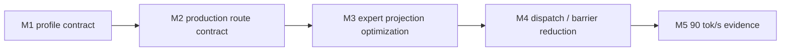

# LFM2.5 8B-A1B M5 Optimization Progress

This file is the single status ledger for the LFM2.5 8B-A1B optimization
workstream targeting a 90 tok/s decode timing gate.

## Goal

| Field | Value |
|---|---|
| Model | `LiquidAI/LFM2.5-8B-A1B` |
| Current release baseline | `0.8.7` |
| Baseline evidence | `85.2` wall tok/s / `89.3` GPU tok/s on 64-token exact trace |
| Target | `>= 90.0` wall tok/s on the same exact-trace decode timing gate |
| Correctness gate | HF 64-token strict-capital trace remains exact |
| Production route | split Sparse MoE with parallel router and BF16 packed4 expert projections |

## Milestone Status

| Milestone | Status | Evidence |
|---|---:|---|
| M1 profile contract | done | A1B config and graph contract tests pass |
| M2 production route contract | done | Default route exposes 22 parallel router, 22 packed gate/up, and 22 packed down decode steps |
| M3 expert projection optimization | pending | Optimize the `gate_up_packed4` / `down_packed4` dominant families |
| M4 dispatch / barrier reduction | pending | Reduce decode step or barrier cost without weakening trace parity |
| M5 90 tok/s evidence | pending | Promote only after exact-trace timing clears the target |

## A1B Structural Contract

| Property | Required value | Reason |
|---|---:|---|
| hidden size | `2048` | Decode hidden vector width |
| layers | `24` | Execution schedule length |
| full-attention layers | `[2, 6, 10, 14, 18, 21]` | Hybrid schedule contract |
| conv layers | `18` | Hybrid schedule contract |
| dense FFN layers | `2` | First two layers are dense, not Sparse MoE |
| Sparse MoE layers | `22` | Dominant decode path |
| experts | `32` | Router grid width |
| experts per token | `4` | Active expert work per token |
| MoE intermediate size | `1792` | Expert projection width |
| routing weights | normalized sigmoid top-k with expert bias | Matches HF A1B behavior |

## Current Bottleneck Interpretation

| Family | Current interpretation |
|---|---|
| `sparse_moe_bf16_gate_up_packed4` | Primary projection bottleneck |
| `sparse_moe_bf16_down_packed4` | Secondary projection bottleneck |
| `gemv_2048_6144_bf16` | Dense layer projection still material |
| vocab GEMV | Output projection remains material |
| `sparse_moe_bf16_router_parallel` | No longer the main bottleneck |

## Decision Log

| Date | Milestone | Decision |
|---|---|---|
| 2026-05-31 | M1 | Fix the model-specific profile as a testable structural contract before adding more route variants |
| 2026-05-31 | M2 | Add a production-route histogram gate that requires 22 parallel router, 22 packed gate/up, and 22 packed down decode steps |
