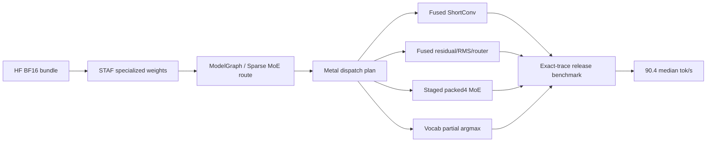
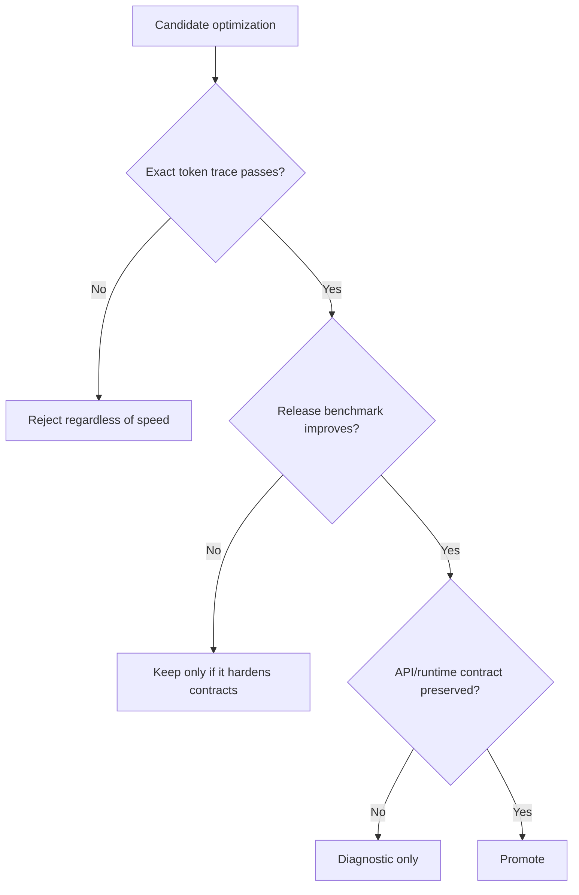

# LFM2.5 8B-A1B Decode Optimization Record

This document is the decision record for the LFM2.5 8B-A1B decode
optimization workstream that targeted the `90 tok/s` release benchmark gate on
Apple Silicon.

It records the final accepted route, the measurement contract, the experiments
that were rejected, and the remaining optimization frontier. The scope is the
non-quantized BF16 HuggingFace bundle path for `LiquidAI/LFM2.5-8B-A1B`.

## Status

| Field | Value |
|---|---|
| Model | `LiquidAI/LFM2.5-8B-A1B` |
| Precision scope | Non-quantized BF16 weights and BF16 decode buffers |
| Measurement target | `>= 90.0` median wall tok/s |
| Final release benchmark | `90.4` median wall tok/s |
| Final minimum sample | `90.1` wall tok/s |
| Final decode route | `162` decode steps, `161` barriers, `host_logit_reads=0` |
| Final commit | `db74ef3d Optimize LFM2.5 A1B decode dispatch` |
| Decision | M5 gate achieved |



## A1B Structural Contract

| Property | Value | Optimization consequence |
|---|---:|---|
| hidden size | `2048` | Enables exact-shape decode kernels |
| layers | `24` | Fixed decode schedule |
| attention layers | `[2, 6, 10, 14, 18, 21]` | Six full-attention decode blocks |
| short-convolution layers | `18` | ShortConv fusion removes repeated projection/update pairs |
| dense FFN layers | `2` | First two layers do not use Sparse MoE |
| Sparse MoE layers | `22` | Main decode bottleneck |
| experts | `32` | Router scans a small fixed expert set |
| experts per token | `4` | Active expert work is sparse but projection-heavy |
| MoE intermediate size | `1792` | Drives gate/up and down projection cost |
| routing | normalized sigmoid top-k with expert bias | Must match the HuggingFace forward path |

## Final Route

The final production route is not one large rewrite. It is a set of narrow,
trace-gated reductions that remove avoidable dispatch and binding overhead
without changing model semantics.

| Area | Final behavior | Reason |
|---|---|---|
| ShortConv | `shortconv_inproj_update_bf16` fuses in-projection and state update | Removes `18` projection/update pairs while preserving rounded BF16 state semantics |
| Residual + RMS + router | `residual_rms_router_parallel_bf16_sigmoid` is enabled by default unless `SWIFTLM_LFM25_DISABLE_FUSED_RMS_ROUTER=1` | Removes the separate residual/RMS/router boundary across the `22` MoE layers |
| Router scratch | selected expert IDs use `uint` scratch storage | Avoids float/int reinterpretation on the hot route |
| MoE gate/up | `sparse_moe_bf16_gate_up_staged_packed4` stages the 2048-wide input vector as threadgroup `float` and uses BF16 packed4 weight reads | Reduces repeated input conversion and keeps gate/up arithmetic vectorized |
| MoE down | `sparse_moe_bf16_down_packed4` remains the stable down-projection path | The broader split and row-sharing variants were slower |
| Output head | `gemv_vocab_blocked8x128_bf16_argmax_partial` plus `argmax_partial_reduce` | Avoids materializing and rereading a full logits vector for the greedy release gate |
| Argument binding | encoded argument-buffer variants are used for the hot fused router, MoE, vocab partial argmax, and partial reduce families | Reduces per-step binding pressure while preserving buffer offsets |
| Submission | command submission keeps the lightweight local commit path and max in-flight control | Dedicated feedback queues and event waits did not improve or were unstable |

The final kernel histogram for the 64-token release benchmark is:

| Kernel family | Count |
|---|---:|
| `synthesized_3way_residualadd_copy_reduction_4p_row2048_f16_wbf16` | `25` |
| `gemv_2048_sq_bf16` | `24` |
| `residual_rms_router_parallel_bf16_sigmoid` | `22` |
| `sparse_moe_bf16_down_packed4` | `22` |
| `sparse_moe_bf16_gate_up_staged_packed4` | `22` |
| `shortconv_inproj_update_bf16` | `18` |
| `batched_gemv3_bf16` | `6` |
| `batched_qk_rms_norm_bf16_2` | `6` |
| `rope_flash_attn_decode` | `6` |
| `batched_gemv2_bf16` | `2` |

## Measurement Contract

The release benchmark is meaningful only because it verifies output correctness
before timing. It must continue to be treated as an exact-trace gate, not a raw
throughput microbenchmark.

```bash
perl -e 'alarm shift; exec @ARGV' 120 /usr/bin/env \
  -u SWIFTLM_VOCAB_DISABLE_BLOCKED8X128 \
  -u SWIFTLM_LFM25_DISABLE_FUSED_RMS_ROUTER \
  -u SWIFTLM_OUTPUT_HEAD_PARTIAL_ARGMAX \
  -u SWIFTLM_SPARSE_MOE_GATE_UP_SIMDGROUPS \
  -u SWIFTLM_SPARSE_MOE_DOWN_SIMDGROUPS \
  .build/release/lfm25-a1b-benchmark \
  --tokens 64 --warmup 1 --iterations 10 --require-m5
```

| Contract | Value |
|---|---|
| Bundle source | HuggingFace cache snapshot for `LiquidAI/LFM2.5-8B-A1B` |
| Prompt | strict-capital chat prompt |
| Correctness gate | exact 64-token HuggingFace trace before timing output |
| Timing scope | decode wall time from the production raw generation timing path |
| Warmup | `1` exact-trace run excluded from measured median |
| Measured iterations | `10` exact-trace runs |
| Pass condition | median wall tok/s `>= 90.0`; `--require-m5` enforces this |

Final measured samples:

| Metric | Value |
|---|---:|
| warmup | `90.7` tok/s |
| best | `90.7` tok/s |
| median | `90.4` tok/s |
| minimum measured sample | `90.1` tok/s |
| measured samples | `90.7, 90.5, 90.4, 90.4, 90.4, 90.4, 90.6, 90.3, 90.1, 90.2` |

## Validation Evidence

| Gate | Result | Notes |
|---|---|---|
| release benchmark build | pass | `swift build -c release --product lfm25-a1b-benchmark` |
| package build-for-testing | pass | `xcodebuild build-for-testing` under a 120-second timeout |
| source generation | pass | `MetalCompilerTests/MetalSourceGeneratorTests`, `50` tests |
| production route | pass | `productionSparseMoERouteUsesA1BOptimizedKernels()` |
| MoE reference | pass | `realPackedSparseMoEKernelMatchesCPUReference()`, max error `6.8899244e-06` |
| default route timing | pass | wall `89.4` tok/s, GPU `93.1` tok/s in the focused xctest timing gate |
| decode profile | pass | total profiled kernel time `10161us` |
| final release M5 gate | pass | median `90.4` tok/s |
| hygiene | pass | `git diff --check`; rejected experiment symbols absent |

The focused decode profile after the final route showed:

| Family | Share |
|---|---:|
| `sparse_moe_bf16_gate_up_staged_packed4` | `34.0%` |
| `sparse_moe_bf16_down_packed4` | `17.0%` |
| `gemv_vocab_blocked8x128_bf16_argmax_partial` | `13.0%` |
| `shortconv_inproj_update_bf16` | `12.4%` |
| `gemv_2048_sq_bf16` | `6.1%` |
| `residual_rms_router_parallel_bf16_sigmoid` | `5.3%` |

The profile confirms that the remaining cost is real model math, especially
MoE projection, rather than only host-side command submission.

## Accepted Decisions

| Decision | Evidence | Rationale |
|---|---|---|
| Keep ShortConv in-projection/state fusion as default | Exact trace passed; default plan dropped from `202` to `184` steps before later route work | Removes dependent dispatches without changing state semantics |
| Promote fused residual/RMS/router after rework | Final exact release benchmark passed at `90.4` median tok/s | Earlier versions were slower because staging traffic outweighed dispatch reduction; the final form is part of the passing route |
| Keep MoE gate/up staged packed4 | Final profile shows the family remains the largest cost but is stable and correct | Threadgroup `float` input staging plus packed4 BF16 reads is the best accepted gate/up form |
| Keep MoE down packed4 | CPU reference and exact trace passed | Wider or split down variants did not improve wall timing |
| Keep output-head partial argmax for the release route | Final route reports `host_logit_reads=0` | The greedy benchmark does not need a CPU-readable full logits vector |
| Use encoded argument-buffer variants for selected hot kernels | Repeated release samples stayed above `90.0` tok/s after adding the variants | Encoded argument buffers preserve offsets and reduce binding overhead for hot repeated kernels |
| Keep full execution barriers unless dependency analysis proves otherwise | Unsafe barrier experiments corrupted tokens | Barrier removal must be graph-proven, not guessed from kernel names |
| Keep the benchmark exact-trace-first | Multiple fast candidates produced wrong traces | Performance numbers from an incorrect trace are invalid |

## Rejected Experiments

The workstream produced several tempting but unsafe or slower candidates. These
must not be reintroduced without new correctness evidence.

| Candidate | Result | Decision |
|---|---|---|
| Removing all decode execution barriers | Reached high apparent throughput but produced wrong token traces | Reject |
| Router-only or family-specific barrier elision | Sometimes passed, then failed repeated exact traces | Reject |
| `SWIFTLM_DECODE_SKIP_PRIVATE_EXECUTION_BARRIERS` | Corrupted the generated token trace | Reject and remove |
| Dedicated Metal 4 feedback queue | Crashed before useful timing output | Reject |
| `MTLSharedEvent` completion wait | Correct but did not improve wall timing | Reject |
| Monolithic Sparse MoE route | Failed exact A1B trace | Reject |
| split2 Sparse MoE gate/up and down | Correctness could pass but timing regressed sharply | Reject |
| row4 gate/up input sharing | Increased register pressure and regressed | Reject |
| row2 gate/up input sharing | Correct but did not clear the release gate | Do not promote |
| packed8 Sparse MoE default | Exact route could be useful diagnostically but was not the final fastest stable default | Do not promote |
| `fast::exp` sigmoid approximation | Did not improve timing and adds another numerical route | Reject |
| BF16 activation scratch | Reduced scratch bandwidth but added conversion and reload cost | Reject |
| Static A1B split kernels | Removed some runtime checks but did not move the bottleneck | Reject |
| Prepared argument-buffer non-zero offset shortcut | Corrupted token trace when offsets were not materialized safely | Reject |
| Greedy argmax-only or private-logits route as a general API path | Useful for diagnostics but unsafe for general host sampling semantics | Reject as general route |
| MTP / speculative decoding in-place | Local A1B configs expose no MTP or draft-head metadata | Out of scope |
| Quantized Q8 route for this goal | Reached useful diagnostic milestones but user scope excluded quantization | Out of scope for final M5 |

## Lessons



| Lesson | Detail |
|---|---|
| Correctness beats throughput | Barrier and monolithic-MoE experiments showed that a fast wrong trace is not useful evidence |
| Dispatch-count reduction is not automatically faster | Early fused router attempts reduced steps but lost on threadgroup traffic and occupancy |
| Host waits were not the main gap | Event waits and multi-token command-buffer experiments did not close M5 |
| MoE projection is the real frontier | The final profile still spends about half the kernel time in gate/up and down |
| Argument buffers must preserve offsets | The safe path is an encoded argument-buffer variant with materialized binding offsets, not a shortcut that loses STAF slice semantics |
| Output-head optimization must match the sampling contract | Greedy-only shortcuts must not leak into general sampling APIs |
| GGUF is useful as a layout reference only | The accepted path remains HuggingFace safetensors plus STAF; no GGUF loader or quantized runtime is introduced |

## Next Optimization Frontier

The `90 tok/s` gate is closed. Further improvement is still possible, but the
remaining work is structural rather than another small kernel knob.

| Frontier | Expected value | Risk |
|---|---|---|
| MoE expert weight layout for decode | Highest | Requires STAF layout changes and reference-aligned tests |
| Gate/up/down scratch-traffic reduction | High | Easy to corrupt selected expert or route-weight semantics |
| Narrow MoE block fusion | Medium to high | Must preserve normalized hidden reuse and exact routing |
| Dependency-proven barrier elimination | Medium | Needs explicit read/write region proof across the decode graph |
| Metal 4 command prerecording | Medium | Requires indirect per-token state and careful lifetime management |
| Vocab/output-head layout refinement | Low to medium | Current partial argmax already captures the largest easy win |

The most defensible next target is MoE-specific weight layout and scratch
traffic. The final profile shows:

```text
MoE gate/up + down ~= 51% of profiled decode kernel time
```

That cost is too large to ignore and too structural to solve with only
simdgroup count changes.

## Operational Rules

Future changes in this area should follow this order:

1. Add or update a narrow contract test for the route.
2. Verify exact token trace before reading throughput numbers.
3. Run the focused profile to confirm the intended kernel family changed.
4. Run the release executable with warmup and multiple iterations.
5. Reject the candidate if repeated release samples do not improve the median
   without correctness or API-contract compromise.

Do not promote:

- barrier removal without dependency proof
- greedy-only logits shortcuts as general sampling paths
- quantized-route results as evidence for the BF16 non-quantized goal
- diagnostic environment routes without exact-trace and release benchmark
  evidence
