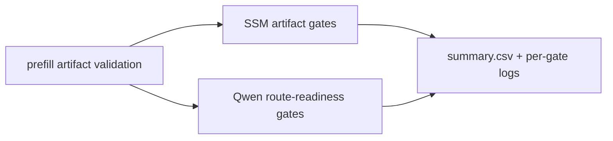

# Production Readiness Gates

This document defines the minimum release gates for `swift-lm`.

Latest captured evidence: [Production Readiness Evidence - 2026-05-05](releases/production-readiness-2026-05-05.md).
Latest prefill artifact evidence: [Prefill Artifact Readiness Evidence - 2026-05-18](releases/prefill-artifact-readiness-2026-05-18.md).
Latest LFM2.5 A1B evidence: [LFM2.5 8B-A1B Production Readiness Evidence - 2026-05-30](releases/lfm25-a1b-production-readiness-2026-05-30.md).
LFM2.5 A1B focused runner: `scripts/benchmarks/run-lfm25-a1b-readiness.sh --timeout 120`.

## Goal

The release bar is:

- correct first-token and short-trace behavior on real bundles
- no known crash path in prompt-state, sampling, or Metal residency paths
- no material throughput regression against model-specific baselines
- clear probes for fast diagnosis when a Metal execution path breaks
- user-facing docs describe the current public API without stale names or stale flow guidance

## Correctness Gates

These suites must pass before a release:

- `xcodebuild test -scheme swift-lm-Package -destination 'platform=macOS,arch=arm64' -only-testing:SwiftLMTests/ReleaseSmokeOutputTests`
- `xcodebuild test -scheme swift-lm-Package -destination 'platform=macOS,arch=arm64' -only-testing:SwiftLMTests/ReleaseSmokePromptStateTests`
- `xcodebuild test -scheme swift-lm-Package -destination 'platform=macOS,arch=arm64' -only-testing:SwiftLMTests/ReleaseSmokeCapabilityTests`
- `xcodebuild test -scheme swift-lm-Package -destination 'platform=macOS,arch=arm64' -only-testing:SwiftLMTests/RotorQuantRealBundleBaselineTests`
- `xcodebuild test -scheme swift-lm-Package -destination 'platform=macOS,arch=arm64' -only-testing:SwiftLMTests/QwenVisionRealBundleTextTests`
- `xcodebuild test -scheme swift-lm-Package -destination 'platform=macOS,arch=arm64' -only-testing:SwiftLMTests/RotorQuantRealBundleFullTests`
- `xcodebuild test -scheme swift-lm-Package -destination 'platform=macOS,arch=arm64' -only-testing:MetalCompilerTests/PrefillTransferTests`
- `xcodebuild test -scheme swift-lm-Package -destination 'platform=macOS,arch=arm64' -only-testing:MetalCompilerTests/RotorQuantCorrectnessTests`

Required expectations:

- LFM local smoke mentions `Tokyo` (`ReleaseSmokeOutputTests`)
- LFM2.5 8B-A1B local real bundle loads from the HuggingFace cache, rejects
  unsupported image input explicitly, emits a non-EOS greedy token, and matches
  the HuggingFace 16-token greedy short trace for the strict capital chat prompt.
- LFM2.5 8B-A1B prompt-state restore preserves the visible strict-capital
  output token trace and returns `Tokyo`.
- LFM2.5 8B-A1B Sparse MoE production routing uses the split route. The legacy
  monolithic route is diagnostic-only and must not be used as correctness
  oracle because it is not HuggingFace first-token equivalent on the current
  A1B bundle.
- LFM2.5 8B-A1B Sparse MoE routing uses the fused parallel expert router
  (`sparse_moe_bf16_router_parallel`) and BF16 packed4 gate/up + down kernels
  by default. The 64-token strict-capital decode timing gate must match the
  HuggingFace token trace exactly, route through the parallel router and
  packed4 kernels, stay at or below 202 decode steps, and clear 78 wall-clock
  tok/s plus 80 GPU tok/s.
- LFM2.5 8B-A1B default Sparse MoE routing stays bounded across short, chat,
  and longer prompt lengths so the production route cannot silently regress to
  diagnostic monolithic latency.
- LFM2.5 8B-A1B default Sparse MoE routing stays bounded across
  1/8/16/32/64-token decode sweeps, matches the regenerated HuggingFace
  64-token strict-capital trace prefix at each checked length, and completes a
  128-token-cap semantic decode with `</think>` and `Tokyo`.
- LFM2.5 8B-A1B default Sparse MoE routing has a multi-prompt sustained gate:
  strict-capital, largest-planet, and Japanese-translation prompts all preserve
  their regenerated HuggingFace 16-token prefixes and reach the expected answer
  content under a 64-token cap, with aggregate throughput kept above the
  current 50 tok/s regression floor.
- Gemma4 FP16 real bundle first non-empty chunk starts with `Tokyo` (`RotorQuantRealBundleBaselineTests`)
- Qwen3.5 real bundle first non-empty chunk starts with `Tokyo`
- RotorQuant Gemma4 full K+V paths (RotorQ8, RotorQ4) preserve the same short factual answer shape (`RotorQuantRealBundleFullTests`)
- Hybrid stateful sequence prefill is model-family gated by trace equivalence.
  BF16 LFM short-convolution sequence prefill and BF16 Qwen DeltaNet/SSM prompt
  ingestion may use the sequence path only while their focused short-trace tests
  match decode-equivalent ingestion. Q3 sequence prefill remains unsupported and
  must report an explicit `sequencePrefillFallbackReason`.

## Performance Gates

These suites or benchmark cases must pass and their output must be reviewed
against the latest saved baseline:

- `xcodebuild test -scheme swift-lm-Package -destination 'platform=macOS,arch=arm64' -only-testing:MetalCompilerTests/RotorQuantBenchmarkTests`
- `xcodebuild test -scheme swift-lm-Package -destination 'platform=macOS,arch=arm64' -only-testing:MetalCompilerTests/BenchmarkDiagnosticsTests`
- `xcodebuild test -scheme swift-lm-Package -destination 'platform=macOS,arch=arm64' -only-testing:SwiftLMTests/GenerationThroughputBenchmarkTests`
- `xcodebuild test -scheme swift-lm-Package -destination 'platform=macOS,arch=arm64' -only-testing:SwiftLMTests/GenerationScalingBenchmarkTests`
- `xcodebuild test -scheme swift-lm-Package -destination 'platform=macOS,arch=arm64' -only-testing:SwiftLMTests/GenerationStreamingBenchmarkTests`

If a benchmark suite exceeds the 120-second outer timeout, split it into
individual test cases and keep each case within 120 seconds. Do not raise the
outer timeout to hide an oversized benchmark harness.

Review items:

- Gemma4 decode `RotorQ4` must not regress materially against FP16
- LFM decode `RotorQ4` may be near FP16, but should not show sustained regression beyond normal benchmark variance
- context-length decode scaling must remain monotonic
- host overhead must remain low relative to GPU time

## Prefill Route Promotion Artifact Gate

Prefill route promotion must be evidence-backed before a faster route becomes
the production default. Run the artifact validation wrapper after the focused
prefill microbench/profile artifacts have been generated:

```bash
scripts/benchmarks/run-prefill-artifact-validation.sh --timeout 120
```

The wrapper records a replayable result bundle:



Required expectations:

- SSM route, threadgroup policy, state feasibility, state bridge, phase/full
  bridge, and artifact-manifest reconstruction gates pass.
- Qwen route-readiness reconstruction passes for both the synthetic contract
  and the current local artifact set.
- The parent summary is written under
  `.test-artifacts/prefill-artifact-validation/<timestamp>/summary.csv`.
- A route can be discussed for default promotion only when its microbench
  promotion CSV, full-profile route gate, and full-profile speed gate all agree.
  The full-profile speed gate must show at least 10% total prefill improvement
  at every production sequence length under review.

If persisted Qwen baseline and experimental full-profile directories are
available, pass them through the wrapper so it regenerates the speed gate before
route-readiness validation:

```bash
scripts/benchmarks/run-prefill-artifact-validation.sh \
  --qwen-baseline-dir .test-artifacts/prefill-profile-baseline \
  --qwen-experimental-dir .test-artifacts/prefill-profile-row-grid
```

## Model-Aware Policy Gate

The default inference policy is not a universal RotorQuant default.

- `InferencePolicy.default` remains conservative and automatic
- `ModelBundleLoader` resolves the default to `RotorQ4/RotorQ4` only when the graph contains attention-backed KV cache decode
- non-attention graphs must not be forced onto RotorQuant

This behavior is covered by `MetalCompilerTests/RotorQuantCorrectnessTests`.

## Probe Gate

`ENABLE_METAL_PROBES` should remain available for fast failure localization.

Probe coverage must include:

- prefill to decode handoff
- prompt-state save and restore
- sampling logits source selection
- hidden override and deepstack staging paths

Probe output must stay disabled by default.

## Documentation Gate

The public API documentation must stay consistent across:

- `README.md`
- `docs/using-swift-lm.md`
- `Sources/SwiftLM/SwiftLM.docc/`

Required expectations:

- `Container / Context / Input` is the documented API shape for both generation and embeddings
- prompt-time thinking control is documented under `PromptPreparationOptions`
- output-time reasoning visibility is documented under `GenerationParameters.reasoning` / `ReasoningOptions`
- staged generation APIs are described as advanced, not as the default entry point
- embedding docs use `TextEmbeddingInput` as the preferred request value

## Test Execution Rules

To reduce crashes and memory pressure during release validation:

- run `build-for-testing` once
- run `test-without-building` suite by suite
- avoid one large `xcodebuild test` invocation across all real bundle suites
- keep real model scopes tight and prefer autorelease-friendly structure

## Not Yet Release-Blocking

These are still important, but they are not the current release gate:

- async decode pipeline expansion
- prerecording / MTL4 indirect execution work
- model-specific automatic policy tuning beyond the current attention-based default resolver
