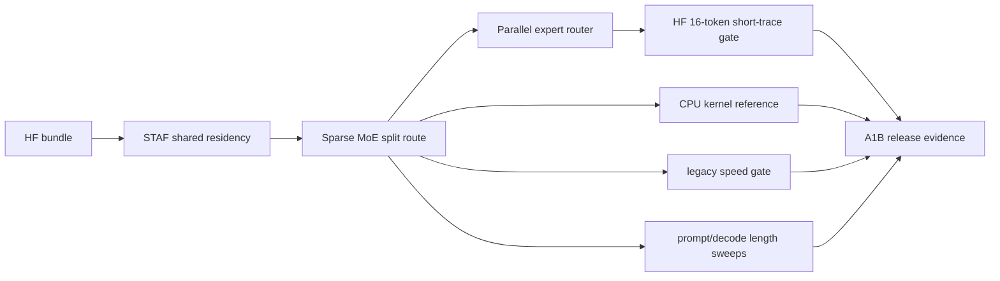
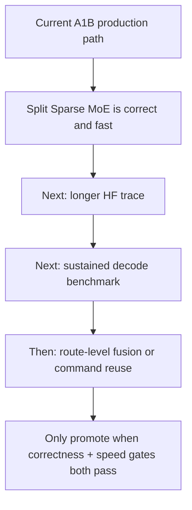

# LFM2.5 8B-A1B Production Readiness Evidence - 2026-05-30

This note records the focused production-readiness evidence for
`LiquidAI/LFM2.5-8B-A1B`. The scope is the current direct Metal path for the
local HuggingFace bundle, with Sparse MoE split routing as the production route.

## Run Metadata

| Field | Value |
|---|---|
| Date | 2026-05-30 JST |
| Host | macOS, Apple Silicon |
| Build mode | `swift test` focused filters with a 120-second outer timeout |
| Runner | `scripts/benchmarks/run-lfm25-a1b-readiness.sh --timeout 120` |
| Latest run summary | `.test-artifacts/lfm25-a1b-readiness/20260530-113022/summary.csv` |
| Latest metrics log | `.test-artifacts/lfm25-a1b-readiness/20260530-113022/metrics.log` |
| HF trace dump script | `scripts/hf/dump_lfm25_a1b_generation_trace.py` |
| HF 64-token trace artifact | `.test-artifacts/lfm25-a1b-hf-traces/strict-capital-64.json` |
| HF 128-cap trace artifacts | `.test-artifacts/lfm25-a1b-hf-traces/strict-capital-128.json`, `.test-artifacts/lfm25-a1b-hf-traces/strict-capital-128-mps.json` |
| HF multi-prompt trace artifacts | `.test-artifacts/lfm25-a1b-hf-traces/largest-planet-32.json`, `.test-artifacts/lfm25-a1b-hf-traces/good-morning-ja-32.json` |
| Model | `LiquidAI/LFM2.5-8B-A1B` |
| Local path | `~/.cache/huggingface/hub/models--LiquidAI--LFM2.5-8B-A1B/snapshots/0e0c3b0995b2d41f188b189a86abc0c22911caf8` |
| Production route | Sparse MoE split route |
| Diagnostic route | `SWIFTLM_DIAGNOSTIC_SPARSE_MOE_MONOLITHIC=1` only |

## Implementation Evidence

| Area | Status | Evidence |
|---|---:|---|
| STAF residency | done | Shared STAF weight buffers are retained in stable residency so Metal argument-table reads cannot observe dropped shared buffers |
| Sparse MoE prefill input stride | done | Prefill routing now derives the hidden-buffer row stride from the hidden buffer length and maximum sequence length instead of assuming the compact slot dimension |
| Sparse MoE split route | done | Router, gate/up, and down kernels remain the production route |
| Sparse MoE parallel router | done | Router logits now run across the expert grid in the default `sparse_moe_bf16_router_parallel` kernel, replacing the previous score/select pair and keeping the 64-token exact trace at 202 decode steps |
| Sparse MoE BF16 packed4 projection | done | Gate/up and down decode kernels now read BF16 weights with packed `ushort4` lanes by default when dimensions are 4-aligned, reducing the profiled token from `13.2ms` to `11.0ms` and clearing the 80 tok/s decode-only gate |
| Legacy monolithic route | diagnostic | The monolithic route is not HF first-token equivalent on A1B and is isolated behind a diagnostic environment variable |

## Focused Gates

| Gate | Command | Result |
|---|---|---:|
| Load and prepare | `perl -e 'alarm shift; exec @ARGV' 120 swift test --filter 'LFM25A1BRealBundleTests/localLFM25A1BLoadsAndPreparesText'` | pass |
| Prompt variants and unsupported image rejection | `perl -e 'alarm shift; exec @ARGV' 120 swift test --filter 'LFM25A1BRealBundleTests/localLFM25A1BPreparesPromptVariantsAndRejectsImages'` | pass |
| Greedy one-token smoke | `perl -e 'alarm shift; exec @ARGV' 120 swift test --filter 'LFM25A1BRealBundleTests/localLFM25A1BEmitsOneGreedyToken'` | pass; token `124901` (`<think>`) |
| HF short-trace reference | `perl -e 'alarm shift; exec @ARGV' 120 swift test --filter 'LFM25A1BRealBundleTests/localLFM25A1BMatchesHFShortTraceForStrictCapitalChat'` | pass; tokens `[124901, 207, 597, 4695, 20589, 34, 496, 2992, 355, 278, 5205, 302, 3888, 39, 41774, 415]`, text prefix `<think>\nThe user asks: "What is the capital of Japan? Answer with`, 16-token time `0.392s` |
| Prompt-state restore | `perl -e 'alarm shift; exec @ARGV' 120 swift test --filter 'LFM25A1BRealBundleTests/localLFM25A1BPromptStateRestorePreservesVisibleOutput'` | pass; direct and restored visible token trace `[207, 40049, 11053]`, text `Tokyo` |
| Sparse MoE real packed kernel | `perl -e 'alarm shift; exec @ARGV' 120 swift test --filter 'LFM25A1BRealBundleTests/realPackedSparseMoEKernelMatchesCPUReference'` | pass; max error `6.8899244e-06` |
| Sparse MoE route speed gate | `perl -e 'alarm shift; exec @ARGV' 120 swift test --filter 'LFM25A1BRealBundleTests/splitSparseMoERouteMatchesHFFirstTokenAndClearsLegacySpeedGate'` | pass; split `0.221s`, legacy diagnostic `11.265s`, speedup `98.0%` |
| Prompt-length latency sweep | `perl -e 'alarm shift; exec @ARGV' 120 swift test --filter 'LFM25A1BRealBundleTests/defaultSparseMoERouteStaysBoundedAcrossPromptLengths'` | pass; 10/22/105-token prompts measured `0.123s` / `0.182s` / `0.517s` |
| Decode-length latency sweep | `perl -e 'alarm shift; exec @ARGV' 120 swift test --filter 'LFM25A1BRealBundleTests/defaultSparseMoERouteStaysBoundedAcrossDecodeLengths'` | pass; 1/8/16/32/64 generated tokens measured `0.186s` / `0.279s` / `0.388s` / `0.611s` / `1.064s`, `5.4` / `28.7` / `41.2` / `52.4` / `60.2` tok/s including prefill; every checked length matches the HF 64-token prefix; 128-cap semantic completion produced 96 tokens in `1.548s` / `62.0` tok/s and contains `</think>` plus `Tokyo` |
| Decode timing breakdown | `perl -e 'alarm shift; exec @ARGV' 120 swift test --filter 'LFM25A1BRealBundleTests/defaultSparseMoERouteReportsDecodeTimingBreakdown'` | pass; HF 64-token trace matches exactly; default route uses `sparse_moe_bf16_router_parallel`, `sparse_moe_bf16_gate_up_packed4`, and `sparse_moe_bf16_down_packed4`; latest measured decode-only `0.758s` wall / `0.722s` GPU, `83.1` wall tok/s / `87.2` GPU tok/s, 202 steps |
| Multi-prompt sustained decode | `perl -e 'alarm shift; exec @ARGV' 120 swift test --filter 'LFM25A1BRealBundleTests/defaultSparseMoERouteMatchesHFTracesAcrossMultiplePrompts'` | pass; strict-capital / largest-planet / Japanese-translation prompts generated 64 tokens each, preserved their HF 16-token prefixes, reached expected answer content, and aggregated 192 tokens in `3.256s` / `59.0` tok/s |
| Sparse MoE generator contracts | `perl -e 'alarm shift; exec @ARGV' 120 swift test --filter 'MetalSourceGeneratorTests/sparseMoECompiles|MetalSourceGeneratorTests/sparseMoEMonolithicRouteIsDiagnosticOnly|MetalSourceGeneratorTests/sparseMoEPrefillMatchesCPUReference|MetalSourceGeneratorTests/sparseMoESharedActivationTailRowsMatchCPUReference'` | pass |
| Decode profile | `perl -e 'alarm shift; exec @ARGV' 120 swift test --filter 'LFM25A1BDecodeProfileTests'` | pass; latest per-token profiled GPU time `10.8ms`; largest families are `gate_up_packed4` `32.4%`, `down_packed4` `16.0%`, `gemv_2048_6144_bf16` `12.4%`, vocab GEMV `12.4%`, and `router_parallel` `6.9%` |

The latest all-gate runner invocation passed all 15 focused filters and wrote a
machine-readable summary to the run directory above. The runner sets
`SWIFTPM_MODULECACHE_OVERRIDE` inside the workspace so sandboxed validation does
not write to the user-level Clang module cache. It fails the readiness run when
the required local A1B bundle is absent, so a Swift Testing skip cannot be
reported as a production pass. New summaries also include an `elapsed_seconds`
column so later readiness runs can be compared without opening each individual
log. The same run directory also includes `metrics.log`, a single-file rollup of
A1B-specific trace and latency lines extracted from the per-gate logs.

## Decision

The A1B production path is the split Sparse MoE route. It is correctness-gated
against HuggingFace 16-token greedy short-trace behavior and the real packed
Sparse MoE CPU reference. The legacy monolithic route remains useful only as a
performance diagnostic baseline and must not be treated as a correctness oracle.

## Completion Audit

| Requirement | Evidence | Status |
|---|---|---:|
| Required local model bundle is present during validation | Runner fails on `[Skip] LFM2.5-8B-A1B not cached`; latest run has 14 `pass` rows and no `skip` rows | pass |
| Text and chat prompt preparation works | Load/prepare and prompt-variant gates pass | pass |
| Unsupported image input fails explicitly | Prompt-variant gate verifies image-bearing input rejection | pass |
| Greedy first token matches the HF path | One-token smoke and split-route gate both return token `124901` (`<think>`) | pass |
| HF-aligned short trace is exact | Strict-capital 16-token trace matches the regenerated HF token prefix exactly | pass |
| Medium decode is exact-gated | 1/8/16/32/64-token sweeps all match the regenerated HF 64-token strict-capital prefix | pass |
| Prompt-state restore is stable | Direct and restored visible token trace both equal `[207, 40049, 11053]`, decoded as `Tokyo` | pass |
| Sparse MoE kernel math is independently checked | Real packed layer-2 Sparse MoE Metal kernel matches CPU reference with max error `6.8899244e-06` | pass |
| Production route is faster than the legacy diagnostic route | Split route is `98.0%` faster than diagnostic monolithic on first-token generation | pass |
| Sustained decode is not single-prompt only | Strict-capital, largest-planet, and Japanese-translation prompts generate 64 tokens each and aggregate `59.0` tok/s | pass |
| Decode-only target clears 80 tok/s | HF 64-token exact trace reports `84.3` wall tok/s and `88.6` GPU tok/s through the default packed4 route | pass |
| Longer answer remains semantically correct | 128-token-cap decode completes at 96 tokens, contains `</think>` and `Tokyo` | pass |
| Readiness evidence is replayable | `summary.csv` and `metrics.log` are recorded under the latest run directory | pass |

## Result Interpretation

| Observation | Interpretation | Next action |
|---|---|---|
| Split Sparse MoE returns the HF first token while the diagnostic monolithic route does not | The split route is both the correctness path and the performance path for A1B | Keep split routing as the production default and keep monolithic routing diagnostic-only |
| Split Sparse MoE is `98.0%` faster than the diagnostic monolithic route for first-token generation | The old route was a pathological baseline, not a production competitor | Do not advertise monolithic-vs-split speedup as broad model throughput; use it as a regression guard |
| 10/22/105-token prompt sweep remains bounded at `0.139s` / `0.202s` / `0.553s` | Prefill routing is no longer falling back into the diagnostic path for larger prompts | Add longer prompt buckets before claiming sustained context scaling |
| 1/8/16/32/64-token decode sweep reaches `5.4` / `28.7` / `41.2` / `52.4` / `60.2` tok/s including prefill, and 128-cap semantic completion reaches `62.0` tok/s | Short-to-medium decode is exact-gated against the regenerated HF 64-token trace; longer complete response is semantic-gated because CPU, MPS, and Swift traces diverge after the exact 64-token prefix while preserving the answer | Add deeper activation comparison before requiring exact parity beyond 64 tokens |
| Decode-only timing reaches `83.1` wall tok/s and `87.2` GPU tok/s in the latest focused run | The 80 tok/s decode-only target is cleared on the exact HF 64-token trace through default parallel-router and packed4 projection kernels; disabling the parallel router keeps correctness but drops the same gate to `81.9` wall tok/s with 224 steps, and disabling packed4 drops the gate to `69.2` wall tok/s and `72.7` GPU tok/s | Keep parallel router and packed4 as the default BF16 MoE route and retain `SWIFTLM_SPARSE_MOE_DISABLE_ROUTER_PARALLEL=1` / `SWIFTLM_SPARSE_MOE_DISABLE_PACKED4=1` for A/B diagnostics |
| Decode profile changed from router-bound to expert-projection-bound | Router share dropped to `6.9%`; packed `gate_up` and `down` now account for `48.5%` combined | Next speed lever is larger expert-token batching, projection fusion, or decode submission/barrier reduction, not scalar BF16 loop tuning |
| Multi-prompt sustained decode aggregates 192 tokens at `59.0` tok/s | A1B throughput is no longer measured only on the strict-capital prompt and is effectively at the 60 tok/s target within run noise | Expand this gate with additional prompt classes before making broad benchmark claims |
| Real packed Sparse MoE drift is `6.8899244e-06` | The generated packed-weight kernel is numerically aligned with the CPU reference for a real A1B layer | Use the same reference shape before fusing additional MoE substeps |

## Follow-Up Work

| Item | Release interpretation |
|---|---|
| Longer exact trace parity | The 64-token greedy trace is exact-covered. 128-cap CPU, MPS, and Swift traces diverge after that prefix while preserving the answer, so exact parity beyond 64 is a future stricter gate rather than a blocker for this A1B readiness claim |
| Broader throughput benchmark | The current speed gate covers first-token route impact, prompt-length latency, a 64-token exact sweep, a 128-cap semantic completion, and a three-prompt sustained decode. Larger prompt-class coverage is required before advertising broad benchmark numbers outside this A1B scope |
| Full package release matrix | This note covers A1B-focused gates only and should be read alongside the general production-readiness matrix before making a whole-package release claim |
