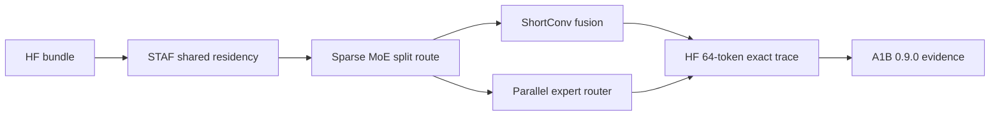

# LFM2.5 8B-A1B Production Readiness Evidence - 2026-05-31

This note records the focused production-readiness evidence for
`LiquidAI/LFM2.5-8B-A1B` at the `0.9.0` release boundary. The scope is the
current direct Metal path for the local HuggingFace bundle, with Sparse MoE
split routing and ShortConv in-projection/state-update fusion as the production
route.

## Run Metadata

| Field | Value |
|---|---|
| Date | 2026-05-31 JST |
| Host | macOS, Apple Silicon |
| Runner | `scripts/benchmarks/run-lfm25-a1b-readiness.sh --timeout 120` |
| Latest run summary | `.test-artifacts/lfm25-a1b-readiness/20260531-235352/summary.csv` |
| Latest metrics log | `.test-artifacts/lfm25-a1b-readiness/20260531-235352/metrics.log` |
| Model | `LiquidAI/LFM2.5-8B-A1B` |
| Local path | `~/.cache/huggingface/hub/models--LiquidAI--LFM2.5-8B-A1B/snapshots/0e0c3b0995b2d41f188b189a86abc0c22911caf8` |
| Production route | Sparse MoE split route plus `shortconv_inproj_update_bf16` |
| Diagnostic route | legacy monolithic Sparse MoE remains diagnostic-only |

## Implementation Evidence

| Area | Status | Evidence |
|---|---:|---|
| STAF residency | done | Shared STAF weight buffers are retained in stable residency |
| Sparse MoE split route | done | Router, gate/up, and down kernels remain the production route |
| Sparse MoE parallel router | done | Default route uses `sparse_moe_bf16_router_parallel` |
| Sparse MoE BF16 packed4 projection | done | Default route uses `sparse_moe_bf16_gate_up_packed4` and `sparse_moe_bf16_down_packed4` |
| ShortConv fusion | done | Default route uses `shortconv_inproj_update_bf16` for the 18 ShortConv layers |
| ShortConv admission hardening | done | Fusion requires same composite/layer and BF16 row-major STAF descriptors for both relevant weight reads |
| ShortConv equivalence coverage | done | Generated fused kernel is bit-exact against the unfused projection plus state-update route |
| Legacy monolithic route | diagnostic | The monolithic route is not HF first-token equivalent on A1B and stays behind a diagnostic environment variable |

## Focused Gates

| Gate | Result |
|---|---:|
| Load and prepare | pass |
| Prompt variants and unsupported image rejection | pass |
| Greedy one-token smoke | pass; token `124901` (`<think>`) |
| HF short-trace reference | pass; strict-capital 16-token trace matches |
| Prompt-state restore | pass; direct and restored visible text both return `Tokyo` |
| Prompt-length latency sweep | pass |
| Decode-length latency sweep | pass; 1/8/16/32/64-token prefixes match the regenerated HF trace |
| Multi-prompt sustained decode | pass; strict-capital, largest-planet, and Japanese-translation prompts preserve their HF prefixes |
| Decode timing breakdown | pass; `184` steps, `183` barriers, `host_logit_reads=0` |
| Real packed Sparse MoE kernel | pass; max error `6.8899244e-06` |
| Sparse MoE route speed gate | pass; split route returns the HF first token and remains much faster than diagnostic monolithic |
| Sparse MoE generator contracts | pass |

The runner passed all 15 focused filters. The latest machine-readable summary
records every row as `pass`.

## Release Benchmark Evidence

| Contract | Result |
|---|---:|
| Exact 64-token HF trace before timing | pass |
| Default route decode steps | `184` |
| Default route barriers | `183` |
| Host logit reads | `0` |
| Default clean release rerun | `86.4` median wall tok/s |
| Opt-in dispatch-minimized clean rerun | `87.2` median wall tok/s |
| M5 target | `90.0` wall tok/s |

The production route is safe to release as a focused performance improvement,
but the 90 tok/s M5 target remains open.

## Completion Audit

| Requirement | Evidence | Status |
|---|---|---:|
| Required local model bundle is present during validation | Runner completed all focused gates and did not report skip rows | pass |
| Text and chat prompt preparation works | Load/prepare and prompt-variant gates pass | pass |
| Unsupported image input fails explicitly | Prompt-variant gate verifies image-bearing input rejection | pass |
| Greedy first token matches the HF path | One-token smoke and split-route gate return token `124901` | pass |
| HF-aligned short trace is exact | Strict-capital 16-token trace matches the regenerated HF token prefix | pass |
| Medium decode is exact-gated | 1/8/16/32/64-token sweeps match the regenerated HF prefix at each checked length | pass |
| Prompt-state restore is stable | Direct and restored visible text both return `Tokyo` | pass |
| Sparse MoE kernel math is independently checked | Real packed layer-2 Sparse MoE Metal kernel matches CPU reference | pass |
| ShortConv fusion is layout-safe | Admission rejects cross-composite and non-row-major BF16 layouts | pass |
| ShortConv fusion is numerically aligned | Fused generated kernel is bit-exact against the unfused route | pass |
| Decode route is smaller than 0.8.7 | Default route drops from `202` to `184` decode steps | pass |
| M5 speed target is cleared | Best clean exact route is `87.2` wall tok/s | open |

## Decision

`0.9.0` promotes the trace-gated ShortConv in-projection/state-update fusion as
the default A1B production route. The fusion is release-safe because admission
is tied to the actual STAF weight descriptors, graph composite/layer identity,
and bit-exact generated-kernel coverage.

The 90 tok/s M5 goal remains a future optimization target. The next route
should reduce real GPU projection work or remove proven dependent dispatches;
more local kernel variants should not be promoted without an exact-trace speed
gate.
