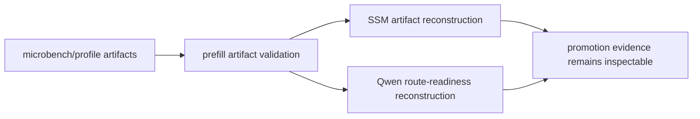

# Prefill Artifact Readiness Evidence - 2026-05-18

This note records the prefill route-promotion artifact gates added after the
0.8.6 correctness-evidence release. It is scoped to artifact readiness for
future prefill route promotion. It is not a throughput claim.

## Validation Summary

| Gate | Command | Status | Evidence |
|---|---|---:|---|
| Parent prefill artifact wrapper | `scripts/benchmarks/run-prefill-artifact-validation.sh --timeout 120` | pass | `.test-artifacts/prefill-artifact-validation/20260517T152128Z/summary.csv` |
| SSM artifact reconstruction | child `run-ssm-artifact-validation.sh` | pass | child summary under `ssm/20260517T152128Z/summary.csv` |
| Qwen route-readiness reconstruction | child `run-qwen-route-readiness-validation.sh` | pass | child summary under `qwen-route-readiness/20260517T152225Z/summary.csv` |
| Build hygiene | `perl -e 'alarm shift; exec @ARGV' 120 swift build` | pass | local build completed; existing warnings are unrelated to this gate |
| Diff hygiene | `git diff --check` | pass | clean |

## Parent Summary

The parent summary contained two passing child gates:

| Gate | Result |
|---|---:|
| `ssm` | pass |
| `qwen_route_readiness` | pass |

## SSM Child Gates

| Phase | Focused gate | Result |
|---|---|---:|
| manifest | `ssmArtifactManifestCoversHarnessOutputs` | pass |
| reconstruct | `ssmRouteArtifactsCanBeReconstructedWhenRequested` | pass |
| reconstruct | `ssmThreadgroupPolicyArtifactCanBeReconstructedWhenRequested` | pass |
| reconstruct | `ssmStateCandidateFeasibilityArtifactCanBeReconstructedWhenRequested` | pass |
| reconstruct | `ssmStateCandidateBridgeArtifactCanBeReconstructedWhenRequested` | pass |
| reconstruct | `ssmPhaseFullBridgeArtifactsCanBeReconstructedWhenRequested` | pass |
| manifest | `ssmArtifactManifestFilesCanBeParsedWhenRequested` | pass |

## Qwen Child Gates

| Phase | Focused gate | Result |
|---|---|---:|
| contract | `routeReadinessCanBeReconstructedFromArtifactCSVs` | pass |
| current_artifacts | `currentRouteReadinessArtifactsCanBeReconstructedWhenRequested` | pass |

## Release Interpretation

- This evidence proves the route-promotion artifacts remain reconstructable and
  inspectable from persisted CSVs.
- This evidence does not promote any new prefill route by itself.
- A prefill route still needs correctness gates, microbench route-promotion
  evidence, full-profile route observation, and full-profile speed-gate evidence
  before default promotion can be discussed.
- Current SSM candidates remain rejected by the artifact gates unless future
  runs produce cross-sequence production wins.
